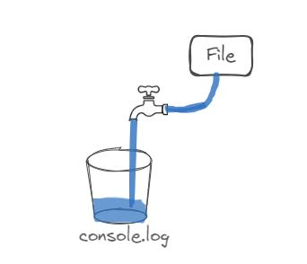
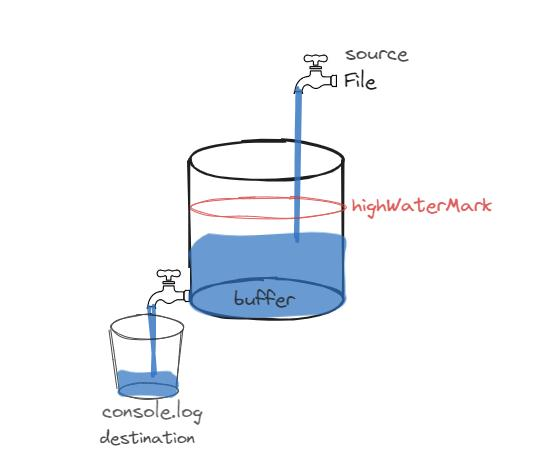
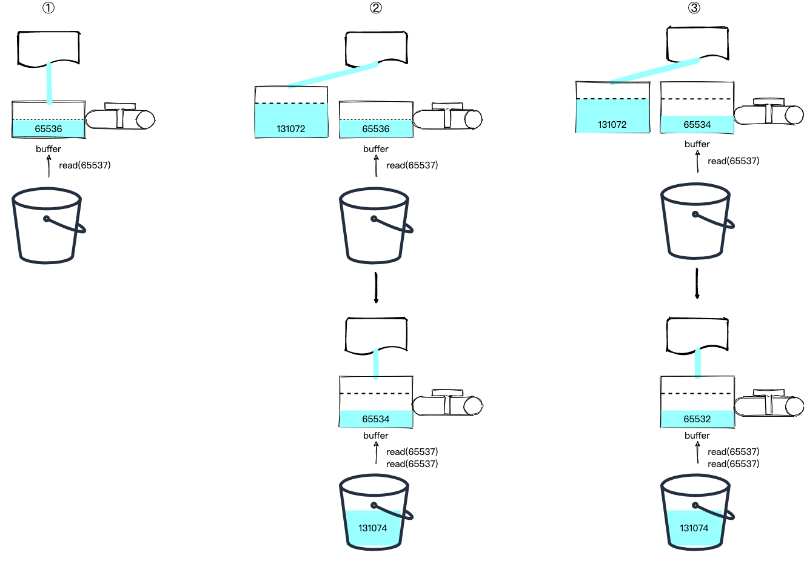
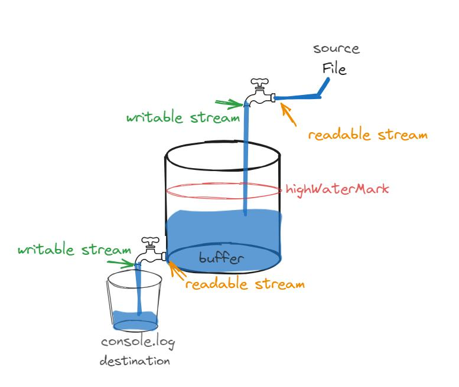

# Stream 流

同 Buffer 一样，Stream 流也是计算机科学中一个常见的概念。在其它语言中用于实现跟 Nodejs 一样的问题，利用有限的内存，操作“海量”的数据。比如 Unix/Linux 中采用 `|` 管道传输数据就是流的应用，没有人会直接去 `cat|less` 一个2/3GB 的日志文件 (敢这么做,分分钟钟爆掉你的内存卡)，而是会采用 `|` 管道来做出一个流，然后在流中查看我们想要的信息。Mysql 模块使用流操作处理结果，Mongoose 模块有一个 QueryStream 模块使用流来操作文档。

## 认识流

流 Stream 是一种对数据处理过程的抽象，将一次性操作（读和写）大数据分解成一个个小的 chunk 的操作。

假设使用常规方式来读写一个大文件 1G，基本就是先将 1G 数据读入内存，然后再写入的过程。

```js
import fs from "node:fs"

// 大文件加载在内存中，会使内存使用异常
fs.readFile("big.file", (err, data) => {
  if (err) throw err
  fs.writeFile("./out", data, () => {})
})
```

使用流的方式处理数据，实际处理数据的过程可能是，先读取1Mb，然后写入1Mb，然后再读取1Mb，再写入1MB，如此往复，直到传输完。这样就不必一次性将所有数据加载到内存中，这使得处理大量数据更加高效。

```js
import fs from "node:fs"
const readStream = fs.createReadStream("./big.file", {
  highWaterMark: 1024 * 1024, // 1Mb
})
const writeStream = fs.createWriteStream("./out")
readStream.pipe(writeStream)
```

所以流的作用是帮我们利用有限的内存，实现操作"海量"数据的目标。而 Stream 对象就是这个处理过程的实现。

## 通过比喻来理解流之 Readable Stream

> 引用 [Node.js 高级编程之 Stream](http://www.paradeto.com/2023/02/09/nodejs-stream/)

可以把可读流(Readable Stream)，可以把它比喻成一个水龙头的入口水流：


水龙头的水来自哪里，需要具体的 Readable Stream 类实现 `_read` 方法来指定。比如 `fs.createReadStream` 创建的 Readable Stream 水源来自文件数据，`process.stdin` 水源来自终端输入。

水龙头的开关可以打开和关闭，如果开关打开，水流可以流动，开关关闭，水流停止流动。当一个可读流初始创建时，默认是处于暂停模式，也就是开关关闭的状态。

```js
const readStream = fs.createReadStream("./file")
// console.log('readStream flowing: %s, paused: %s', readStream._readableState.flowing, readStream._readableState.paused) // null true
console.log(
  "readStream flowing: %s, paused: %s",
  readStream.readableFlowing,
  readStream.isPaused(),
) // null true
```

初始创建时，`readable.readableFlowing` 为 null ，此时流不会生成数据。在此状态下，当为流对象通过以下方式之一使用时，都会将 `readable.readableFlowing` 切换到 `true`，从而使 Readable Stream 开始传输数据。

- 绑定 `data` 事件（流 Stream 继承于 EventEmitter，所以可能监听 newListener 事件来识别 data 事件）。
- 调用 `readable.resume()` 方法
- 调用 `readable.pipe()` 方法

```js
const readStream = fs.createReadStream("./file")
readStream.on("data", (chunk) => {
  console.log(chunk)
})
console.log(
  "readStream flowing: %s, paused: %s",
  readStream.readableFlowing,
  readStream.isPaused(),
) // true false
```

这样就打开了水龙头开关，通知水源地往龙头灌水了，水就流到了 data 事件的回调函数中进行处理。



也可以先通过 resume 方法来手动开启水龙头，不过要小心，有可能导致水丢失，这就好比先把水龙头打开了，然后再去放桶，肯定会漏掉一些水。

```js
const readStream = fs.createReadStream("./file")
readStream.resume()
readStream.on("data", console.log) // 打印为空
```

另外，也可以主动调用 `pause` 方法暂停接收，相当于关闭水龙头。比如下面这个例子在接收到第一批水后就关闭了水龙头：

```js
const readStream = fs.createReadStream("./big.file")

readStream.once("data", (chunk) => {
  readStream.pause()
})
```

### Buffer 缓冲区域

假设第一桶水接满了，需要换个桶重新接水，我们会关闭水龙头，暂停了水龙头到接水桶这段水流，但是像上游的水源地的水还是不断的往水龙头供水。如果直接关闭未端水龙头，可能水源地到水龙头这段水管会撑爆掉，此时两种方案：

- 第一种：接水桶满了要换桶时，关闭水龙头的同时，通知上游，比如自来水厂停止供水。那这样的话，第二桶打开水龙头开始接水时，同样还要通知上游水厂开始供水，交互流程明显变长了，而且多方参与，还要设置沟通机制。
- 第二种：在供水过程中设置一个储水池作为缓冲，当需要换桶时，关闭接水侧的水龙头即可。此时不需要停止供水，多余水的可以存储在作为缓冲的储水池中，只要及时换好水桶，打开开关就可以继续接收，此时会先消耗掉暂停期间 buffer 中的水，然后再从源头读取。



```js
const readStream = fs.createReadStream("./big.file")

readStream.once("data", (chunk) => {
  // 暂停读取，此时数据存储缓冲区
  readStream.pause()
  setTimeout(() => {
    const data = readStream._readableState.buffer.head.data.toString()
    readStream.once("data", (chunk) => {
      console.log(data === chunk.toString()) // 第二次读到的数据确实是来自上次 pause 后存放到 buffer 中的
    })
    // 恢复读取
    readStream.resume()
  }, 2000)
})
```

### High Water Mark 高水位线

上面暂停期间，储水池也不可能一直储水，它也只有一定的容量，它本身也只是起一个缓冲的作用，不可能让它无限容量的蓄水。所以必须设置一个警戒线 high water mark，当蓄水容量已经到达该阀值时，还没有打开水龙头开关接水，就只能通知上游水厂停止供水，避免水满溢出，丢失数据。

高水位线（High Water Mark），这个值指定了在开始暂停，到再次恢复流动期间，缓冲区最多可以积累多少字节（或对象）。这个阀值在 64 位系统中一般默认是 65536 (64Kb)。当然可以设置自定义阀值，但自定义的值也不能大于内部限定的阀值 1GB

```js
const readStream = fs.createReadStream(filePath)
console.log(readStream.readableHighWaterMark) // 65536 = 64 * 1024

// 或者在创建流时指定阀值
const readStream = fs.createReadStream(filePath, { highWaterMark: 1024 * 1024 }) // 1Mb
```

HighWaterMark 的理解有两个注意点：

- 对不同的数据模式下，highWaterMark 值的单位是不同的，对于普通的二进制 buffer 流，单位是字节。对于在对象模式下操作，单位是连续操作对象的个数。对于提供了编码 encoding 时，处理的字符串，此时 highWaterMark 指定的是 UTF-16 码元的个数。
- 通常情况下，默认水位线的值，或者初始化时传入 highWaterMark 值后不会改变，但有一种情况，在在传输过程中会改变初始的水位线的值，即当 `read(size)` 方法传入的 size 值大于初始设置的 highWaterMark 值。具体示例见下面。

### `read(size)` 手动定量取水

上面例子都是水龙头打开，流出来多少水（即代码中的 chunk）我们就接多少水，有没有可能我们自己控制接水量的多少呢？答案是肯定的，我们可以调用 `readable.read(size)` 这个方法，传入接水量 size，单位字节。

`readable.read()` 方法如果未指定 size 参数，将返回缓冲区里所有数据。返回值是一个数据块 chunk，或者 null。

注意返回 null 时，仅表示此时 buffer 中没有更多数据可读取，但可能在源上还有更多的数据正在缓冲，一旦缓冲区再次积累了数据，就会重新触发 `readable` 事件，而 `end` 事件才表示数据传输结束。

比如下面这个例子：

```js
const readStream = fs.createReadStream("./big.file")
console.log(readStream.read(100))
```

不过，上面的这个代码是读不到数据的。原因在于，read 方法是从 buffer 中读取数据，而此时 readable Stream 刚创建，还没有方式触发流传输（见上面有三种方式触发流模式），readableFlowing 为 null，buffer 缓冲区里面还是空的。

readable Stream 可读流，当里面有数据可供读取时，会发出一个 `readable` 事件通知，我们可以监听它。

```js
const chunks = []

const readStream = fs.createReadStream("./big.file")

readStream.on("readable", () => {
  let chunk
  console.log("Stream is readable (new data received in buffer)")
  while (null !== (chunk = readStream.read(100))) {
    console.log(`Read ${chunk.length} bytes of data from buffer`)
    chunks.push(chunk)
  }
})

readStream.on("end", () => {
  const content = chunks.join("")
  console.log(`Read Content is: ${content}`)
})
```

调用 `on('readable'...` 会触发水源往 buffer 中灌水，当 buffer 中灌满水后，会调用 `readable` 事件的回调函数，此时可以通过 `read(size)` 方法按指定的容量 size 来消费 buffer 中的缓存的数据。

这里有个问题，如果当我们入参的 size 的值超过了 buffer 默认的水位线 highWaterMark 值怎么办？我们来实验一下：

```js
const readStream = fs.createReadStream("./big.file")
readStream.on("readable", () => {
  let chunk
  console.log("Stream is readable (new data received in buffer)")
  console.log(
    readStream._readableState.highWaterMark, // 65536
    readStream._readableState.length,
  )
  // Use a loop to make sure we read all currently available data
  while (null !== (chunk = readStream.read(65537))) {
    console.log(`Read ${chunk.length} bytes of data...`)
  }
})
```

运行后，控制台打印如下：

```js
Stream is readable (new data received in buffer)
65536 65536
Stream is readable (new data received in buffer)
131072 196608
Read 65537 bytes of data...
Read 65537 bytes of data...
Stream is readable (new data received in buffer)
131072 196606
Read 65537 bytes of data...
Read 65537 bytes of data...
Stream is readable (new data received in buffer)
131072 196604
...
```

分析这个日志，我们发现第一次 readable 事件并没有进入 while 循环，且第一次之后 highWaterMark 的值增加了。经过调试后，得到结论，图示如下：



基本过程如下：

1. 第一次触发 readable 事件，此时 buffer 中的数据为 65536，而我们需要读取 65537 的数据，数据不够 read 返回 null。并且发现 read 读取的数据大于 highWaterMark，所以更新该参数为原来的两倍，即 131072（highWaterMark 不是一成不变的），然后以该值从水源中再读入一段数据到一个新的节点中 （buffer 是一个链表）。
2. 然后，触发第二次 readable 事件，此时 buffer 数据总长度为 `65536 + 131072 = 196608`，我们可以读入两次 65537 的数据。此时 buffer 数据总长度变为 `196608 - 2 x 65537 = 65534`，数据又不够了，read 返回 null，且由于 read 读取的数据小于 highWaterMark，不需要更新，仍然以原来的值从水源中再读入一段数据到一个新的节点中。
3. 然后，触发第三次 readable…

### 总结可读流

两种模式：

- 在流动模式下 flowing：数据会自动从底层系统读取，并通过继承于 EventEmitter 类使用事件尽快提供给应用。所有的 Readable Stream 流都以暂停模式开始，可以通过以下方式之一切换到流动模式：
  - 添加 'data' 事件监听。
  - 调用 `stream.resume()` 方法。
  - 调用 `stream.pipe()` 方法将数据发送到 Writable Stream。
- 在暂停模式下 paused，必须显式调用 `stream.read([size])` 方法以从流中再次读取数据块。Readable Stream 流可以使用以下方法之一切换回暂停模式：
  - 如果没有通过 pipe 方法接入过管道目标流，则可以通过调用 `stream.pause()` 方法。
  - 如果有管道目标，则通过调用 `stream.unpipe()` 方法删除多个管道目标后，流自动转为暂停模式。

根据不同时候，流模式的切换，会导致流可能处于三种状态下：

- `readable.readableFlowing === null` 可读流被创建时的初始状态，此时不生产可读取的数据。在此状态下，为流绑定 'data' 事件监听器、调用 `readable.pipe()` 方法、或调用 `readable.resume()` 方法会将 `readable.readableFlowing` 切换到 `true`，从而使 Readable 在生成数据时开始主动触发事件。
- `readable.readableFlowing === true` 处于流模式，正常生产数据提供给消费者。
- `readable.readableFlowing === false` 处于暂停模式，调用 `readable.pause()`、`readable.unpipe()` 或接收背压（buffer 缓存的数据超过水位线）将导致 `readable.readableFlowing` 设置为 false，暂时停止数据的流动，但不会停止数据的生成。在此状态下，为 'data' 事件绑定监听器不会将 `readable.readableFlowing` 切换到 true。

## Writable Stream

可以把 Writable Stream 同样比喻成一个水龙头，但不同于 Readable Stream 关注水龙头接水口（入口），Writable Stream 是关注水龙的的出水口。



水流向哪里，需要具体的 Writable Stream 实例实现 `_write` 方法。比如 `fs.createWriteStream` 创建 Writable Stream 流向目标文件，`process.stdout` 流向终端输出显示。

```js
const writeStream = fs.createWriteStream("./file")
writeStream.write("a")
```

### cork 和 uncork

类似于 Readable Stream 可读流可以暂停 pause 和恢复 resume，Writable Stream 可写流也可以先堵住 cork(软木塞，比如红酒的橡木塞)暂停写入流，再疏通 uncork 后恢复写入流。

当调用 `writeStream.cork()` 时，即把出口堵住，此时只能先把数据写缓冲区 buffer 里。

```js
const writeStream = fs.createWriteStream("./file")
writeStream.cork()
writeStream.write("a") // 不会写入到磁盘文件中，而是 Writable Stream 内部维护的 buffer 缓冲内存区域中
console.log(writeStream._writableState.buffered[0].chunk.toString()) // a
console.log("writeStream.writableCorked: ", writeStream.writableCorked) // 1
```

然后通过调用 `writeStream.uncork()` 重新打开出口，继续写入数据。

```js
const writeStream = fs.createWriteStream("./file")
writeStream.cork()
writeStream.write("a") // 不会写入到磁盘文件中，而是 Writable Stream 内部维护的 buffer 缓冲内存区域中
console.log("writeStream.writableCorked: ", writeStream.writableCorked) // 1
console.log(writeStream._writableState.buffered[0].chunk.toString()) // a
setTimeout(() => {
  writeStream.uncork() // 打开出口，恢复数据写入
  console.log("writeStream.writableCorked: ", writeStream.writableCorked) // 0
  console.log(writeStream._writableState.buffered[0]) // undefined
}, 1000)
```

如果在一个流上多次调用 `writable.cork()` 方法堵住出口，则必须调用相同数量的 `writable.uncork()` 调用疏通出口，才能使缓冲区的数据写入文件。属性 `writable.writableCorked` 记录了堵塞次数。

```js
writeStream.cork()
writeStream.write("some ")
writeStream.cork()
console.log("writeStream.writableCorked: ", writeStream.writableCorked) // 2
writeStream.write("data ")
process.nextTick(() => {
  writeStream.uncork()
  console.log("writeStream.writableCorked: ", writeStream.writableCorked) // 1
  // 在第二次调用uncork()之前，不会将缓冲区数据写入文件。
  writeStream.uncork()
  console.log("writeStream.writableCorked: ", writeStream.writableCorked) // 0
})
```

### `write` 方法的返回值

`writable.write(chunk[, encoding][, callback])` 函数是有返回值的，当返回 false 时，表示缓冲池中的水位超过了 highWaterMark（64 KB），此时正确的做法应该停止继续往池子中写入，等待池子中的水排干了，会触发 drain 事件，此时可以再继续注水。

```js
const writeStream = fs.createWriteStream("./file3")
const ret = writeStream.write(Array(20000).fill("a").join(""))

if (!ret) {
  writeStream.on("drain", () => {
    writeStream.write(Array(1).fill("b").join(""))
    console.log(fs.readFileSync("./file3").length) // 20001
  })
}
```

如果仍然不管警戒线，继续调用 `write()`，仍会缓冲所有写入的块，直到出现最大内存使用量，此时它将无条件中止程序。即使在它中止之前，高内存使用量也会导致垃圾收集器性能不佳和高 RSS（通常不会释放回系统，即使在不再需要内存之后）。

### 背压 back pressure

背压(back pressure)是一个术语，用于描述在数据传输过程中，当数据生成（或读取）的速度超过数据消费（或写入）的速度时，所产生的一种压力状态。在Node.js的流处理中，背压机制用于确保数据从源头到终点的流动是平滑且不会导致内存溢出的。

在 Node.js 中，背压主要通过可写流（Writable Streams）的 `write()`方法来实现。当可写流的内部缓冲区即将达到其高水位线（highWaterMark）时，`write()`方法会返回 false，表示当前无法接收更多数据。此时，应该暂停数据写入，直到写入数据的缓冲区排干后，再继续。即drain事件被触发。见上面 write 示例。

Nodejs Stream 流主要有四种抽象类：

- 可读流 (Readable Stream)：允许数据被读取。例如从文件读取数据。
- 可写流 (Writable Stream)：允许数据被写入。例如向文件写入数据。
- 双工流 (Duplex Stream)：既可读也可写。例如网络套接字。
- 转换流 (Transform Stream)：数据可以在写入和读出过程中进行修改。在读写过程中可以修改或转换数据的 Duplex 流。例如压缩数据。

## 读写的数据模式

通常情况下，不管是可读流还是可写流，操作的数据都是基于 Nodejs Buffer 数据，所以可以是 Buffer / TypedArray / DataView 的实例对象来处理二进制数据。此时流中处理数据单位按字节操作。

但是，Stream 也通过 ObjectMode 选项来切换为对象模式，这样流中处理的数据可以使用 js 规范的类型值（除 null，它在流中具有特殊用途）。这样的流被认为是在“对象模式"中运行。

- 字节模式：流操作的主要是字节数据，例如文件读写，网络数据传输等。
- 对象模式：流操作的是对象，每个读取或写入的操作都是针对一个对象而不是字节数。

```js
import { Readable, Writable } from "node:stream"

// 创建一个以 Object mode 运行的可读流
const objectReadableStream = new Readable({
  objectMode: true,
  read() {},
})

// 创建一个以 Object mode 运行的可写流
const objectWritableStream = new Writable({
  objectMode: true,
  write(chunk, encoding, callback) {
    console.log(chunk)
    callback()
  },
})
```

示例

```js
import { Writable } from "node:stream"

// 创建一个自定义的可写流，用于日志记录
class LogStream extends Writable {
  constructor(options) {
    // 设置对象模式
    super({ ...options, objectMode: true })
  }

  _write(chunk, encoding, callback) {
    console.log(`Received object: ${JSON.stringify(chunk)}`) // 接收到的 chunk，此时是一个对象 {level, message, error}
    callback()
  }
}

const logStream = new LogStream()

logStream.write({ level: "info", message: "This is an information message." })
logStream.write({
  level: "error",
  message: "Oops! Something went wrong.",
  error: new Error("Error"),
})

// 以上代码会打印出传入的对象
```

## 内建的流实现

Stream 模块同 Buffer / EventsEmitter 模块一样，也是 Nodejs 非常基础的模块，很多内置模块都是依赖于该模块扩展。Stream 类继承于 EventsEmitter 类，同时派生出四个子类：Readable / Writable / Duplex / Transform。然后其它内置模块继承于子类实现。

Stream 流的实现：

- 服务器上的 HTTP 请求 Request 基于可读流 Readable 实现
- 客户端上的 HTTP 响应 Response 基于可写流 Writable 实现
- 文件系统读取流 `fs.createReadStream()`，可写流 `fs.createWriteStream()`
- zlib 流
- crypto 加密流
- TCP 套接字
- 子进程标准输入 stdin、输出 stdout和标准错误 stderr

## Stream API

Readable Stream

```js
// 事件
readable.on('readable', () => {}); // '当有数据可从流中读取时，将触发 'readable' 事件，直至配置的高水位标记 (state.highWaterMark)。如果已经到达流的末尾，则调用 stream.read() 将返回 null 并触发 'end' 事件。
readable.on('data', (chunk) => {}); // 当流中有数据可供消费时触发，如果使用 readable.setEncoding() 方法为流指定了默认编码，则监听器回调将把数据块作为字符串传递；否则数据将作为 Buffer 传递。
readable.on('end', () => {}); // 当流中没有数据可供消费时触发。
readable.on('error', (error) => {}); // 当读取流中数据发生错误时触发。
readable.on('pause', () => {}); // 当调用 stream.pause() 并且 readsFlowing 不为 false 时，就会触发 'pause' 事件。
readable.on('resume', () => {}); // 当调用 stream.resume() 并且 readsFlowing 不为 true 时，将会触发 'resume' 事件。
readable.on('close', () => {}); // 当流及其任何底层资源（例如文件描述符）已关闭时，则会触发 'close' 事件。

// 属性
readable.readableEncoding // 返回可读流设置的 encoding 属性
readable.readableFlowing // 代表可读流的三种状态，初始时为 null，流模式下为 true，暂停模式下为 false
readable.readableHighWaterMark // 返回构造可读流时传入的 highWaterMark 的值。
readable.readableLength // 包含准备读取的队列中的字节数（或对象数）
readable.readable // 如果可以安全地调用 readable.read()，则为 true。
readable.isPaused() // 返回可读流当前的操作状态,在调用 readable.pause() 之后为 true。
readable.readableEnded // 触发 end 事件后变为 true
readable.closed // 触发 close 事件后为 true
readable.destroyed // 在调用 readable.destroy() 之后为 true。
readable.errored
readable.readableAborted // 返回在触发 'end' 事件之前流是被破销毁或出错。
readable.readableDidRead // 返回 'data' 事件是否已经触发
readable.readableObjectMode // 是否是 object mode

// 方法
readable.setEncoding(encoding)
// 为从可读流读取的数据设置字符编码。
// 默认情况下没有设置字符编码，流数据返回的是 Buffer 对象。 如果设置了字符编码，则流数据返回指定编码的字符串。

readable.read([size])
// 从内部缓冲拉取并返回数据。 如果没有可读的数据，则返回 null。
// 如果没有指定 size 参数，则返回内部缓冲中的所有数据。
// 在 readable事件监听器中调用，建议readable.read() 应该只对处于暂停模式的可读流调用。 在流动模式中， readable.read() 会自动调用直到内部缓冲的数据完全耗尽，所以在流动模式中使用意义不大。

readable.pipe(writable[, options])
// 绑定可写流到可读流，将可读流自动切换到流动模式，并将可读流的所有数据推送到绑定的可写流。 数据流会被自动管理，所以即使可读流更快，目标可写流也不会超负荷。
// 引方法返回目标流的引用，这样就可以对流进行链式地管道操作，正常结束自动会关闭流
// 如果可读流在处理期间发送错误，则可写流目标不会自动关闭。 如果发生错误，则需要手动关闭每个可写流以防止内存泄漏。(调用writable.end())

readable.unpipe([destination])
// 解绑之前使用 stream.pipe() 方法绑定的可写流。
// 如果没有指定 destination, 则解绑所有管道.
// 如果指定了 destination, 但它没有建立管道，则不起作用.
// 解除绑定记得手动关闭目标流。(调用writable.end())


readable.pause()
// 使流动模式的流停止触发 'data' 事件，并切换到暂停模式。 任何可用的数据都会保留在内部缓存中。

readable.resume()
// 将被暂停的可读流恢复(resume)触发 'data' 事件，并将流切换到流动模式。

readable.destroy([error])
// 销毁流。 可选地触发 'error' 事件，并触发 'close' 事件。
// 在此调用之后，可读流将会释放所有内部的资源


// 一些 Nodejs 新版本新增的实验性功能
readable.unshift(chunk[, encoding])
readable.wrap(stream)
readable.compose(stream[, options])
readable.iterator([options])
readable.map(fn[, options])
readable.filter(fn[, options])
readable.forEach(fn[, options])
readable.toArray([options])
readable.some(fn[, options])
readable.find(fn[, options])
readable.every(fn[, options])
readable.flatMap(fn[, options])
readable.drop(limit[, options])
readable.take(limit[, options])
readable.reduce(fn[, initial[, options]])
```

Writable Stream

```js
// 事件
writable.on('error', (err)=>{}) // 在写入或管道数据时发生错误，则会触发 'error' 事件
writable.on('finish', ()=>{}) // 调用 writable.end()且缓冲数据都已传给底层系统之后触发。
writable.on('close', ()=>{}) // 当流被关闭或底层文件被关闭时触发
writable.on('drain', ()=>{}) // 调用 stream.write(chunk) 返回 false，则当可以继续写入数据到流时会触发 'drain' 事件。
writable.on('pipe', (src)=>{}) // 在可读流上调用 readStream.pipe() 方法时会发出 'pipe' 事件，并将此可写流添加到其目标集。
writable.on('unpipe', (src)=>{}) // 可读流上调用 readStream.unpipe() 方法时会发出 'unpipe'事件，从其目标集中移除此可写流。

// 属性
writable.writableLength // 包含准备写入的队列中的字节数（或对象）
writable.writableHighWaterMark // 返回构造可写流时传入的 highWaterMark 的阀值。
writable.writable  // 如果调用 writable.write() 是安全的，则为 true。
writable.writableEnded // 在调用了 writable.end() 之后为 true
writable.writableFinished // 在准备触发 'finish' 事件之前立即设置为 true。
writable.closed
writable.destroyed // destroy() 方法之后为 true
writable.writableAborted // 流在 finish 事件前被取消或出错
writable.writableCorked // 堵塞出口的次数
writable.errored // 如果流因错误而被销毁，则返回错误。
writable.writableNeedDrain // 如果流的缓冲区已满并且流将触发 'drain'，则为 true。
writable.writableObjectMode // 给定 Writable 流的属性 objectMode 布尔值。

// 方法
writable.setDefaultEncoding(encoding)
// 为可写流writeable对象全局设置默认的编码规则。
// 也可以在调用write()或end()方法时传入第二个参数单独设置，覆盖全局设置。

writable.write(chunk[, encoding][, callback])
// 在接收了 chunk 后，如果内部的缓冲小于创建流时配置的 highWaterMark，则返回 true 。
// 如果返回 false ，则应该停止向流写入数据，直到 'drain' 事件被触发。
// 所以使用write，要考虑一个防止背压与避免内存问题，可以配合’drain'封装一次write,或使用readStream.pipe(writeStream)

writable.cork()
// 强制堵塞可写流的输出，继续写入数据都缓存在内存中。只当调用 stream.uncork() 或 stream.end() 方法时，缓冲的数据才恢复写入

writable.uncork()
// 重新疏通可写流，继续写入。
// 如果在一个流上多次调用 writable.cork() 方法，则必须调用相同数量的 writable.uncork() 调用来刷新缓冲的数据。当前堵塞的次数可以通过 writable.writableCorked

writable.end([chunk[, encoding]][, callback])
// 调用 writable.end() 表明已没有数据要被写入可写流。
// 可选的 chunk 和 encoding 参数可以在关闭流之前再写入最后一块数据。
// 如果传入了 callback 函数，则会做为监听器添加到 'finish' 事件。
// 调用 stream.end() 之后再调用 stream.write() 会导致错误


writable.destroy([error])
// 销毁流。 可选地触发 'error'，并且触发 'close' 事件（除非将 emitClose 设置为 false）。
// 调用该方法后，可写流就结束了，之后再调用 write() 或 end() 都会导致 ERR_STREAM_DESTROYED 错误。 这是销毁流的最直接的方式。
```

Duplex Stream 双工流是同时实现 Readable 和 Writable 接口流，自然拥有上述全部属性和方法。同时增加以下属性：

- `duplex.allowHalfOpen` 如果为 false，则流将在可读端结束时自动结束可写端。最初由 allowHalfOpen 构造函数选项设置，默认为 true。这可以手动更改以更改现有 Duplex 流实例的半打开行为，但必须在触发 'end' 事件之前更改。

Transform Stream 转换流是基于 Duplex Stream 流，自然拥有上述全部属性和方法。

另外，Stream 基类提供了一系列工具方法操作可读流和可写流。

```js
stream.finished(stream[, options], callback)
stream.pipeline(source[, ...transforms], destination, callback)
stream.pipeline(streams, callback)
stream.compose(...streams)
stream.isErrored(stream)
stream.isReadable(stream)
stream.addAbortSignal(signal, stream) // 将 AbortSignal 附加到可读或可写流。这样通过 signal 控制取消流的行为。
stream.getDefaultHighWaterMark(objectMode)
stream.setDefaultHighWaterMark(objectMode, value)

stream.Readable.from(iterable[, options])
stream.Readable.isDisturbed(stream)
stream.Readable.fromWeb(readableStream[, options]) // 与 web 标准的 ReadableStream 互转
stream.Readable.toWeb(streamReadable[, options])

stream.Writable.fromWeb(writableStream[, options]) // 与 web 标准的 WritableStream 互转
stream.Writable.toWeb(streamWritable)

stream.Duplex.from(src)
stream.Duplex.fromWeb(pair[, options]) // 与 web 标准的 WritableStream 互转
stream.Duplex.toWeb(streamDuplex)
```

## 自定义实现流

Nodejs 提供了两种方式自定义实现流

- 简单方式： new 对应的类
- 继承方式：extend 对应类

但不管是哪种方式实现，都必须提供对应类型流类型的必须实现的方法。

```
类          必须实现的方法                           描述
Readable    _read(size)                            为可读流提供可读取的数据源，即如何生产数据
Writable    _write(chunk, encoding, callback)      为可写流确定如何写入数据，即如何消费数据
Duplex      _read(size)
            _write(chunk, encoding, callback)
Transform   _flush(callback)                       在 end 事件触发可读流 Readable 结束之前调用此方法，用于在流的未尾添加额外的数据位。
            _transform(chunk, encoding, callback)  提供数据流转换的实现
```

上述方法都带有下划线前缀，如果是继承的方式实现自定义流，这些方法是作为子类内部私有方法实现，如果简单方式自定义类，会作为实参对象的方法传入（此时没有下划线），它们都不应由用户程序直接调用。

### Readable Stream

```js
import { Readable, Writable, Duplex, Transform } from 'node:stream'

// 简单方式，自定义可读流
const myReadable = new Readable({
  // 必填
  read           // <Function> stream._read() 方法的实现。为可读流提供可读取的数据源，即如何生产数据
  // 选填
  highWaterMark   // <number> 在停止从底层资源读取之前存储在内部缓冲区中的最大字节数。默认值：buffer 模式下 65536 (64 KiB)，或 objectMode 模式下 16 。
  encoding        // <string> 如果指定，则缓冲区将使用指定的编码解码为字符串。默认值：null。
  objectMode     // <boolean> 此流是否应表现为对象流。这意味着 stream.read(n) 返回单个对象的值，而不是大小为 n 的 Buffer。默认值：false。
  emitClose      // <boolean> 流被销毁后是否应该触发 'close'。默认值：true。
  autoDestroy   // <boolean> 此流是否应在结束后自动调用自身的 .destroy()。默认值：true。
  destroy       // <Function> stream._destroy() 方法的实现。
  construct     // <Function> stream._construct() 方法的实现。将在流构造函数之后，但在 _read / _destroy 之前调用。
  signal        // <AbortSignal> 表示可能取消的信号。
})

// 继承方式，自定义可读流
class MyReadable extends Readable {
  constructor(options) {
    // options = {hightWaterMark, encoding, objectMode, emitClose, autoDestroy, signal}
    super(options);
    // ...
  }
  // 必填
  _read(size) {}

  // 选填
  _construct() {}
  _destroy(){}
  _final(){}
}

```

示例：

```js

```

### Writable Stream

```js
const myWritable = new Writable({
  // 必填
  write               // <Function> stream._write() 方法的实现。
  // 选填
  highWaterMark       // <number> stream.write() 开始返回 false 时的缓冲级别。默认值：65536 (64 KiB)，或 16 用于 objectMode 流。
  defaultEncoding     // <string> 当没有将编码指定为 stream.write() 的参数时使用的默认编码。默认值：'utf8'。
  decodeStrings       // <boolean> 是否将传递给 stream.write() 的 string 编码为 Buffer（使用 stream.write() 调用中指定的编码），然后再将它们传递给 stream._write()。不转换其他类型的数据（即 Buffer 不解码为 string）。设置为 false 将阻止 string 被转换。默认值：true。
  objectMode          // <boolean> stream.write(anyObj) 是否为有效操作。设置后，如果流实现支持，则可以写入除字符串、<Buffer>、<TypedArray> 或 <DataView> 之外的 JavaScript 值。默认值：false。
  emitClose           // <boolean> 流被销毁后是否应该触发 'close'。默认值：true。
  autoDestroy         // <boolean> 此流是否应在结束后自动调用自身的 .destroy()。默认值：true。
  writev              // <Function> stream._writev() 方法的实现。
  destroy             // <Function> stream._destroy() 方法的实现。
  final               // <Function> stream._final() 方法的实现。
  construct           // <Function> stream._construct() 方法的实现。
  signal              // <AbortSignal> 表示可能取消的信号。
});

class MyWritable extends Writable {
  constructor(options) {
    // options = {hightWaterMark, defaultEncoding, decodeStrings, objectMode, emitClose, autoDestroy, signal}
    super(options);
  }

  // 必填
  _write(chunk, encoding, callback){}

  // 选填
  _construct(){}
  _destroy(){}
  _final() {}
  _writev() {}
}
```

### Duplex Stream

```js
const myDuplex = new Duplex({
  // 必填
  read(size){}                        // <Function> stream._read() 方法的实现。为可读流提供可读取的数据源，即如何生产数据
  write(chunk, encoding, callback){}  // <Function> stream._write() 方法的实现。
  // 选填
  allowHalfOpen                       // <boolean> 如果设置为 false，则流将在可读端结束时自动结束可写端。默认值：true。
  readable                            // <boolean> 设置 Duplex 是否可读。默认值：true。
  writable                            // <boolean> 设置 Duplex 是否可写。默认值：true。
  readableObjectMode                  // <boolean> 为流的可读端设置 objectMode。如果 objectMode 为 true，则无效。默认值：false。
  writableObjectMode                  // <boolean> 为流的可写端设置 objectMode。如果 objectMode 为 true，则无效。默认值：false。
  readableHighWaterMark               // <number> 为流的可读端设置 highWaterMark。如果提供 highWaterMark，则无效。
  writableHighWaterMark               // <number> 为流的可写端设置 highWaterMark。如果提供 highWaterMark，则无效。
});

class MyDuplex extends Duplex {
  constructor(source, options) {
   // options = {allowHalfOpen, readableHighWaterMark, writableHighWaterMark, readableObjectMode, writableObjectMode, readable, writable}
    super(options);
  }

  _write(chunk, encoding, callback) {  }

  _read(size) {  }
}
```

### Transform

```js
const myTransform = new Transform({
  transform(chunk, encoding, callback) {} // <Function> stream._transform() 方法的实现。
  flush(callback) {}  // <Function> stream._flush() 方法的实现。
});

class MyTransform extends Transform {
  constructor(options) {
    super(options);
  }
  _transform(chunk, encoding, callback) {}
  _flush(callback) {}
}
```

将 chunk 作为 null 传递表示流结束 (EOF)，其行为与 readable.push(null) 相同，之后无法写入更多数据。EOF 信号放在缓冲区的末尾，任何缓冲的数据仍将被刷新

## 延伸知识：生产者消费者问题

生产者消费者问题（Producer-Consumer Problem），也称有限缓冲问题（Bounded-Buffer Problem），是一个多线程同步问题的经典案例。

该问题描述了两个共享固定大小缓冲区的线程——即所谓的“生产者”和“消费者”——在实际运行时会发生的问题。生产者的主要作用是生成一定量的数据放到缓冲区中，然后重复此过程。与此同时，消费者也在缓冲区消耗这些数据。该问题的关键就是要保证生产者不会在缓冲区已经装满时加入数据，消费者也不会在缓冲区为空时消耗数据。

要解决该问题，就必须让生产者在缓冲区满时休眠（要么干脆就放弃数据），等到下次消费者消耗缓冲区中的数据的时候，生产者才能被唤醒，开始往缓冲区添加数据。同样，也可以让消费者在缓冲区空时进入休眠，等到生产者往缓冲区添加数据之后，再唤醒消费者。

生产者和消费者的问题，归根结底都是线程间的通信问题。常用的方法有信号灯法等。如果解决方法不够完善，则容易出现死锁的情况。出现死锁时，两个线程都会陷入休眠，等待对方唤醒自己。该问题也能被推广到多个生产者和消费者的情形。

> 引用
>
> [操作系统中的经典问题——生产者消费者问题（两种方式实现）](https://www.cnblogs.com/xgp123/p/12339830.html)
>
> [五个同步问题的经典模型之一：生产者/消费者问题](https://www.jianshu.com/p/b16296e9ac85)

## 链接

[Node.js 高级编程之 Stream](http://www.paradeto.com/2023/02/09/nodejs-stream/)
