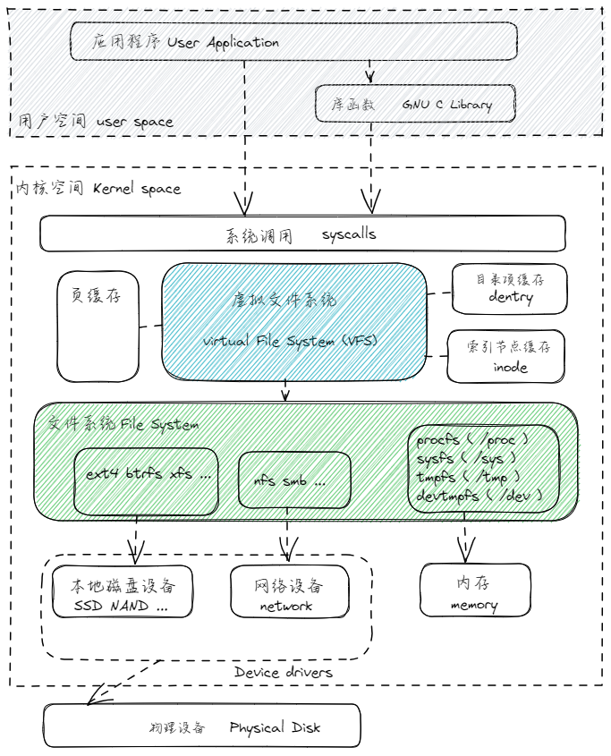
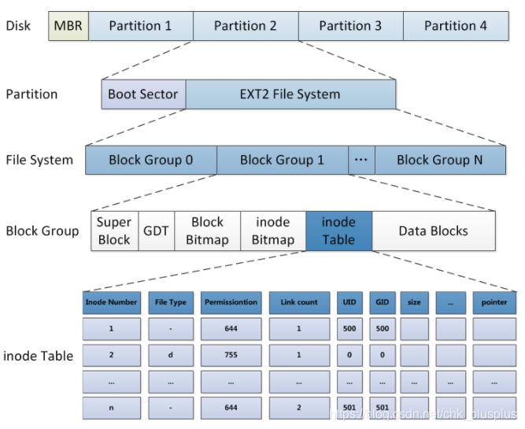
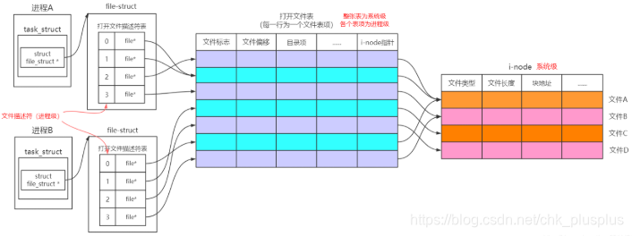
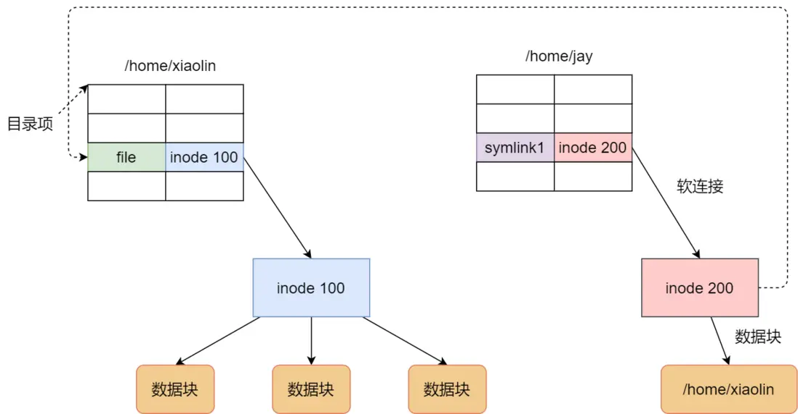
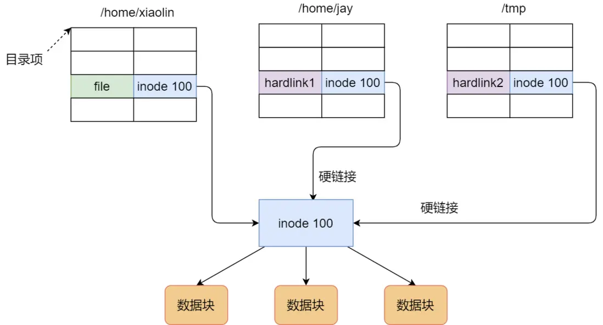

# Linux 文件系统

## POSIX

POSIX（Portable Operating System Interface，可移植操作系统接口）是 IEEE 为了使 Unix 操作系统兼容其他操作系统所定义的一系列 API 标准。比如 Linux 和 macOS 等操作系统大多数遵循这种标准。所以通常说 POSIX 系统指的是类 Unix 系统，包括 Linux / macOs 系统。另一大操作系统是 Windows 它是微软开发的操作系统。

## POSIX 文件系统和 window 文件系统差异

- 文件系统类型
  - Linux 支持多种文件系统类型，如 ext4、XFS、Btrfs 等，而Windows主要使用 NTFS 和 FAT32（较早的版本）等文件系统。这些文件系统具有不同的特性和性能，以满足各自操作系统的需求。
- 文件系统层次结构
  - Linux 文件系统具有统一的根目录（/），所有设备和文件都挂载在此根目录下。而 Windows 文件系统为每个设备分配一个独立的驱动器号（如C:、D:等）。
- 路径分隔符
  - Linux 使用正斜杠（/）作为路径分隔符，而Windows使用反斜杠（\）作为路径分隔符。例如，Linux 文件路径可能是 `/home/user/documents`，而 Windows 文件路径可能是 `C:\Users\user\Documents`。
- 文件名大小写敏感
  - Linux 文件系统区分文件名的大小写，这意味着 file.txt 和 File.txt 被视为两个不同的文件。而在 Windows 文件系统中，文件名大小写不敏感，file.txt 和 File.txt 被视为同一个文件。
- 访问权限和所有权
  - Linux 文件系统具有严格的权限和所有权模型，包括用户、组和其他用户的读、写和执行权限。这有助于保护系统文件和用户数据的安全。而 Windows 文件系统使用访问控制列表（ACLs）来管理文件和目录的权限。

因为服务器端系统以 Linux 为主，所以下面以 Linux 系统为例讲解文件系统的相关概念。

## Linux 的访问权限

### 用户

Linux 系统是一个多用户多任务的分时操作系统，任何一个要使用系统资源的用户，都必须首先向系统管理员申请一个账号，然后以这个账号的身份进入系统并使用系统资源。

Linux 系统将用户账户可以分为两类：常用的普通用户和超级用户。

- 普通用户只能访问自己拥有或被赋予权限的资源
- 超级用户（root）拥有对所有系统资源的完全访问权限

### 用户组

类似于我们构建后台管理系统中设计用户权限系统，为了避免为每个用户单独设置权限的繁琐，通常会引入角色的概念，然后基于角色设置资源的操作权限，再将用户绑定到角色上，这样用户就拥有了该角色的权限去访问资源。

同样的，在 Linux 系统也，用户也可以注册 N 多个，也是为了方便管理用户权限，Linux 使用用户组的概念来控制用户对系统资源的访问权限。

当用户创建一个文件或目录时，可以指定该文件或目录的所有者、所有组和其他组的权限。

- 所有者：在初始时，创建的用户即为所有者，超级管理员 root 可以使用 `chown` 命令更改所有者。
- 所有组：当某个用户加进这个组后，也会继承该所有组的所有权限。
- 其他组

每个文件和目录都有一个所有者和一个所属组。

### 权限

Linux 系统中对文件和目录操作很简单，只有三种：读 read、写 write、执行 execute。

这些权限以符号形式表示，可以用数字或符号表示。

- 读 read： r 4 允许查看目录中的文件列表
- 写 write： w 2 允许在目录中创建、删除和重命名文件
- 执行 execute： x 1 允许进入目录

一个文件的具体权限是上述三种操作按读写执行的顺序进行组合表示，如果某位上没有权限用短横线 `-` 表示。比如：

- 全部权限表达为：rwx，权限值 7（4+2+1）
- 只读权限，r--，权限值为 4
- 能读写但没有执行的权限，rw-，权限值 6（4+2）

具体到一个文件或目录的权限，由文件或目录的所有者权限、所有组权限、其它组权限组成。每组权限值都是读写执行三种权限值的和。

比如文件A的权限是它的所有者拥有全部权限（rwx 7）、所有组只拥有读写权限（rw- 6）、其它组只读（r-- 4），那么文件A的权限表示为 `-rwxrw-r--`，写入权限值为 `764`。文件权限的操作命令 `chmod 664 file_a`

> 首位的 `-` 表示文件A的文件类型，具体见下面文件类型说明。

## Linux 的文件体系

**Linux 的一切皆文件**

设计一个系统的终极目标往往就是要找到原子操作，一旦锁定了原子操作，设计工作就会变得简单而有序。“文件”作为一个抽象概念，其原子操作非常简单，只有读和写，这无疑是一个非常好的模型。通过这个模型，API 的设计可以化繁为简，用户可以使用通用的方式去访问任何资源，通过相应的中间件做好对底层的适配。

现代操作系统为解决信息能独立于进程之外被持久化存储，而引入了文件的概念，文件作为进程创建信息的逻辑单元可被多个进程并发使用。在 UNIX 系统中，操作系统为磁盘上的文本与图像、鼠标与键盘等输入设备及网络交互等 I/O 操作设计了一组通用 API，使他们被处理时都可以统一使用字节流方式。换言之，UNIX 系统中除进程之外的一切皆是文件。

而 Linux 系统继承了这一特性，但更进了一步，Linux 系统以文件的形式对计算机中的数据和硬件资源都进行统一管理，这包括进程间通信（IPC）和网络通信等输入/输出资源，也就是更彻底的一切皆文件。并且为了便于文件的管理，Linux 还引入了目录（有时亦被称为文件夹）这一概念。目录使文件可被分类管理，且目录的引入使 Linux 的文件系统形成一个层级结构的目录树。所谓的目录树就是以根目录（/）为主，向下呈现分支状的一种文件结构。

一切皆文件和文件目录树的资源管理方式一起构成了 Linux 的文件体系，让 Linux 操作系统可以方便使用系统资源。你可以使用同一套 API (read, write)和工具(cat , 重定向, 管道)来处理 Linux 系统中的大多数资源。

## Linux 的文件类型

Linux 系统中的各种事物比如像文档、目录（Mac OS X 和 Windows 系统下称之为文件夹）、键盘、监视器、硬盘、可移动媒体设备、打印机、调制解调器、虚拟终端，还有进程间通信（IPC）和网络通信等输入/输出资源都是定义在文件体系下的字节流。Linux 系统对这些系统资源主要分为以下几类：

- 普通文件（`-`）
  - 从 Linux 的角度来说，类似 mp4、pdf、html 这样应用层面上的文件类型都属于普通文件
  - Linux 用户可以根据访问权限对普通文件进行查看、更改和删除
- 目录文件（`d`，directory file）
  - 目录文件对于用惯 Windows 的用户来说不太容易理解，目录也是文件的一种
  - 目录文件包含了各自目录下的文件名和指向这些文件的指针，打开目录事实上就是打开目录文件，只要有访问权限，你就可以随意访问这些目录下的文件（普通文件的执行权限就是目录文件的访问权限），但是只有内核的进程能够修改它们
  - 虽然不能修改，但是我们能够通过vim去查看目录文件的内容
- 符号链接（`l`，symbolic link）
  - 这种类型的文件类似 Windows 中的快捷方式，是指向另一个文件的间接指针，也就是我们常说的软链接
- 块设备文件（`b`，block）
  - 这些文件一般隐藏在 `/dev` 目录下，在进行设备读取和外设交互时会被使用到
  - 比如磁盘和光驱就是块设备文件
- 字符设备文件（`c`，char）
  - 同块文件一样，字符设置文件也隐藏在 `/dev` 目录下，在进行设备读取和外设交互时会被使用到。
  - 字符设备一般指串行端口设备，例如键盘、鼠标(一次性读取装置)。
  - 系统中的所有硬件设备要么是块设备文件，要么是字符设备文件，无一例外
- FIFO（`p`，pipe）
  - 管道文件主要用于进程间通讯。比如使用 `mkfifo` 命令可以创建一个 FIFO 文件，启用一个进程A 从 FIFO 文件里读数据，启动进程B 往FIFO里写数据，先进先出，随写随读。
- 套接字（`s`，socket）
  - 用于进程间的网络通信，也可以用于本机之间的非网络通信
  - 这些文件一般隐藏在 `/var/run`目录下，证明着相关进程的存在

Linux 的文件是没有所谓的扩展名的，一个 Linux文件能不能被执行与它是否可执行的属性有关，只要你的权限中有 x ，比如[ `-rwxr-xr-x` ] 就代表这个文件可以被执行，与文件扩展名没有关系。跟在 Windows下能被执行的文件扩展名通常是 .com .exe .bat 等不同。
不过，可以被执行跟可以执行成功不一样。比如在 root 主目彔下的 install.log 是一个文本文件，修改权限成为 `-rwxrwxrwx` 后这个文件能够真的执行成功吗？ 当然不行，因为它的内容根本就没有可以执行的数据。所以说，这个 x 代表这个文件具有可执行的能力， 但是能不能执行成功，当然就得要看该文件的内容了。

虽然如此，不过我们仍然希望能从扩展名来了解该文件是什么东西，所以一般我们还是会以适当的扩展名来表示该文件是什么种类的。所以Linux 系统上的文件名真的只是让你了解该文件可能的用途而已，真正的执行与否仍然需要权限的规范才行。比如常见的 `/bin/ls` 这个显示文件属性的指令要是权限被修改为无法执行，那么ls 就变成不能执行了。这种问题最常发生在文件传送的过程中。例如你在网络上下载一个可执行文件，但是偏偏在你的 Linux 系统中就是无法执行，那就可能是档案的属性被改变了。而且从网络上传送到你 的 Linux 系统中，文件的属性权限确实是会被改变的

## Linux 虚拟文件系统

实现 Linux 文件系统实现的程序有很多，但当前使用的是 ext4。

- ext2/ext3/ext4：这是Linux中最常用的文件系统系列。ext4是当前最新版本，它提供了许多改进，如更大的文件系统和文件大小支持、数据完整性保护和更快的性能。
- XFS：是一个高性能的日志文件系统，尤其适合处理大文件和大型存储设备。它提供了一些高级功能，如在线增长和缩小、元数据日志记录和数据预分配。
- Btrfs：是一个现代的、高度可扩展的文件系统，具有许多高级功能，如快照、数据压缩、数据去重和内置RAID支持。尽管Btrfs仍在发展中，但它已经成为许多发行版的默认文件系统。
- ReiserFS：是一个针对处理大量小文件而优化的文件系统，以高效的磁盘空间利用率和快速的文件访问速度而闻名。然而，由于其开发已经停滞，ReiserFS在现代Linux发行版中的应用逐渐减少。
- JFS：JFS（Journaled File System）是一个IBM 开发的高性能文件系统，具有日志记录、动态磁盘空间分配和在线文件系统调整等功能。然而，JFS 在现代Linux发行版中的应用较少。
- FAT32/NTFS：虽然这些文件系统主要用于 Windows 操作系统，但 Linux 也支持它们，以实现跨平台数据共享和兼容

实现文件系统的程序很多，而操作系统希望对用户提供一个统一的接口，于是在用户层与文件系统层引入了中间层，这个中间层就称为虚拟文件系统（Virtual File System，VFS）。VFS 定义了一组所有文件系统都要支持的数据结构和标准接口，这样程序员不需要了解文件系统的工作原理，只需要了解 VFS 提供的统一接口即可。



## 硬盘分区

Linux 文件系统初始化的第一步是对硬盘（disk）进行分区（partition），分区就是将物理磁盘划分为一个或多个逻辑区域的过程，为下一步格式化做准备。

分区并不是必须的，完全可以把一整块硬盘作为一个区。但从数据的安全性以及系统性能角度来看，分区还是有很多用处的，所以一般都会对硬盘进行分区。

每块硬盘上最重要的第一扇区，这个扇区中有硬盘主引导记录(Master boot record, MBR) 及分区表(partition table)：

- 其中 MBR 占有 446 bytes，硬盘主引导记录放有最基本的引导加载程序，是系统开机启动的关键环节
- 而分区表占有 64 bytes，它记录了硬盘分区的相关信息

有了分区之后就需要把它格式化成具体的文件系统以便VFS访问。通常情况下，一个分区会被格式化一个文件系统。

## 文件系统格式化

标准的 Linux 文件系统 ext2/ext3/ext4 是使用基于inode的文件系统。

一个文件，除了实际的文件内容数据外，通常还有很多元信息，比如 Linux 中的文件元信息包括：权限(rwx)、文件属性（拥有者、群组）、文件类型、文件创建和修改时间、文件大小参数。文件系统通常会将这些元信息和实际内容分别存放在不同的区块中。

所以在 Linux 文件系统中，会将硬盘的一个分区进一步划分成一个启动扇区和一个文件系统区。

- 每个分区最前面一个区块称为启动扇区(boot sector)，有且只有一个。
  这个启动扇区可以安装开机管理程序， 这个设计让我们能将不同的引导装载程序安装到个别的文件系统前端，而不用覆盖整个硬盘唯一的MBR，也就是这样才能实现多重引导的功能。
- 剩下的硬盘分区空间会用来格式化文件系统，会被进一步分为多个块组 (block group)，每个块组有独立的 inode table / data blocks 体系.
  - 其中每个块组实际再进一步分为分为6个部分，除了inode table 和 data block 外还有4个附属模块，附属模块主要起到优化和完善系统性能的作用。

从硬盘分区到文件系统格式化，整个区块划分如下图：



一个块组 block group 包含以下几部分：

### boot sector 引导块

一个分区由引导块和底层文件系统组成，但是一般只有根文件系统中这一块有引导代码，其它文件系统中这一块空着。

### super block 超级块

超级块是一个文件系统的核心， 没有Superblock ，就没有这个文件系统了，因此如果superblock死掉了，你的文件系统可能就需要花费很多时间去挽救

超级块记录了整个分区的文件系统信息，一般大小为1024bytes，记录的信息主要有：

- data blocks 与 inode table 的总量
- 未使用与已使用的inode / block 数量
- 一个valid bit 数值，若此文件系统已被挂载，则valid bit 为0 ，若未被挂载，则valid bit 为1
- block 与inode 的大小 (block 为1, 2, 4K，inode 为128bytes 或256bytes)；
- 其他各种文件系统相关信息：filesystem 的挂载时间、最近一次写入资料的时间、最近一次检验磁碟(fsck) 的时间

超级块区域的数据用于初始化VFS在内存中的超级块对象，同样的，VFS超级块对象可以改变之后回写回磁盘超级块区域。

### Group Description Table 块组描述符表（GDT）

这个区段存储当前块组的全局信息，比如描述每个block group的开始与结束的block号码，以及说明每个区段(superblock, bitmap, inodemap, data block)分别介于哪一个block号码之间，以及空闲的块数和空闲的inode数等。

### block bitmap

bitmap 位图是利用二进制的一位来表示 data blocks 中一个逻辑区块的使用情况，如果某一位 bit 值为1，则这个位对应的逻辑块或者说数据区的那个块是被使用了的，如果值为0则是空闲的。其本身只占一个块。形式如下：

```
1111110011111110001110110111111100111 ...
```

如果你想要新增文件时要使用哪个block 来记录呢？当然是选择「空的block」来记录。那你怎么知道哪个block 是空的？这就得要通过block bitmap了，它会记录哪些block是空的，因此我们的系统就能够很快速的找到可使用的空间来记录。

同样在你删除某些文件时，那些文件原本占用的block号码就得要释放出来， 此时在block bitmap 中对应该block号码的标志位就得要修改成为「未使用中」

### inode Bitmap

索引节点位图与block bitmap 是类似的功能，只是block bitmap 记录的是使用与未使用的 data blocks 区域， 而 inode bitmap 是记录使用与未使用的 inode table 区域。其本身也只占一个块。

如果某一位为1，则代表这一位对应的 inode table 中那个区域没有存信息，也是占一个块。从这里也可以看出 inode 的数目是有限的，如果有非常多的小文件的话可能造成一种情况，磁盘还有空间，inode号码用完了。

> 一个块 4K，每位表示一个数据块，共可以表示 4 _ 1024 _ 8 = 2^15 个空闲块，由于 1 个数据块 data block 也是 4K 大小，那么最大可以表示的空间为 2^15 _ 4 _ 1024 = 2^27 个 byte，也就是 128M。
> 也就是说按照上面的结构，如果采用「一个块的位图 block bitmap + 一系列的数据块 data blocks」，外加「一个块的 inode 的位图 inode bitmap+ 一系列的 inode 的结构 inode table 能表示的最大空间也就 128M，这太少了。现在很多文件都比这个大，比如一个文件有400MB 且每个block 为4K 时， 那么至少也要十万条block 号码的记录！inode 哪有这么多空间来存储？
>
> 文件系统会采用 间接、双间接、三间接的方法来解决这个问题，简单理解就是一个 block 不够，就根据需求多用几个 block。所谓的间接就是当 inode bitmap 空间不够时，再拿一个block来当作记录block号码的记录区，如果文件太大时，就会使用间接的block来记录号码。如上图中间接只是拿一个block来记录额外的号码而已。同理，如果文件持续长大，那么就会利用所谓的双间接，第一个block仅再指出下一个记录号码的block在哪里，实际记录的在第二个block当中。依此类推，三间接就是利用第三层block来记录号码啦！

### inode Table

inode 表中每个inode节点（即索引节点）对应一个文件，存储了文件的元信息，除了文件名以外的所有信息。比如用户组，权限，大小，修改时间等。inode中还保存了指向文件实际数据的 data block 地址信息。通过inode机制实现了文件数据本身和数据描述信息的分开存储。

> 文件名存储在目录缓冲区 dentry cache。

- 主要记录文件的属性以及该文件实际数据是放置在哪些block中，它记录的信息至少有这些：
  1. 大小、真正内容的block号码（一个或多个）
  2. 操作权限(read/write/excute)
  3. 拥有者与群组(owner/group)
  4. 各种时间：建立或状态改变的时间、最近一次的读取时间、最近修改的时间
- 没有文件名！文件名在目录的block中！
- 一个文件占用一个 inode，每个inode有编号，如果有非常多的小文件的话，会存在 inode 号被用完但磁盘空间还有剩余的情况
- 注意，这里的文件不单单是普通文件，目录文件也就是文件夹其实也是一个文件，还有其他的也是
- inode 的数量与大小在格式化时就已经固定了，每个inode 大小均固定为128 bytes (新的ext4 与xfs 可设定到256 bytes)
- 文件系统能够建立的文件数量与inode 的数量有关，存在空间还够但inode不够的情况
- 系统读取文件时需要先找到inode，并分析inode 所记录的权限与使用者是否符合，若符合才能够开始实际读取 block 的内容
- inode 要记录的资料非常多，但偏偏又只有128bytes ， 而inode 记录一个block 号码要花掉4byte ，假设我一个文件有400MB 且每个block 为4K 时， 那么至少也要十万条block 号码的记录！inode 哪有这么多空间来存储？为此我们的系统很聪明的将inode 记录block 号码的区域定义为12个直接，一个间接, 一个双间接与一个三间接记录区（详细见附录）

### Data Blocks 数据区块

这里存储的就是实际的磁盘数据了。

- 对于普通文件，其内容就是文件数据
- 对于目录文件，其内容是该目录下的所有文件名（包块子目录）
- 对于软链接，其内容是原目标路径名。

## 目录和目录项

### 目录

基于 Linux 一切皆文件的设计思想，目录其实也是个文件。和普通文件不同的是，普通文件的数据块 data blocks 里面保存的是文件数据，而目录文件的数据块里面保存的是目录里面一项一项的文件信息。

在目录文件的数据块中，最简单的保存格式就是列表，就是一项一项地将目录下的文件信息（如文件名、文件 inode、文件类型等）列在表里。列表中每一项就代表该目录下的文件的文件名和对应的 inode，通过这个 inode，就可以找到真正的文件。

```
// 目录数据块里存放着该目录下的文件列表，类似于下面，inode 号只是举例，不代表真实

文件 inode   文件类型    文件名
1            目录       .     // 当前目录
2            目录       ..    // 上级目录
3            文件       文件A
4            文件       文件B
```

通常，第一项是`.`，表示当前目录，第二项是`..`，表示上一级目录，接下来就是一项一项的文件名和 inode 对应关系。

如果一个目录有超级多的文件，我们要想在这个目录下找文件，按照列表一项一项的找，效率就不高了。于是，保存目录的格式改成哈希表，对文件名进行哈希计算，把哈希值保存起来，如果我们要查找一个目录下面的文件名，可以通过名称取哈希，就说明这个文件的信息在相应的块里面，然后通过哈希查找文件 inode。

Linux 系统的 ext 文件系统就是采用了哈希表，来保存目录的内容，这种方法的优点是查找非常迅速，插入和删除也较简单，不过需要一些预备措施来避免哈希冲突。

### dentry 目录项

前面提到文件名称的信息不存入 inode table，而是存在目录文件中。查找文件，首先需要在目录文件中查询，在一个树结构的文件系统中通过在磁盘上反复搜索完成，需要不断地进行 I/O 操作，开销较大。所以，为了减少 I/O 操作，把当前使用的文件目录缓存在内存，以后要使用该文件时先在内存中缓存的内容搜索，从而降低了磁盘操作次数，提高了文件系统的访问速度。

这个内存的缓存数据结构就是目录项缓存区 dentry。所以 dentry 在底层磁盘上并没有对象的实体，dentry 是只存在于内存中的对象，是文件系统每次在磁盘里查找文件的结果缓存，包括文件名到inode的映射数据，还有文件之间目录层次关系也会保留，所以也叫“dcache”。

总结来说，dentry 或者说 dcache 有作用有两个：

- 缓存访问到文件和 inode 索引节点号之间的映射关系
- 维护文件之间的目录层次关系

> 底层代码使用哈希表和双向循环链表来保存上述关系。

### 区别

目录缓存 dentry 和目录文件（文件夹）的区别：

- 目录文件是磁盘上的具体的一种文件
- 目录项则是在内存中，用于缓存文件名和inode 映射关系的一种数据结构，是为了提高查找效率而存在的。dentry 是一种逻辑上的概念，或者说是一种缓存机制。

## 文件系统挂载

在一个区被格式化为一个文件系统之后，它就可以被Linux操作系统使用了，只是这个时候Linux操作系统还找不到它，所以我们还需要把这个文件系统「注册」进Linux操作系统的文件体系里，这个操作就叫「挂载」 (mount)。
挂载是利用一个目录当成进入点（类似选一个现成的目录作为代理），将文件系统放置在该目录下，也就是说，进入该目录就可以读取该文件系统的内容，类似整个文件系统只是目录树的一个文件夹（目录）。
这个进入点的目录我们称为「挂载点」。

由于整个 Linux 系统最重要的是根目录，因此根目录一定需要挂载到某个分区。 而其他的目录则可依用户自己的需求来给予挂载到不同的分去。

## 文件对象、文件描述符

一个进程中打开一个文件时会创建一个 file 结构体（相当于其它语言中对象概念），里面通常会有以下信息：

- 文件所在的 dentry 对象 f_path.dentry
- 文件所在文件系统挂载的根目录 f_path.mnt
- 文件的引用计数（有多少进程打开该文件） f_count
- 打开文件时指定的操作标记符 f_flags
- 文件的访问权限 f_mode
- 文件读写位置
- 文件所有者 f_uid，所有组 f_gid
- 文件关联的操作函数 file_operation
- 等等

可以看到文件对象中记录了打开它的引用计数，就是被多少进程打开了，所以文件 file 对象与打开它的进程关联，但不是该进程专属的，如果另一个进程中打开同一文件，通常会共享这个文件对象。这个共享关系是如何实现的呢？

每个进程的进程控制块（PCB Process Control Block）中都有一个文件描述符表（file descriptor table），保存着当前进程里所有打开文件 file 对象的指针和索引序号。其中的索引序号就是所谓的文件描述符 （fd: file descriptor），它是一个非负整数。在系统调用层面，都是用文件描述符来进行各种IO操作。比如最常见的三种文件描述符：0 表示标准输入流 stdin、1 表示标准输出流 stdout、2 表示标准错误流 stderr。

```bash
# 将 ls 标准输出到 list.txt 文件，错误输出到 error.log
ls 1> list.txt 2> error.log
```

进程每次调用open打开一个文件的时候，内核就会创建一个FILE对象，然后把文件描述符表中最小可用的索引号给这个FILE对象，并用一个FILE\*指针作为文件描述符表对应位置的表项，来指向代表打开文件的这个FILE对象。

另外，进程内还维护了另外两张表：

- 打开文件表：表里每条记录就是一个 file 对象，也称为一个打开文件句柄（open file handle）
- inode 表：表里每条记录维护着一个 inode 信息，包括指向锁列表、文件相关属性（大小、访问权限等）



## 文件描述符标志

文件描述符标志是指用于控制文件描述符行为的标志。

在 Linux 中，每个打开的文件都会分配一个文件描述符，文件描述符是一个整数，它唯一标识打开的文件。文件描述符标志用于指定文件的打开模式（如只读、只写、读写等）和操作行为（如是否以追加模式写入、是否进行同步写入等）。

在 nodejs 中常见的文件描述符标志包括：

```
'a'：  打开文件进行追加。如果文件不存在，则创建该文件。
'ax'： 类似于 'a' 但如果路径存在则失败。
'a+'： 打开文件进行读取和追加。如果文件不存在，则创建该文件。
'ax+'：类似于 'a+' 但如果路径存在则失败。
'as'： 以同步模式打开文件进行追加。如果文件不存在，则创建该文件。
'as+'：以同步模式打开文件进行读取和追加。如果文件不存在，则创建该文件。
'r'：  打开文件进行读取。如果文件不存在，则会发生异常。
'rs'： 打开文件以同步模式读取。如果文件不存在，则会发生异常。
'r+'： 打开文件进行读写。如果文件不存在，则会发生异常。
'rs+'：以同步模式打开文件进行读写。指示操作系统绕过本地文件系统缓存。这主要用于在 NFS 挂载上打开文件，因为它允许跳过可能过时的本地缓存。它对 I/O 性能有非常实际的影响，因此除非需要，否则不建议使用此标志。这不会将 fs.open() 或 fsPromises.open() 变成同步阻塞调用。如果需要同步操作，应该使用类似 fs.openSync() 的东西。
'w'：  打开文件进行写入。创建（如果它不存在）或截断（如果它存在）该文件。
'wx'： 类似于 'w' 但如果路径存在则失败。
'w+'： 打开文件进行读写。创建（如果它不存在）或截断（如果它存在）该文件。
'wx+'：类似于 'w+' 但如果路径存在则失败。
```

> 在 Linux 中通常是操作中传入数字来表示 flag，比如 `open(2)` 中的数值 2 表示 `O_EXCL` 独占方式打开文件。

某些标志的行为是特定于操作系统的。比如在 MacOS 和 Linux 中使用 `a+` 标志打开目录，将返回错误，而在 windows 和 FreeBSD 上，将返回文件描述符。

```js
// macOS and Linux
fs.open("<directory>", "a+", (err, fd) => {
  // => [Error: EISDIR: illegal operation on a directory, open <directory>]
})

// Windows and FreeBSD
fs.open("<directory>", "a+", (err, fd) => {
  // => null, <fd>
})
```

还有在 windows 上，使用 `w` 标志打开隐藏文件`fs.open(file, 'w', cb)`将失败并抛出 `EPERM` 错误，可以换成使用 `r+` 标志打开隐藏文件进行写入 `fs.open(file, 'r+', cb)`。

上述文件描述符标志也可以使用 nodejs 中文件常量来组合。

```js
import { open, constants } from "node:fs"

const {
  O_RDWR, // 打开文件进行读写
  O_CREAT, // 如果文件不存在则创建文件
  O_EXCL, // 如果设置了 O_CREAT 标志，并且文件已存在，则打开文件将失败
} = constants

// open('/path/to/my/file', 'wx+'), cb)
open("/path/to/my/file", O_RDWR | O_CREAT | O_EXCL, (err, fd) => {})
```

nodejs 提供的具体常量见 [文件描述符标志常量](https://nodejs.org/docs/latest/api/fs.html#fs-constants)

## 文件树的读取过程

硬盘经过分区和格式化，每个区都成为了一个文件系统，挂载这个文件系统后就可以让Linux操作系统通过VFS访问硬盘时跟访问一个普通文件夹一样。这里通过一个在目录树中读取文件的实际例子来细讲一下目录文件和普通文件。

通过上面分析我们知道以下事实：

1. 进程中打开一个文件，都会创建一个 file 对象，并在进程的文件描述符表中获取一个文件描述符进行映射
1. 每个文件（不管是一般文件还是目录文件）都会占用一个inode
1. 依据文件内容的大小来分配一个或多个data block 来存储文件内容
1. 创建一个文件后，文件完整信息分布在3处地方，生成2个新文件：
1. 文件名记录在该文件所在目录的目录文件的block中，没有新文件生成
1. 文件属性、权限信息、记录具体内容的block编号记录在inode中，inode是新生成文件
1. 文件具体内存记录在block中，block是新生成文件
1. 因为文件名的记录是在目录的block当中，「新增/删除/更名文件名」操作只与目录的 w 写权限有关

所以在Linux/Unix中，文件名称只是文件的一个属性，叫别名也好，叫绰号也罢，仅为了方便用户记忆和使用，但系统内部并不需要用文件名来定为文件位置，这样处理最直观的好处就是，你可以对正在使用的文件改名，换目录，甚至放到废纸篓，都不会影响当前文件的使用，这在Windows里是无法想象的。比如你打开个Word文件，然后对其进行重命名操作，Windows会告诉你无法操作，需要先关闭文件再重命名。但在Mac里就毫无压力，因为Mac的操作系统同样采用了inode的设计。

### 创建文件

当在ext 文件系统下建立一个一般文件时， ext 会分配一个 inode 与相对于该文件大小的block 数量给该文件

例如：假设我的一个block 为4 Kbytes ，而我要建立一个100 KBytes 的文件，那么linux 将分配一个inode 与25 个block 来储存该文件
但同时请注意，由于inode 仅有12 个直接指向，因此还要多一个block 来作为区块号码的记录，这就是双间接 inode bitmap。

### 创建目录过程

当在ext2文件系统建立一个目录时（就是新建了一个目录文件），文件系统会分配一个inode与至少一块block给该目录

inode记录该目录的相关权限与属性，并记录分配到的那块block号码。而block则是记录在这个目录下的文件名与该文件对应的inode号。

另外，block中还会自动生成两条记录，一条是`.`文件夹记录，inode指向自身，另一条是`..`文件夹记录，inode指向父文件夹

### 从目录树读取文件

当在进程中打开一个文件进行读取时，通过 open 函数返回的文件描述符，查到文件对象，然后从文件对象中 dentry 搜索，第一次没有缓存，就 file 对象中拿到当前文件系统的根路径 inode。

由于目录树是由根目录开始，因此操作系统先通过挂载信息找到挂载点的inode号，由此得到根目录的inode内容，并依据该inode读取根目录的block信息，再一层一层的往下读到正确的文件。

举例来说，如果想要读取/etc/passwd 这个文件时，系统是如何读取的呢？

先看一下这个文件以及有关路径文件夹的信息：

```bash
$ ll -di / /etc /etc/passwd
# inode号   文件访问权限  连接数  拥有者   所属用户组 大小  文件创建时间     文件名（路径）
     128 dr-xr-xr-x     17    root    root     4096  May 4 17:56   /
33595521 drwxr-xr-x     131   root    root     8192  Jun 17 00:20  /etc
36628004 -rw-r--r--     1     root    root     2092  Jun 17 00:20  /etc/passwd
```

于是该文件的读取流程为：

1. 打开文件获取文件描述符 fd，通过 fd 获取到文件对象 file，从文件对象获取当前文件系统的根路径信息
1. `/` 的inode：通过挂载点的信息找到 inode号码为128的根目录inode，且inode规定的权限让我们可以读取该block的内容(有r与x)，并在 dentry 里缓存 `/ => 128` 的映射关系。
1. `/`的block：经过上个步骤取得block的号码，并找到该内容有etc/目录的inode号码(33595521)
1. `/etc`的inode：读取33595521号inode得知具有r与x的权限，因此可以读取etc/的block内容，并在 dentry 里缓存 `/etc => 33595521` 的映射关系。
1. `/etc`的block：经过上个步骤取得block号码，并找到该内容有passwd文件的inode号码(36628004)
1. `passwd`的inode：读取36628004号inode得知具有r的权限，因此可以读取passwd的block内容，并在 dentry 里缓存 `passwd => 36628004` 的映射关系。
1. `passwd`的block：最后将该block内容的资料读出来

下次再读取 passwd 文件时可以直接在 dentry 缓存在区里直接拿到 inode 号 36628004，然后到对应的 data block 中读取内容。

## 硬链接和软链接

### 软链接 Symbolic Link

软连接，或者说符号链接 symbolic link，本身是一个文件，类似Windows 的快捷方式，可以让你通过连接文件找到原文件。比如不想在深层目录中一层一层打开，就可以直接在桌面建个快捷方式直达。

在软件逻辑层面，创建软链接会创建一个新的文件，这个文件本身有新的inode，有新的 data block，只不过 data block 里的内容是指向原文件的绝对路径或相对路径。

```bash
$ touch myfile && echo "my file first line" > myfile
$ ln -s myfile soft  # 创建一个软连接文件soft
```

然后查看文件信息

```bash
$ ls -lhi
# inode号  文件访问权限 连接数  拥有者  所属用户组 大小  文件创建时间   文件名（路径）
87446916  -rw-r--r--  2     root   root     28B  11 30 10:42   myfile
87450113  lrwxr-xr-x  1     root   root     6B   11 30 10:44   soft -> myfile
```

你会发现上表中文件访问权限前面用 `l` 标志表明这个文件是个软链接文件。还是这个软连接文件的大小为 6 byte，因为 soft 链接文件关联的原文件名 `myfile` 总共有6个英文，每个英文占用 1个byte ，所以文件大小就是 6byte了。而且可以知道这里存的是相对路径，当然也可以使用绝对路径（就是在 `ln` 命令中把文件名改成绝对路径 `ln -s /home/myfile soft`），使用相对路径的话，移动软连接文件的位置就可能导致软连接失效，所以一般使用绝对路径。

系统读到这个软链接文件，会根据文件类型 `l`，作特殊处理，让数据的读取指向这个地址的那个文件。这个原理本质上同Windows的快捷方式文件是一样的。



### 硬链接 Hard Link

创建硬连接（hard link）是在当前的目录文件（或者另一个目录文件）的 data block 中新增一条新文件名连接到具体文件 inode 号码的关联记录。

> 基于 Linux 一切皆文件的设计思想，目录其实也是个文件。在目录文件的数据块 data blocks 中的数据保存着该目录下的文件的文件名和对应的 inode 的映射关系。

比如在同一个分区的文件目录树中，有一个文件 `/home/xiaolin/file`，然后在另一个目录 `/home/jay` 新增一个硬链接，指向 `/home/xiao/lin/file` 文件。

```bash
cd /home/jay
ln /home/xiaolin/file hard     # 创建一个硬连接文件 hard
```



### 区别

相同点：

1. 让用户更方便的访问到文件、目录、驱动器或者网络设备等文件系统对象
2. 当用户访问一个具有很深目录结构的文件时，不用再一级一级的打开目录，而是直接双击链接，就打开了相应的文件
3. 常用它们来解决一些库版本的问题，比如 pnpm 利用硬链接解决 npm 包本地重复存储的问题
4. 从使用的角度讲，两者没有任何区别，都与正常的文件访问方式一样，支持读写，如果是可执行文件的话也可以直接执行。区别在于底层实现原理

不同点：

1. 底层实现不同
   1. 软连接本身就是一个文件，有分配 inode，文件类型标识 `l`，文件内容存放着目标文件的路径。系统读到这个文件类型时，会特殊处理，让数据的读取指向这个地址的那个文件。
   2. 硬链接不产生文件，只是在硬链接所有目录文件中新增了一条新文件名和目标文件 inode 的映射记录。
2. 删除原文件时
   1. 软连接的文件内容所指向原文件路径，会无法找到该文件，因为文件已经被删除。
   2. 硬连接不会受到影响，因为它直接指向 inode，只要 inode 对应的 blocks 还在，就还能找到。而删除一个文件只是删除文件所在目录记录，并不会影响 inode 和 block。
3. 软链接可以跨文件系统，硬链接不能跨文件系统
   1. 软链接关联的是原文件路径，可以跨文件系统
   2. 硬链接关联的是原文件 inode，不可以跨文件系统。因为 inode 号只有在同一个文件系统中才是唯一的，当 Linux 挂载多个文件系统后会出现 inode 号重复的现象。
4. 硬链接不能链接目录
   1. 因为硬连接是真的硬，跟系统本身的文件一模一样，系统是分不清的，所以如果是在不同的目录底下建立目录的hard link 时，要对目录下的所有文件都创建硬连接。
   2. 并且因为目录文件必须存在的两个硬链接记录 `.` 当前目录和 `..` 上一级目录，创建硬链接时很可能会导致目录搜寻时的错误循环问题，导致一个名为死结的困境。

### 复制和拷贝

复制和拷贝的共同点是都生成一份文件的副本，副本和原文件是两个独立的文件，文件内容是相同的，但不相关联，一个的被修改完全不会影响到另一个。

复制和拷贝区别是：在你右键点击复制后就会立刻在当前目录下生成一份副本，而拷贝则是把此文件的副本放到剪贴板，等待被粘贴。

### 替身

其实从上面的描述，你会发现，不管是软连接还是硬连接，都有各自的缺点：

- 软连接：删除了原文件或修改原文件的路径，就会找不到原文件了
- 硬连接：1. 不能跨文件系统；2. 不能连接目录

那能不能设计一种连接方式，避免这些缺点，比这两种连接方式更稳定？

重新设计有点困难，我们可以从优化开始：假设能把这两种方式结合在一起，是不是就完全没有缺点了？看上去可行，因为软连接的问题硬连接完全没有，硬连接的问题软连接也完全没有，只要两者结合就能互补，但你仔细想一下，软连接的问题硬连接也有，那就是虽然硬连接删除了原文件也能工作，但是需要在同一文件系统内才行，所以两种方式都有同样的问题：跨文件系统删除原文件，都会找不到原文件。

假如忽略这个问题，结合软连接和硬连接的最简单方式就是扩展软连接了，因为硬连接本身就是文件系统的元功能，修改的动静太大，所以扩展软连接比较靠谱。扩展的方式很简单：在软连接文件的block中添加一条信息，也就是inode号，先找路径，如果找不到，就看Inode在不在，或者查找顺序反过来。
而如果要进一步解决最后的问题，只能升级Inode了，让它能带有不同文件系统的前缀之类的，让inode号整个操作系统唯一。

我们的思考先到这里，来看苹果公司的思考吧，苹果不仅思考了这个问题，而且还给出了他们的解决方案：替身（Alias）。
其实说白了苹果的解决方案跟我们刚才想的一样，替身文件包含了原文件的路径和inode（好像不完全是这样，但是是类似的），当用户访问替身文件时，系统分析替身文件，找到原始文件的路径信息，然后判断原始文件是否存在，如果存在就访问它，如果不存在，就找具有相同inode的文件，然后访问该文件。
所以替身虽然具有软硬连接的优点，但还会面临上面提到的最后一个问题。

同时替身只是macOS自己的概念，并且是Finder层级的概念，所以终端下的程序（比如vim）是不能识别替身的。
比如我手动创建一个替身「myfile的替身」，能看到确实是新文件，inode号不一样，大小也大很多，同时会看到文件属性稍微有点不一样（是普通文件类型，但是最后多了一个属性@），然后使用cat查看时，不会自动定向到myfile上，而是直接看到了它的内容。

```bash
$ ls -lhi
87455259 -rw-r--r--  1 bigbear  staff    63B 11 30 10:51 hard
87455259 -rw-r--r--  1 bigbear  staff     6B 11 30 11:00 myfile
87824419 -rw-r--r--@ 1 bigbear  staff   880B 12  4 01:40 myfile的替身
87450113 lrwxr-xr-x  1 bigbear  staff     6B 11 30 10:44 soft -> myfile

$ cat myfile的替身
bookm��s/b����nԿAop/tUsersbigbearDesktoptemp2myfile 0@m*���A�ϫ�    file:///
Macintosh H �A���$72B43��0F-211��88C���/0dn�`��@�T U V �� l |  �0 ���P"��%
```

## 文件 I/O

文件的读写方式各有千秋，对于文件的 I/O 分类也非常多，常见的有

- 缓冲与非缓冲 I/O
- 直接与非直接 I/O
- 阻塞与非阻塞 I/O
- 同步与异步 I/O

### 缓冲与非缓冲 I/O

Linux 文件操作的标准库是可以实现数据的缓存，那么根据「是否利用标准库缓冲」，可以把文件 I/O 分为缓冲 I/O 和非缓冲 I/O：

- 缓冲 I/O，利用的是标准库提供的 API 来操作文件，然后标准库内部实现再调用系统 API 操作文件。
- 非缓冲 I/O，应用程序直接通过系统调用访问文件，不经过标准库缓存。

这里所说的「缓冲」特指标准库内部实现的缓冲。

比方说，很多程序遇到换行时才真正输出，而换行前的内容，其实就是被标准库暂时缓存了起来，这样做的目的是，减少系统调用的次数，毕竟系统调用是有 CPU 上下文切换的开销的。

### 直接与非直接 I/O

我们都知道磁盘 I/O 是非常慢的，所以 Linux 内核为了减少磁盘 I/O 次数，在系统调用后，会把用户数据拷贝到内核中缓存起来，这个内核缓存空间也就是「页缓存 page cache」，只有当缓存满足某些条件的时候，才发起磁盘 I/O 的请求。

那么，根据是「否利用操作系统的页缓存」，可以把文件 I/O 分为直接 I/O 与非直接 I/O：

- 直接 I/O，不会发生内核缓存和用户程序之间数据复制，而是直接经过文件系统访问磁盘。
- 非直接 I/O，读操作时，数据从内核缓存中拷贝给用户程序，写操作时，数据从用户程序拷贝给内核缓存，再由内核决定什么时候写入数据到磁盘。

如果你在使用文件操作类的系统调用函数时，指定了 `O_DIRECT` 标志，则表示使用直接 I/O。如果没有设置过，默认使用的是非直接 I/O。

如果用了非直接 I/O 进行写数据操作，内核什么情况下才会把缓存数据写入到磁盘？以下几种场景会触发内核缓存的数据写入磁盘：

- 在调用 `write` 的最后，当发现内核缓存的数据太多的时候，内核会把数据写到磁盘上；
- 用户主动调用 `sync`，内核缓存会刷到磁盘上；
- 当内存十分紧张，无法再分配页面时，也会把内核缓存的数据刷到磁盘上；
- 内核缓存的数据的缓存时间超过某个时间时，也会把数据刷到磁盘上；

### 阻塞与非阻塞 I/O

- 阻塞 I/O，当用户程序执行 read ，线程会被阻塞，一直等到内核数据准备好，并把数据从内核缓冲区拷贝到应用程序的缓冲区中，当拷贝过程完成，read 才会返回。
- 非阻塞 I/O，非阻塞的 read 请求在数据未准备好的情况下立即返回，可以继续往下执行，此时应用程序不断轮询内核，直到数据准备好，内核将数据拷贝到应用程序缓冲区，read 调用才可以获取到结果。

所以阻塞 I/O 等待的是**内核数据准备好**和**数据从内核态拷贝到用户态**这两个过程，而非阻塞 I/O 只阻塞**数据从内核态拷贝到用户态**这个过程，内核数据准备过程不阻塞。

应用程序每次轮询内核的 I/O 是否准备好，感觉有点傻乎乎，因为轮询的过程中，应用程序啥也做不了，只是在循环。为了解决这种傻乎乎轮询方式，于是 I/O 多路复用技术就出来了，如 select、poll，它是通过 I/O 事件分发，当内核数据准备好时，再以事件通知应用程序进行操作。这个做法大大改善了应用进程对 CPU 的利用率，在没有被通知的情况下，应用进程可以使用 CPU 做其他的事情。

### 同步与异步 I/O

前面我们知道了，I/O 是分为两个过程的：

1. 数据准备的过程
2. 数据从内核空间拷贝到用户进程缓冲区的过程

阻塞 I/O 会阻塞在「过程 1 」和「过程 2」，而非阻塞 I/O 和基于非阻塞 I/O 的多路复用只会阻塞在「过程 2」，所以这三个都可以认为是同步 I/O。

异步 I/O 则不同，「过程 1 」和「过程 2 」都不会阻塞。

### 区别

用一个例子来说明这几种 I/O 模型的区别：

举个你去饭堂吃饭的例子，你好比用户程序，饭堂好比操作系统。

阻塞 I/O 好比，你去饭堂吃饭，但是饭堂的菜还没做好，然后你就一直在那里等啊等，等了好长一段时间终于等到饭堂阿姨把菜端了出来（数据准备的过程），但是你还得继续等阿姨把菜（内核空间）打到你的饭盒里（用户空间），经历完这两个过程，你才可以离开。

非阻塞 I/O 好比，你去了饭堂，问阿姨菜做好了没有，阿姨告诉你没，你就离开了，过几十分钟，你又来饭堂问阿姨，阿姨说做好了，于是阿姨帮你把菜打到你的饭盒里，这个过程你是得等待的。

基于非阻塞的 I/O 多路复用好比，你去饭堂吃饭，发现有一排窗口，饭堂阿姨告诉你这些窗口都还没做好菜，等做好了再通知你，于是等啊等（select 调用中），过了一会阿姨通知你菜做好了，但是不知道哪个窗口的菜做好了，你自己看吧。于是你只能一个一个窗口去确认，后面发现 5 号窗口菜做好了，于是你让 5 号窗口的阿姨帮你打菜到饭盒里，这个打菜的过程你是要等待的，虽然时间不长。打完菜后，你自然就可以离开了。

异步 I/O 好比，你让饭堂阿姨将菜做好并把菜打到饭盒里后，把饭盒送到你面前，整个过程你都不需要任何等待。

## 链接

- [Linux文件系统详解](https://www.cnblogs.com/bellkosmos/p/detail_of_linux_file_system.html)
- [详解「复制、拷贝、替身、软连接、硬连接」区别](https://www.cnblogs.com/bellkosmos/p/8016911.html)
- [一口气搞懂「文件系统」，就靠这 25 张图了](https://segmentfault.com/a/1190000023615225#item-2-8)
- [Linux虚拟文件系统（VFS）](https://blog.csdn.net/chk_plusplus/article/details/117745409) --- 有各个分区块对象的源代码结构体说明
