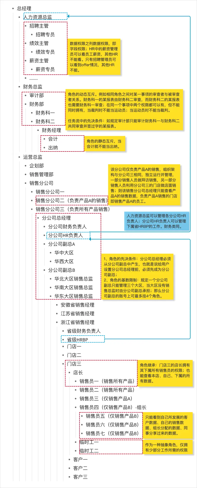

# 授权和鉴权 Authorization & Audit

[B端产品如何设计权限系统？4个要素，5个模型，2个行业案例](https://www.woshipm.com/pd/4854473.html)
[权限系统设计 ACL, DAC, MAC, RBAC, ABAC模型的不同应用场景](https://developer.aliyun.com/article/918347)
[万字长文：深入浅出RBAC权限设计](https://www.woshipm.com/pd/5576757.html)

> 在古代封建社会中央集权的帝制制度下，皇帝把资源下发给特定的人、岗位、宦官集团等以促进农业生产、税收、户籍管理、治安维护等，维系社会运转和控制。
> 其中资源包括权力、办事流程等抽象资源，也包括钱财、粮食、盐、矿等实物资源，同时包括印章、信纸、官服、轿子、马等承载资源、以及兵符等象征权力、代表等级的工具。
> 而管理机制除了帝制，还有子承父业的继承机制、藩王行为规范、文官武官的互斥监督、官职逐级递升约束、虎符口令双向验证等等。

授权和鉴权都在系统权限管理范畴内。所以先认识权限管理。

## why 为什么需要权限管理

一个社会如果没有法律的限制、没有道德的约束，大家恣意妄为，随心所欲，那不是乱套了嘛。同样的道理，如果一个系统，如果谁都可以进行访问各种资源，那也没有知识产权的作用了。

## What 什么是权限管理

权限管理，先拆字理解，管理什么？管理系统资源。权，代表权力，可以控制。限，理解为限制。所以权限管理，可以简单理解为控制系统内的资源在限制条件内进行操作。那怎么限制呢，就需要一种机制。

权限就是控制主体对客体在限定的访问机制下操作的行为。

## 4个基本要素

权限就是控制主体对客体在限定的访问机制下的行为。所以权限管理有 4个基本要素：主体、客体、行为、机制

### 主体

主体指行为的发起者，根据业务场景不同，指代有不同的实体，比如：

- 用户或用户组，也就是系统的使用者，他们与系统的账号体系相对应，一个用户对应一个唯一账号，多个用户组成一个用户组
- 角色及角色组，通常与组织架构，或者业务流程体系相对应。比如 Oracle产品中分为工作角色、职责角色、数据角色和抽象角色四类
- 用户标签及用户标签组，通常是指一些特征属性
- 设备及设备组，HarmonyOS系统首期给Mate40系列开放使用
- IP地址，如限制对某个IP地址的访问
- 理位置，如O2O生活平台在不同位置展示的店铺不同
- 局域网，如公司电脑在内网和外网所访问的资源不同

### 客体

指行为的承受者，是操作的目标对象。主要有三大类：

- 资源：基本的数据、字段等
- 承载资源的容器：页面、菜单、按钮等
- 操作资源所必须的条件：某个流程、数据所属权等。

> 常说的功能权限指的是承载资源的容器（即页面、目录或菜单、Tab、按钮）；数据权限指的是资源本身，如行数据或某个数据字段。

### 行为

指主体对客体的操作，常见的有：登入、登出、增删改查、上传下载、分享等。

### 机制

系统机制包括对主体、客体和主客体关系的认证，主体的行为，以及对行为的授权。常见的机制有：

- 继承。父级可以拥有子级的权限，依托于组织架构或角色层级结构；例如销售部门负责人有所有下属的权限；
- 互斥。是对主体之间责任的强制性规定，防止同一主体拥有足够权限进行欺骗行为，防止即当运动员又当裁判的行为。责任分离有静态和动态之分：
  - 静态互斥。一个用户不能同时拥有两个互斥的角色。例如财务岗位中的会计和出纳不能让同一个人承担；
  - 动态互斥。一个用户可以拥有两个角色，但在运行时只能激活一个角色，也成为运行互斥机制。例如银行内部为了灵活放贷，职员张三可以同时有贷款申请者角色和贷款审批者角色，但对于同一笔贷款，不能即申请又审批。
- 先决条件。A想成为C，就必须先成为B，C只能从B中产生；
- 基数限制。是主体与主体、主体与客体、主体与行为间数量关系的限制。例如一个用户可拥有的角色数目受限；一个角色被分配的用户数量受限；一个角色的权限数目受限；
- 授予机制。是主体将自己的权限授予给其他主体的权限；
- 双向验证。系统即验证主体，也验证客体，双方都通过验证时才能允许主体对客体的行为；
- 共享机制。

另外，就是操作范围的限制，一般依托于以下三类关系：

- 组织架构
- 角色层级结构
- 组织范围的抽象关系

环境限制，依托于以下三类：

- 空间限制。例如针对地理位置、IP地址、局域网的限制
- 时间限制。例如考试时间到了之后，操作权限有所限制
- 频度限制。例如对输入密码的频率的限制

## 5种常见的权限模型

不同的公司或软件提供商，设计了无数种控制用户访问资源的方法。但无论哪种设计，都可归到经典权限模型里:

- 访问控制列表 (ACL, Access Control List)
- 自主访问控制(DAC, Discretionary Access Control)
- 强制访问控制(MAC, Mandatory Access Control)
- 基于角色访问控制(RBAC, Role-based Access Control)
- 基于属性访问控制(ABAC, Attribute-based Access Control)

### 访问控制列表 (ACL, Access Control List)

> 规定资源可以被哪些主体进行哪些操作
> 比如小红编辑博客内容

访问控制列表 (ACL, Access Control List)是最早的，也是最基本的一种访问控制机制，是围绕客体进行控制的模型，在其他模型中也有ACL的身影。

机制：每一个客体都有一个权限列表，列表中记录的是哪些主体可以对这个客体做哪些行为，非常简单，权限列表由管理员统一分配。
当用户A要对一篇文章进行编辑时，ACL会先检查一下文章编辑功能的控制列表中有没有用户A，有就可以编辑，无则不能编辑。
适用场景：部门隔离，如隔离客户资源和人事资源。
例如：王总是一家创业公司的老板，负责一款CMS系统的设计。起初，网站的所有博客内容都由公司唯一的运营小红负责，所以王总就对小红的账号开启博客管理的所有权限（增删改查）。

```
ACL 权限配置表
  资源：博客管理
        主体：小红
        操作：增删改查

        主体：王总（管理员）
        操作：增删改查
      权限页面
        主体: 王总（管理员）
        操作: 增删改查
```

缺点：m个主体访问n个客体，就会产生 m \* n 条列表记录。所以当主体数量变多时，配置和维护的工作就成倍增加，成本大，容易出错。所以只适用于简单的较少数量权限要求的系统中。

可优化的一点，为了解决相同权限的主体挨个重复配置的问题，可以用分组的方法，将相同权限的主体归为一组，所以在实现上有用户组概念。

### 自主访问控制(DAC, Discretionary Access Control)

> 规定资源可以被哪些主体进行哪些操作， 同时主体可以将资源、操作的权限，自主地授予其他主体
> 比如小红授权小明也能编辑博客内容

自主访问控制(DAC, Discretionary Access Control)，是 ACL 的一种扩展。

机制：在ACL模型的基础上，允许主体可以将自己拥有的权限自主地授予其他主体。权限可以脱离管理员分配，主体可以“自主（Discretionary）”授权。
适用场景：文件系统，如各类文档访问权限
例如：每次新增一个内容运营人员，都需要老板王总亲自给他开通权限。因为公司事务繁忙，王总要小红直接可以给新人配置权限。

```
DCL 权限配置表
  资源：博客管理
        主体：小红
        操作：增删改查

        主体：小明
        操作：增改查

        主体：王总（管理员）
        操作：增删改查
      权限页面
        主体: 王总（管理员）
        操作: 增删改查

        主体：小红
        操作：增改查
```

缺点：

1. 对权限控制比较分散，不方便管理：例如无法简单地将一组文件设置统一的权限开放给指定的一群用户。
2. 主体的权限太大，可以随意下放权限，无意间就可能泄露信息。

### 强制访问控制(MAC, Mandatory Access Control)

> a. 规定可以被哪些类别的主体进行哪些操作 b. 规定主体可以对哪些等级的资源进行哪些操作 当一个操作，同时满足a与b时，允许操作。
> 运营实习生只能对草稿状态的博客进行编辑

MAC 弥补 DAC 权限控制过于分散的问题。在 MAC 中所有的访问控制策略重新收归到系统管理员来制定，主体无法改变。同时也避免了 ACL 只围绕客体限制权限的单一方式。
MAC 模型中主要的是双向验证机制，主体有一个权限标识，客体也有一个权限标识，而主体能否对该客体进行操作取决于双方的权限标识的关系。而这种关系通常在管理员分配权限时已经由系统做了硬性限制，所以体现为“强制”访问。

机制：a. 规定资源可以被哪些类别的主体进行哪些操作 b. 规定主体可以对哪些等级的资源进行哪些操作 当一个操作，同时满足a与b时，允许操作。
适用场景：保密系统，如财务数据等
例如：将军分为上将>中将>少将，军事文件保密等级分为绝密>机密>秘密，规定不同军衔仅能访问不同保密等级的文件，如少将只能访问秘密文件；当某一账号访问某一文件时，系统会验证账号的军衔，也验证文件的保密等级，当军衔和保密等级相对应时才可以访问。

```
MAC
资源配置表
  资源: 博客内容
      主体: 运营人员
      状态：草稿
      操作：查看、编辑
主体配置表
  用户管理
    主体: 小明
    部门: 运营部
    岗位：实习生
```

缺点：MAC 对主体和客体的双重验证，确保了资源的交叉隔离，注意安全性。但机制控制太严格，实现工作量大，缺乏灵活性，所以常应用于政府机关。

### 基于角色访问控制(RBAC, Role-based Access Control)

> a. 规定角色可以对哪些资源进行哪些操作 b. 规定主体拥有哪些角色 当一个操作，同时满足a与b时，允许操作。
> 运营人员可以编辑博客内容，小红和小明都是运营部员工，所以他们都可以编辑博客内容，

基于角色访问控制(RBAC, Role-based Access Control)在目前使用的最广泛、最普遍。RBAC 的思想，来源现实世界中企业架构。在主体和权限之间引入了“角色（Role）”的分层概念，角色解耦了主体直接与权限的关系。有四个不同的层次：

- RBAC0：基本模型，相当于ACL+角色。权限被赋予角色，而不是用户，当一个角色被制定给一个用户时，该用户就拥有了该角色所包含的权限。所有的角色都是平级的，没有制定角色层级关系；所有主体对象都没有附加约束，没有制定限制；
- RBAC1：角色分级模型，相当于RBAC0+继承机制，父级角色可以拥有子级角色的权限；
- RBAC2：角色限制模型，相当于RBAC0+互斥机制+先决条件机制+基数限制机制；
- RBAC3：统一模型，相当于RBAC1+RBAC2。

> RBAC 模型于1992年由美国国家标准与技术研究院组织开发，是目前最通用的权限管理模型，节省了很大的权限维护成本。
> 1996年，GerorgeMason 大学的教授 Ravi Sandhu 对 BAC 模型进行改进，提出了 RBAC96 模型族，包括 RBAC0、RBAC1、RBAC2和RBAC3四个模型，其中 RBAC0 是其它模型的基础。

#### RBAC0 基础模型

RBAC0：基本模型，相当于ACL+角色。权限被赋予角色，而不是用户，当一个角色被制定给一个用户时，该用户就拥有了该角色所包含的权限。所有的角色都是平级的，没有制定角色层级关系；所有主体对象都没有附加约束，没有制定限制；

例子：随着运营部门不断发展壮大，每次有新员工入职，王总发现小红都要为新员工单独配置权限，而且无法批量修改，十分繁琐，时常需要王总协助。同时王总发现小红对运营部门员工分工明确，部分人员负责内容审核，需要为他们开启审核管理的权限；部分人员负责产出内容，需要为他们开启内容管理的权限……。于是王总就想在现有的用户层上再抽象出一层——角色层，只要对角色设置权限，属于该角色的人员就自动拥有这些权限。

```
权限表：
  名称：审核管理
  资源：博客内容
  操作：审核

  名称：内容管理
  资源：博客内容
  操作: 增删改查
```

```
用户表
  主体：小明
  角色：审核人员
```

```
角色表：
  名称：审核人员
  权限：审核管理

  名称：内容管理人员
  权限：内容管理
```

#### RBAC1：角色分级模型

RBAC1：角色分级模型，相当于RBAC0+继承机制，父级角色可以直接继承子级角色的权限；

例子：在CMS系统使用了一段时间后，王总发现了一个新问题——系统中存在的角色太多了，因为只要有权限不一样的用户加入系统，就需要新建一个角色，当用户权限分得很细的时候，甚至比ACL还繁琐，于是王总就想着手解决这一问题。

```
角色表
  管理员、运营经理、运营主管、运营-内容审核人员、运营-内容管理人员、运营-内容管理实习生、运营-广告对接人员、运营-内容审核组长
```

他发现角色之间存在着类似组织架构一样的上下级关系，比如运营经理>运营主管>运营组长>运营人员>运营实习生，并且上级拥有下级的所有权限，同时可以额外拥有其他权限，于是他在现有的角色基础上又抽象出一层角色等级。

```
角色表
  管理员
  运营经理
    运营主管
      运营组长
        内容审核人员
        内容管理人员
        广告对接人员
```

在角色中引入上下级关系的RBAC模型就叫做角色继承的RBAC模型（RBAC1），通过给角色分级，高级别的角色可继承低级别角色的权限，一定程度上简化了权限管理工作。

> 角色间的继承关系可分为一般继承关系和受限继承关系。一般继承关系要求角色继承关系是一个绝对偏序关系，允许角色间的多向继承，即下级角色可以拥有多个上级角色，上级角色也可以拥有多个下级角色。而受限继承关系则要求角色继承关系是一个树状结构，角色间只能单向继承，即下级角色只能拥有一个上级角色，但是上级角色可以拥有多个下级角色。

### RBAC2：角色限制模型

RBAC2：角色限制模型，相当于RBAC0+互斥机制+先决条件机制+基数限制机制。

例子：过了一段时间，运营经理小红向王总反馈，她的账号竟然可以看到公司的财务账单，经过核查，是王总由于粗心导致给小红的账号多绑了一个财务经理的角色。为了彻底规避这种风险，王总就让开发加了一条判断：当角色是运营经理时不能同时是财务经理。

这种针对角色进行限制的模型就叫做角色限制的RBAC模型（RBAC2），可以把限制具体地分为静态职责分离（SSD）和动态职责分离（DSD）：

- 静态职责分离（SSD）：
  - 互斥角色：同一用户只能分配到一组互斥角色集合中至多一个角色，比如用户不能同时拥有会计和审计两个角色
  - 基数约束：一个用户可拥有的角色数目受限；一个角色可被分配的用户数量受限；一个角色对应的权限数目受限
  - 先决条件角色：用户想要成为上级角色，必须先成为下一级角色，比如游戏中的转职
- 动态职责分离（DSD）：
  - 允许一个用户具有多个角色，但在运行时只能激活其中某些角色，比如BOSS直聘，一个用户既可以是招聘者也可以是应聘者，但同时只能选择一种身份进行操作

#### RBAC3：统一模型，相当于RBAC1+RBAC2

RBAC3=RBAC1+RBAC2，既引入了角色间的继承关系，又引入了角色限制关系。

#### 优化：组的概念

例子：现有的权限管理模型虽然已经对“角色”进行了层级优化，但并没有优化主体（员工），这就意味着每入职一个新员工，王总还是得单独为其设置权限（绑定角色），还是很麻烦，于是他利用抽象的思想将相同属性的员工进行归类。在公司里，最简单的相同属性就是“部门”了，如果给部门赋予了角色和权限，那么这个部门中的所有用户都有了部门权限，而不需要为每一个用户再单独指定角色，这就相当于用员工进行了分组。

```
主体
  xxx 公司
    财务部
    运营部
    开发部
    ...
```

员工可以分组，权限同样也可以分组。在权限特别多的情况下，可以把同一层级的权限合并为一个权限组，如二级菜单下面有十几个按钮，如果对按钮的操作没有角色限制，可以把这些按钮权限与二级菜单权限合并为一个权限组，然后再把权限组赋予角色就可以了。

```
客体
  资源承载的容器
    菜单
      财务管理
      内容管理
        审核
          操作：通过、拒绝、复核
        文章
          操作：增删改查
        评论
          操作：增删改查
```

“组”概念的引入完善了RBAC模型，在简化操作的同时更贴近了实际业务，便于理解。

### 基于属性访问控制(ABAC, Attribute-based Access Control)

> 规定哪些属性的主体可以对哪些属性的资源在哪些属性的情况下进行哪些操作
> 运营人员只能在上午9点到12点之间在公司内网中可以编辑博客内容

为了内容的安全，运营经理小红向王总提了一个需求：负责内容管理的人员不可以在公司以外的地点发布内容。这可难倒了王总，因为现有的RBAC权限模型仅能对页面/功能/数据赋予权限，没法执行如此精细的权限控制。在查阅相关资料后，王总找到了该问题的解决方法——基于属性的权限管理模型（ABAC）。

基于属性访问控制(ABAC, Attribute-based Access Control)能很好地解决RBAC的缺点，在新增资源时容易维护。

原理：通过动态计算一个或一组属性是否满足某种机制来授权，是一种很灵活的权限模型，可以按需实现不同颗粒度的权限控制。

属性通常有四类：

1. 主体属性，如用户年龄、性别等；
2. 客体属性，如资源的创建时间、创建位置、密级等；
3. 环境属性，即空间限制、时间限制、频度限制；
4. 操作属性，即行为类型，如读写、只读等。

设定一个权限，就是定义一条含有以上四类属性令牌的策略（Policy）。一个访问请求会逐条匹配策略，如果没有匹配到策略，则返回默认效果。默认效果可以根据场景定制，也可以是默认拒绝或允许。另外匹配的方式也可以根据场景定制，可以使用逐条顺序匹配，匹配到就直接返回。或者完全匹配所有策略，如果有一个不符就拒绝（允许），全部符合才允许（拒绝）。

适用场景：防火墙，如端口访问等。
例子：阿里云的RAM访问控制运用的就是ABAC模型：

```
策略表

  效果：允许
  操作：流入
  主体：来自上海IP的客户端
  资源：所有以33开头的端口（如3306）
  情况：在北京时间 9:00~18:00

  效果：禁止
  操作：流出
  主体：任何
  资源：任何
  情况：任何
```

```json
// 阿里云RAM策略配置表
{
  "Version": "1",
  "Statement": [
    {
      "Effect": "Allow",
      "Action": ["oss:List*", "oss:Get*"],
      "Resource": ["acs:oss:*:*:samplebucket", "acs:oss:*:*:samplebucket/*"],
      "Condition": {
        "IpAddress": {
          "acs:SourceIp": "42.160.1.0"
        }
      }
    }
  ]
}
```

## 2个案例分析

[Oracle 系统的 RBAC 模型](https://www.woshipm.com/pd/4854473.html)
[通用型CRM系统 Salesforce](https://www.woshipm.com/pd/4854473.html)

## RBAC 设计步骤

[RBAC 权限设置步骤]('./authorization-rbac-action.md')

另外，前端交互设计注意事项：

- 无权限的页面，通过 URL 也无法访问
- 无权限的操作，交互入口也不展示
- 无权限的数据，在列表中也不显示
- 权限的限制需求前后端都做限制，接口鉴权也要有。

## Casbin

[Casbin](https://casbin.org/zh/) 是一个强大的、高效的开源访问控制框架，其权限管理机制支持多种访问控制模型(ACL,RBAC,ABAC等)。Casbin 在 node 环境的实现依赖包 node-casbin。

[casbin 基本使用]('./authorization-casbin.md')

## 总结

权限管理是整个系统内采用的权限策略的集合，视不同业务场景和需求而采用不同的权限策略。所以要避免以下几个误区：

- 唯RBAC论：尽管RBAC已经被广泛应用，但还是要避免一上来就这么做。权限的设计需要评估数据量和业务复杂度，如果预估的数据量特别少，业务又很简单，那完全可以用其他方式。
- 唯自由配置论：不要认为把权限设置得灵活可配用户就满意了，实际上用户没有那么聪明，他会为角色名称而纠结，看到一系列的权限配置也会不知所措。如果你的业务能够抽象出一些固定角色和统一权限，那就把他们内置起来。
- 权限越多/越细越好：权限不是功能列表，一味地细化而不注重实际业务，只会增加开发工作量，也不利于用户配置。能到菜单权限就不到页面权限，能到页面权限就不到按钮权限；能到行数据权限就不到列数据权限；尽量避免不同用户对相同字段有不同计算规则的情况。可以仅选择常用的功能点作为权限配置，也可以将多个功能点抽象为一个权限点，如将“增删改”三个功能抽象为一个“管理”权限点。

将上文已讲的所有机制及权限对应的场景放入一个公司的管理系统中如下展示：

