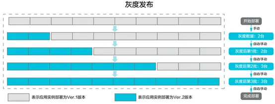

# 发布策略

发布策略，简单理解就是为了实现发布目标的解决方案。

发布策略不是在即将发布的时候才制定的，应该是项目计划阶段的一部分。由产品从研发到上线过程中的所有相关团队负责人共同讨论制定，内容是整个产品生命周期中的发布相关事宜，包括发布前、发布中和发布后三个阶段。发布前最重要的是发布计划，发布过程中监控和日志管理、问题应对方案，发布后的维护方案，整个内容要形成一份文档记录下来。最后，在整个生命周期中，随着需求的变化，发布策略也会动态的随着项目同时改变，文档要做好同步进行更新和维护。

发布策略的具体化目标应该是实现产品的高频低风险的发布。要实现这个目标的核心要素是：发布分支和发布方法

## 发布分支的选择

使用合适的发布分支，可以减少执行发布所需的时间，是高频发布的前提。团队要根据产品的类型、业务的发布周期要求、企业的自动化程度和团队的能力及特点来选择不同的分支策略。发布分支主要有主干发布和分支发布两种。

### 主干发布

主干发布就是用主干代码进行软件发布，所有新特性的开发，都提交到主干上，当需要发布的时候，直接把主干上的代码部署到生产环境。这样可以一直保持主干代码处于随时可发布的状态。

基于主干发布，团队可以选择用特性分支进行开发，开发过程中要注意以下两点：

1. 一是早提交，要将代码尽早提交到主干，缩短开发分支的生存周期。因为分支周期越长，积累的代码数量就越多，在提交到主干分支的时候产生冲突的机会就越大，这样就会增加合并的时间。关于开发分支生存周期多短算是合适，业界说法不统一，在《持续交付2.0》中给出的意见是控制在3天以下，可以结合自己的业务情况做参考。实现短周期需要在最初需求拆分的时候做好规划，控制好需求的颗粒度；
2. 二是早同步，每个开发分支在工作过程中，要及时和主干代码进行同步，至少每天1次，这样可以减少最后合并过程中的代码冲突问题。

### 分支发布

分支发布是专门从主干上拉出一个发布分支，用于对外发布。这样可以在发布的同时，主干持续进行开发，不会受到版本发布的影响。新版本发布后出现缺陷，可以在发布分支修改后同步到主干，也可以在主干上修改后合并到发布分支。

使用分支发布的时候也要注意两点：

1. 一个是分支的存在周期不要过长，如果在发布分支上修改了缺陷，要及时同步到主干分支；
2. 二是不要从发布分支创建新的分支，所有的分支都应该来源于主干分支，保证代码源的唯一性。

综上所述，我们看到不论是主干发布还是分支发布，如果想实现高频低风险，重要的就是要做好三个控制：

- 一是控制分支数，越少越好，最好只有主干分支。
- 二是控制分支生存周期，越短越好。
- 三是控制发布周期，越短越好。软件发布频率越高，发布周期就越短，但是这个频率需要视实际开发需求和场景而定。

## 常见的发布方法

降低发布风险，实现零停机发布，是选择发布方法的主要参考依据。

### 停服发布

停机发布会在发布以前关闭服务，直接将新的版本覆盖掉老的版本，并且将产品依赖的其它服务一并完成升级。

- 优势：
  - 简单, 不太需要考虑新旧版本共存时的兼容性问题
- 劣势：
  - 发布过程中，服务不可用
  - 只能在业务低峰期 (往往是夜间)发布，并且需要很多团队在一起工作
  - 出现故障后很难回滚
- 适合场景：
  - 开发和测试环境
  - 非关键应用，用户影响面小
  - 兼容性比较难管控的场景

### 金丝雀发布 Canary Release

金丝雀这个术语的来历：

> 矿井中的金丝雀：17 世纪，英国矿井工人发现，金丝雀对瓦斯这种气体十分敏感。空气中哪怕有极其微量的瓦斯，金丝雀也会停止歌唱；当瓦斯含量超过一定限度时，虽然鲁钝的人类毫无察觉，金丝雀却早已毒发身亡。当时在采矿设备相对简陋的条件下，工人们每次下井都会带上一只金丝雀作为瓦斯检测指标，以便在危险状况下紧急撤离。

在软件发布中，金丝雀发布指的是将新特性的代码先发布到一台机器上，或者小比例的部分机器上，承接访问流量，做功能验证。根据用户反馈决定是扩大发布还是回滚代码。金丝雀发布通常会结合产品监控系统，通过监控指标，观察充当金丝雀功能的机器的健康状况。如果金丝雀测试通过，则把剩余的机器逐步升级成新版本，否者出现问题，立即回滚代码。

- 优势：
  - 对用户体验影响较小，在金丝雀发布过程中，只有少量用户会受影响 -发布安全能够得到保障
- 劣势：
  - 金丝雀的机器数量比较少，承担的访问量也比较少，会有一些问题并不能够暴露出来
  - 如果集群机器比较多，一台一台发布，发布时间会比较长
- 适用场景：
  - APM 监控比较完备且与发布系统集成

实现上，通常也是配合 nginx 负载均衡设置，具体步骤：

1. 在集群服务上，选一台服务作为金丝雀，设置 `down`，然后在此服务器上部署新功能的代码。
2. 部署完成后，切换小部分流量到此服务，进行观察。
3. 如果没有问题，则增加流量权重，然后再重复上述步骤。如果有问题，则重新下线该服务，进行代码回滚，重新部署旧代码。

```
# 将作为金丝雀的服务下线
upstream  lb_servers{
    server 111.13.103.91 down;
    server 111.13.179.222;
}

# 部署成功后，切换小部流量
upstream  lb_servers{
    server 111.13.103.91 weight=10;
    server 111.13.179.222 weight=90;
}
```

### 灰度发布 Gray Release (滚动发布)

> 黑与白中间颜色即为灰。互联网产品的灰度测试，在一开始，不去定义这个产品是黑，还是白，让它有一个灰度的周期。在这个灰度周期里，让用户的口碑决定它是生是死，是白还是黑。



灰度发布的具体步骤：

1. 通过 nginx 先 down 一台或小批量服务，然后在这些服务上部署新功能的应用，完成部署后，先不直接将流量切过来，而是测试人员对新版本进行线上测试，这些开始的服务就是作为金丝雀作用的服务。
2. 如果测试没有问题，那么可以将少量的用户流量导入到已经部署且完成测试的新功能的服务上，然后通过APM等服务监控系统对新版本做运行状态观察，收集各种运行时数据，如果此时对新旧版本做各种数据对比，进行所谓的 A/B 测试(A/B Testing)。
3. 当确认新版本运行良好后，再逐步将更多的流量导入到新版本的服务上，在此期间，还可以不断地调整新旧两个版本运行的服务器副本数量，以使得新版本能够承受越来越大的流量压力。直到将集群中所有机器都切换到新版本上，且流量 100% 放行后，完成灰度发布。
4. 如果在灰度发布过程中发现了新版本有问题，就应该立即将流量切回还未升级的老版本机器上，再对新版本的机器做回滚操作，就会将负面影响控制在最小范围内。

所以说灰度发布是金丝雀发布的延伸，金丝雀发布是灰度发布的初始阶段。实现灰度发布的闭环流程，还包括：放量规则，用户筛选、发布频率、应用的部署策略、回滚策略、前端埋点系统（用户反馈信息或用户行为如何收集）、后端 APM 监控系统等，以此决定下一批次的放量。

- 优势：
  - 用户体验影响比较小, 不需要停机发布
  - 能够控制发布风险
- 劣势：
  - 发布时间会比较长
  - 需要复杂的配套服务，比如发布系统、负载均衡器、APM监控系统等
  - 需要考虑新旧版本共存时的兼容性
- 适用场景：
  - 适合可用性较高的生产环境发布

### 蓝绿发布 Blue/Green Release

蓝绿部署，是采用两个分开的集群对软件版本进行升级的一种方式。它的部署模型中包括一个蓝色集群 Group1 和一个绿色集群 Group2，在没有新版本上线的情况下，两个集群上运行的版本是一致的，同时对外提供服务。

当需要升级版本时，蓝绿部署的流程是：

1. 无新版本发布时，蓝主机组和绿主机组同时对外提供服务；
2. 从负载均衡器列表中删除集群Group1，让集群 Group2 单独提供服务。
3. 在集群 Group1 上部署新版本。
4. 集群 Group1 升级完毕后，把负载均衡列表全部指向 Group1，并删除集群 Group2 ，由 Group1 单独提供服务。
5. 在集群 Group2 上部署完新版本后，再把它添加回负载均衡列表中。

这样，就完成了两个集群上所有机器的版本升级。

- 优势：
  - 升级切换和回退速度非常快
  - 零停机时间
- 劣势：
  - 一次性的全量切换, 如果发布出现问题, 会对用户产生比较大的影响
  - 需要两倍的机器资源
  - 需要中间件和应用自身支持热备集群的流量切换
- 适用场景：
  - 机器资源比较富余或者按需分配 (背靠云厂商)

### A/B testing

A/B testing 从目的上看，并不算一种发布方案， A / B 测试更属于测试范畴。通过灰度发布的方式来验证 A / B 功能的差异，来决策产品最终发布的功能。

### 功能开关

这种发布方式是利用代码中的功能开关来控制发布逻辑，是一种相对比较低成本和简单的发布方式。研发人员可以灵活定制和自助完成的发布方式。这种方式通常依赖于一个配置中心系统，当然如果没有，可以使用简单的配置文件。

应用上线后，开关先不打开，只待一声令下，可以全量打开开关，也可以按照某种维度(公司ID，用户ID等)分批打开开关进行流量验证，如果有问题，则随时关闭开关。

- 优势
  - 升级切换和回退速度非常快，而且相对于复杂的发布工具，成本较为低廉。
- 劣势
  - 代码的侵入性较高，开关本身也是代码，而且是与业务无关的代码
  - 必须定期清理老版本的逻辑，否则维护和交接代码成本增加。

## 延伸知识点

在 DevOps 的整个流程节点中，有一部分是 CI/CD 节点，有很多不同的语义：

- 持续集成 Continuous Integration (CI)
- 持续交付 Continuous Delivery (CD)
- 持续部署 Continuous Deployment (CD)
- 持续发布 Continuous Release

这些节点在研发流程中位置如下：

```
开发 ==> 集成(构建) ==> 交付 ==> 部署 ==> 发布
===============持续测试===================>
```

- 持续集成：每当开发人员提交了新代码之后，就对整个应用进行构建，并对其执行全面的自动化测试集合。根据构建和测试结果，我们可以确定新代码和原有代码是否正确的集成在一起，目的是让正在开发的软件始终处于可用的状态。
- 持续交付是持续集成的延伸，将集成后的代码部署到类生产环境，比如准生产环境等，确保可以以可持续的方式快速向客户发布新的更改。如果持续测试，代码没有问题，可以继续部署到生产环境中。目的是确保可以以可持续的方式快速向客户发布新的更改；
- 持续部署是在持续交付的基础上，把部署到生产环境的过程自动化。
- 持续发布是把新特性提供给客户的过程，让功能对用户可见的这个过程称为发布。比如说在 nginx 中把访问流量切换到已完成新功能部署的对应服务上。
- 持续测试是贯穿整个研发流程始终的，从持续集成到持续部署，都有自动化测试的存在。

这里面共同出现的“持续”一词，可以理解为是敏捷开发概念在 devops 研发流程中的延续，主要是指软件功能的小批次的频繁的操作。比如某个功能在特性分支上工作，并且定期向主干分支合并，同时始终让主干分支保持可发布状态，并能做到在正常工作时段里按需进行一键式的自动化发布。不管是在测试过程中，还是用户使用过程中，发现的问题（包括缺陷、性能问题、安全问题、可用性问题等），开发人员都能快速得到反馈，并立即加以解决。然后循环上述过程，保持这样一个“持续”的软件开发过程。

要更好的理解这些名词的不同含义，可以从开发、技术、业务角度来解读：

**持续集成是一个开发实践，持续部署是一个自动化的技术实践，持续交付和持续发布是一个业务行为。**

## 参考链接

-[一文读懂敏捷开发的发布策略](https://bbs.huaweicloud.com/blogs/313749)

- [蓝绿部署、金丝雀发布（灰度发布）、A/B测试的准确定义](https://www.lijiaocn.com/%E6%96%B9%E6%B3%95/2018/10/23/devops-blue-green-deployment-ab-test-canary.html) --- 指出了 AB test 关注点在多功能版本差异
- [要进大厂？前端灰度发布必须要知道](https://juejin.cn/post/6844903969110622222) --- 指出灰度中逻辑灰度在前端实现的伪代码
- [常见应用发布方式浅析](https://blog.csdn.net/zhinengyunwei/article/details/104043703) --- 图文并茂，列举了多种服务器部署方式
- [灰度发布：灰度很简单，发布很复杂](https://blog.csdn.net/justdo2008/article/details/80551247) --- 明确了灰度是一个系统性概念，包含一系列工作的集合。
- [前端工程化：构建、部署、灰度](https://zhuanlan.zhihu.com/p/71562853)
