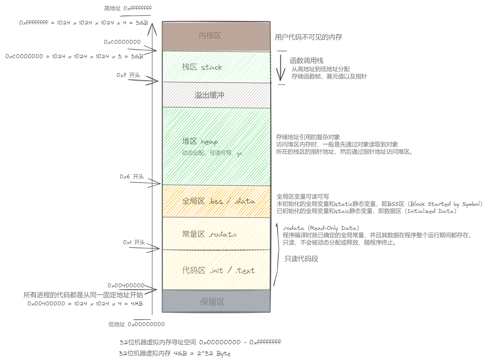
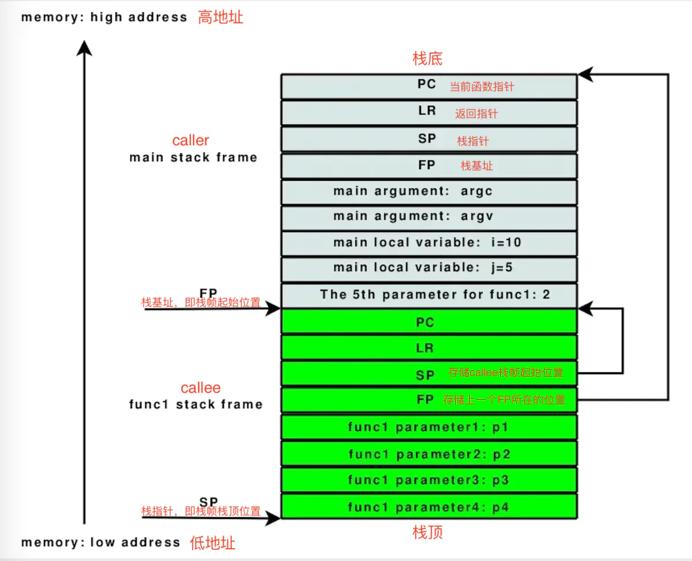
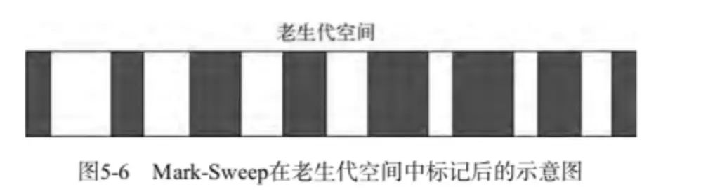
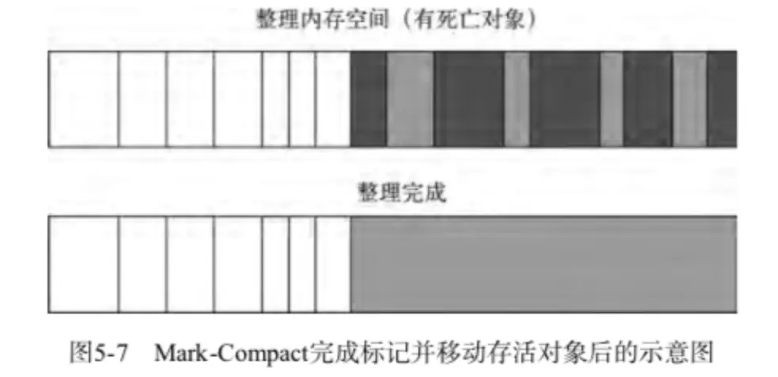

# 应用程序内存管理

```
内存系统目录：
- 计算机的存储：软盘、硬盘、内存、缓存、虚拟内存
- 什么是内存、堆、栈
- 内存的生命周期：内存分配、内存的使用、内存释放和内存回收
- 内存管理：手动和自动
- v8 的内存回收机制，主要针对堆内存
  - 早期的引用计数
  - 分代回收：新生代区和老生代区
  - 回收算法：Scavenge / Mark-Sweep（标记－清除） / Mark-compact（标记－紧缩）Incremental marking（增量标记）/ lazy sweeping（惰性清理）
- 什么是内存泄漏
- 如何排查内存泄露
  - 内存泄漏的症状
  - 内存泄漏的检查：怎么知道应用占用了多少内存，怎么看内存变化趋势？
- 常见的内存泄漏原因
- 如何预防内存泄漏
```

计算机内存管理通常分为三个方面，尽管区别有点模糊：

- 硬件内存管理：硬件级别的内存管理，这和内存实际嵌入的电子设备有关，通常包括 RAM、ROM、高速缓存等内容。具体内容见上一节。
- 操作系统内存管理：在操作系统中，内存必须分配给应用程序，并在不再需要内存时由其他程序重用。每个程序都拥有计算机实际的物理内存。
- 应用程序内存管理：应用程序内存管理涉及从操作系统分配的有限的可用内存中提供程序代码中对象和数据结构所需的内存，当不再需要时回收该内存以供重复使用。由于应用程序通常无法预先预测它们将需要多少内存，也无法无限制地使用内存，因此它们需要额外的代码来处理不断变化的内存需求。这就是任何一种编程语言都要实现内存管理器功能。

> 引用 [Memory management Reference](https://www.memorymanagement.org/mmref/begin.html#hardware-memory-management)

## 进程地址空间划分

> 划分以 C 语言为例，没有找到 JS 语言相关，仅作参考
> 这里的进程内存指虚拟内存，不是物理内存。应用的虚拟内存默认分配 4G 大小，但五大区只占 3G，还有 1G 是五大区之外的内核区

进程内存按照内存地址从低到高划分五大区：代码区(.init/.text)、常量区(.rodata)、全局静态区(.data/.bss)、堆区(heap)、栈区(.stack)。（内核区和保留部分不再考虑范围内）

- 代码区 .init/.text ：（0x00400000）代码区是编译时分配，主要用于存放程序初始化和运行时的代码，主要是程序编码后的 CPU 指令。
- 常量区 .rodata : （0x1 开头）主要存放编译时可确定的全局常量，在程序运行期不能被改变，常量因为可能在程序中被多次使用，所以在程序运行之前就会提前分配内存。空间由系统管理，生命周期为整个程序运行期。
- 全局静态区 .data / .bass : 全局变量是指变量值可以在运行时被动态修改，而静态变量是 static 修饰的变量，包含静态局部变量和静态全局变量。
  - 未初始化的全局变量和静态变量，即BSS区（.bss）
  - 已初始化的全局变量和静态变量，即数据区（.data）
- 堆区 heap : （0x6开头）堆是从低向高地址扩展的数据结构，是一块不连续的内存区域。存储着栈中指针指向的实际对象。程序运行时动态申请和分配，存放对象等引用类型的变量。访问堆区内存时，一般是先通过对象读取到对象所在的栈区的指针地址，然后通过指针地址访问堆区。堆区管理需要注意 野指针（提前释放了，查询时找不到内容）、内存泄露（没有释放，一直占用内存）、过度释放（对已释放的对象进行release操作）。
- 栈区 stack ：（0x7开头）栈是从高地址向低地址扩展，是一块连续的内存区域，存储方法和函数帧、基元值以及指向存储对象的指针。由系统管理在函数调用时开辟空间，函数调用结束时回收空间。



## 函数栈

函数栈又称为栈区，在内存中从高地址往低地址分配，与堆区相对，具体图示请查看文章最开始的图示。

栈帧是指函数（运行中且未完成）占用的一块独立的连续内存区域，应用中新创建的每个线程都有专用的栈空间，栈可以在线程期间自由使用。而线程中有千千万万的函数调用，这些函数共享进程的这个栈空间。每个函数所使用的栈空间是一个栈帧，所有的栈帧就组成了这个线程完整的栈。

函数调用是发生在栈上的，每个函数的相关信息（例如局部变量、调用记录等）都存储在一个栈帧中，每执行一次函数调用，就会生成一个与其相关的栈帧，然后将其栈帧压入函数栈，而当函数执行结束，则将此函数对应的栈帧出栈并释放掉。



上述图示说明：

- main stack frame 为主函数的栈帧
- func1 stack frame 为当前函数(被调用者)的栈帧
- 栈底在高地址，栈向下增长。
- FP 就是栈基址，它指向函数的栈帧起始地址
- SP 则是函数的栈指针，它指向栈顶的位置。
- ARM 压栈的顺序很是规矩(也比较容易被黑客攻破么)，依次为当前函数指针PC、返回指针LR、栈指针SP、栈基址FP、传入参数个数及指针、本地变量和临时变量。如果函数准备调用另一个函数，跳转之前临时变量区先要保存另一个函数的参数。
- ARM 也可以用栈基址和栈指针明确标示栈帧的位置，栈指针SP一直移动，ARM的特点是，两个栈空间内的地址（SP+FP）前面，必然有两个代码地址（PC+LR）明确标示着调用函数位置内的某个地址。

堆栈溢出：一般情况下应用程序是不需要考虑堆和栈的大小的，但是事实上堆和栈都不是无上限的，过多的递归会导致栈溢出，过多的alloc变量会导致堆溢出。

所以预防堆栈溢出的方法：

1. 避免层次过深的递归调用；
2. 已经不使用的变量及时释放，注意闭包中长时间引用的变量
3. 避免分配占用空间太大的对象，并及时释放;

## 应用程序的内存管理

在应用程序中，内存的生命周期通常要经历：

- 分配：当我们申明变量、函数、对象的时候，自动为他们需要的内存
- 使用：即读写内存，也就是使用变量、函数调用等
- 释放：变量或函数不再被引用
- 回收：垃圾回收机制自动回收不再使用的内存。

大多数内存管理的问题都在这个释放和回收阶段。在这里最艰难的任务是找到“哪些被分配的内存确实已经不再需要了”。不同应用程序对内存分配和内存回收的处理方式的不同，分为：

- 手动内存管理：主要是指由程序员主动告知程序中何时开始分配内存和何时回收内存，比如 C 语言中的 malloc 函数调用就好像在对内存管理器说“现在分配这么多内存给我使用”，当使用完后不需要时，调用 free 函数，好像在说“我已经完成任务了，现在不需要了，可以回收此内存”，如果没有这样的指令，内存管理器不会回收任何内存。这类编程语言有 C / C++ / Pascal / Fortran 等。
- 自动内存管理：程序的内存管理器会根据代码中的数据声明自动分配对应数据类型需要的内存块，也会主动去回收已经不再使用的内存以便下次重复使用。大多数现代高级编程语言都嵌入了“垃圾回收器”，比如 Basic / Perl / Java / Javascript / Python 等。

这些编程语言中，最大的差异就是内存回收的实现方法了。内存的回收通常需要考虑以下问题：

- CPU 的开销，执行内存回收的代码要占用 CPU 一段时间。
- 暂停时间，执行内存回收所需要的时间，这段时间内不会执行应用代码，如果清理时间较长就会影响到应用交互体验或事件响应。
- 内存开销，程序的内存管理器执行回收逻辑，本身也要占用一部分内存。还有就是一部分没法完全回收的内存碎片的处理。

> 引用 [Memory management Reference](https://www.memorymanagement.org/mmref/begin.html#manual-memory-management)

## V8 引擎的内存管理

Node.js 使用 Chrome 的 V8 引擎来运行 JavaScript。所以 Node 上能够执行 JavaScript 直接受益于V8，可以随着V8的升级就能享受到更好的性能或新的语言特性(如ES5和ES6)等。

所以说 nodejs 的内存管理，实际上是要理解 V8 如何管理 JS 程序的内存使用。

> 引用：[深入浅出nodeJS - 2 - (内存控制、理解Buffer、网络编程)](https://segmentfault.com/a/1190000018850117)

在 V8 中，程序可用内存分区如下（可用主要指随程序运行会变化的两大内存区域，不包括代码区、常量区、静态区等）：

- Stack memory 栈内存：存储静态数据、方法和函数帧、基元值以及指向存储对象的指针。栈是从高地址向低地址扩展，是一块连续的内存区域，它们以 LIFO(Last In First Out) 后进先出顺序入栈和出栈，由系统管理。(函数调用时开辟空间，函数调用结束时回收空间)，所以这里没有什么太多担心的问题。
- Heap memory 堆内存：堆是从低向高地址扩展的数据结构，是一块不连续的内存区域。存储着栈中指针指向的实际对象。因为 JavaScript 中的所有内容都是一个对象，这意味着所有动态数据（如数组、函数、闭包、集合和所有类的实例等）都存储在堆中。因此堆是应用程序使用最大的内存块，也是垃圾回收 （GC: Garbage Collection） 发生的地方。

Nodejs 同时也受到V8的限制，尤其是内存使用上。一般的后台开发语言中，内存使用的大小几乎没有限制。但是，V8 最初是为浏览器的打造的，在V8引擎的实现中，64位系统只可以操纵 1.4GB 内存，32位系统只可以操纵 0.7GB 内存。

在 Nodejs 中运行程序，栈内存一般限制在 984 KB，堆内存使用限制大约是 4GB，不同的机器可能会有不同。具体使用值可以通过以下代码查看：

查看栈内存

```sh
node --v8-options
# 会输出一堆数据，找到 --stack_size
--stack_size (default size of stack region v8 is allowed to use (in kBytes))
    type: int  default: 984
```

要增加最大堆栈大小，可以如下操作：

```
$ node --stack_size=1200
```

查看堆内存

```js
import v8 from "node:v8"

const stat = v8.getHeapStatistics()
console.log("🚀 ~ stat:", stat)

// 输出，单位 byte , /1024 = k / 1024 = m / 1024 = G
🚀 ~ stat: {
  total_heap_size: 4915200,  // 4.6875M 当前分配的总堆大小
  total_heap_size_executable: 524288, // 0.5M 为编译字节代码分配的堆大小
  total_physical_size: 4915200, // 4.6875M 硬盘的总可用大小
  total_available_size: 4342102128, // 4140.951M / 1024 = 4.043G 总的可用堆大小
  used_heap_size: 4103072, // 3.91M  分配给应用程序的堆大小
  heap_size_limit: 4345298944, // 4144M / 1024 = 4.046G 堆大小的限制，默认值为 max_old_space_size
  malloced_memory: 262256, // 0.2501M. 当前已分配的内存
  peak_malloced_memory: 100384, // 0.0957M 峰值分配的内存
  does_zap_garbage: 0, // 设置为0或1，表示 选项已启用或未启用 zap_code_space
  number_of_native_contexts: 1, // 活跃的顶层本地上下文
  number_of_detached_contexts: 0 // 未被垃圾收集的分离上下文
}
```

在浏览器中，V8 限制的内存可能没办法更改，但是在 nodejs 中，可以通过 `max-old-space-size` 命令行参数，它的单位是 Mb，更改限制值。

```sh
# 将内存限制值 heap_size_limit 更改为8G
node --max-old-space-size=8192 test.js
```

但是一般不会调高，因为内存多了之后，每次垃圾回收的时间也会增长，这也是为啥v8 对内存使用有限制的原因。

## 内存分配

为了不让程序员费心分配内存，JavaScript 语言在出现以下情形时，V8 会自动根据值的类型分配所需的内存。

- 变量初始化值时，根据值的类型分配内存

```js
var n = 123 // 给数值变量分配内存
var s = "azerty" // 给字符串分配内存

var o = {
  a: 1,
  b: null,
} // 给对象及其包含的值分配内存

// 给数组及其包含的值分配内存（就像对象一样）
var a = [1, null, "abra"]

function f(a) {
  return a + 2
} // 给函数（可调用的对象）分配内存

// 函数表达式也能分配一个对象
someElement.addEventListener(
  "click",
  function () {
    someElement.style.backgroundColor = "blue"
  },
  false,
)
```

- 通过函数调用时分配内存，有些函数的调用结果是分配对象内存

```js
// 有些函数调用结果是分配对象内存
var d = new Date() // 分配一个 Date 对象
var e = document.createElement("div") // 分配一个 DOM 元素

// 有些方法的调用就是分配新变量或者新对象
var s = "azerty"
var s2 = s.substr(0, 3) // s2 是一个新的字符串
// 因为字符串是不变量，
// JavaScript 可能决定不分配内存，
// 只是存储了 [0-3] 的范围。

var a = ["ouais ouais", "nan nan"]
var a2 = ["generation", "nan nan"]
var a3 = a.concat(a2)
// 新数组有四个元素，是 a 连接 a2 的结果
```

## 内存的使用

用值的过程。实际上是对分配内存进行读取与写入的操作。读取与写入可能是写入一个变量或者一个对象的属性值，甚至传递函数的参数。

## 内存的释放

栈中的内容由操作系统自动实现创建与释放，每调用一个函数都会创建一个函数栈，函数内部的创建的变量在这个栈里有效，当函数返回时，这个函数栈会整体的被弹出，这些变量就变得不可见了，也就等同于被释放了。函数栈的空间范围，就是栈内变量的生命周期，变量仅在其生命周期内有效。

堆中内容的使用，其实都需要通过栈作为中转。分配一个堆上的空间，会在栈上有一个指针类型的变量与之关联，之后对堆内容的读写操作，无一不是通过与之关联的栈上指针变量进行的。

很显然，栈与堆存在着依赖关系，它们同生不同死，一个是自生自灭，另一个却贪恋红尘、不死不休。所以内存管理的核心是对堆内存的管理，要解决的最难的问题是找到“哪些被分配的内存确实已经不再需要了”。目前广泛流行的程序语言有两种主流的解决方案：

- 一种是手动管理方式(比如C/C++)，它要求开发人员来确定在程序中哪一块内存不再需要并且主动释放它。
- 另一种是垃圾回收管理方式(Java/Javascript/Golang)。它们嵌入了“垃圾回收器”，它的主要工作是跟踪内存的分配和使用，以便当分配的内存不再使用时，自动释放它。

> 现在出现了第三种方案，就是 Rust 提出的所有权机制。

## V8 的垃圾回收机制 GC

垃圾回收器要解决的基本问题就是，找到堆内存中那些不再被直接或间接引用的对象，并释放掉它们所占的堆内存，以便为创建新对象分配需要的堆内存。

### 引用

垃圾回收算法主要依赖于引用的概念。在内存管理的环境中，一个对象如果有访问另一个对象的权限（隐式或者显式），叫做一个对象引用另一个对象。例如，一个 Javascript 对象具有对它原型的引用（隐式引用）和对它属性的引用（显式引用）。在这里，“对象”的概念不仅特指 JavaScript 对象，还包括函数作用域（或者全局词法作用域）。

这是一项昂贵的计算任务，并且由于 javascript 是单线程执行语言，垃圾回收期间，将中断应用程序执行，直到垃圾回收完成。V8的垃圾回收器的实现，现在已经成熟，其性能优异，停顿短暂，性能负担也非常可控，一次垃圾回收基本都是毫秒级。

### V8 早期的引用计数垃圾回收

> 引用 [MDN 内存管理-垃圾回收](https://developer.mozilla.org/zh-CN/docs/Web/JavaScript/Memory_Management#%E5%9E%83%E5%9C%BE%E5%9B%9E%E6%94%B6)

这是 V8 最早最初级的垃圾收集算法，此算法把“对象是否不再需要”简化定义为“对象有没有其他对象引用到它”。如果没有引用指向该对象（零引用），对象将被垃圾回收机制回收。

```js
var o = {
  a: {
    b: 2,
  },
}
// 两个对象被创建，一个作为另一个的属性被引用，另一个被分配给变量 o
// 很显然，没有一个可以被垃圾收集

var o2 = o // o2 变量是第二个对“这个对象”的引用

o = 1 // 现在，“这个对象”只有一个 o2 变量的引用了，“这个对象”的原始引用 o 已经没有

var oa = o2.a // 引用“这个对象”的 a 属性
// 现在，“这个对象”有两个引用了，一个是 o2，一个是 oa

o2 = "yo" // 虽然最初的对象现在已经是零引用了，可以被垃圾回收了
// 但是它的属性 a 的对象还在被 oa 引用，所以还不能回收

oa = null // a 属性的那个对象现在也是零引用了
// 它可以被垃圾回收了
```

该算法有个限制：无法处理回收循环引用的对象。

在下面的例子中，两个对象被创建，并互相引用，形成了一个循环。它们被调用之后会离开函数作用域，所以它们已经没有用了，可以被回收了。然而，引用计数算法考虑到它们互相都有至少一次引用，所以它们不会被回收。

```js
function f() {
  var o = {}
  var o2 = {}
  o.a = o2 // o 引用 o2
  o2.a = o // o2 引用 o

  return "azerty"
}

f()
```

另一个更具实际意义的例子：myDivElement 这个 DOM 元素里的 circularReference 属性引用了 myDivElement，造成了循环引用。如果该属性没有显示移除或者设为 null，引用计数式垃圾收集器将总是且至少有一个引用，并将一直保持在内存里的 DOM 元素，即使其从 DOM 树中删去了。如果这个 DOM 元素拥有大量的数据 (如上的 lotsOfData 属性)，而这个数据占用的内存将永远不会被释放。

```js
var div
window.onload = function () {
  div = document.getElementById("myDivElement")
  div.circularReference = div
  div.lotsOfData = new Array(10000).join("*")
}
```

### V8 现代的垃圾回收

现在 V8 的垃圾回收机制可以理解为：两个阶段（新生代和老生代）和四种算法（Scavenge 和 Mark-Sweep（标记－清除） / Mark-compact（标记－紧缩）/ Incremental marking（增量标记）/ lazy sweeping（惰性清理）。

- 新生代：即存活周期较短的JAVASCRIPT对象，如临时变量、字符串等
- 老生代：为经过多次垃圾回收仍然存活，存活周期较长的对象，如主控制器、服务器对象等。
- Scavenge 算法：速度快，无内存碎片，通过复制的方式进行内存空间管理，是一种典型的以空间换时间的算法，主要作用于新生代区域执行 GC
- Mark-Sweep（标记－清除） / Mark-compact（标记－紧缩），通过标记来对老生代区域进行内存整理和回收，主要作用于老生代区域执行GC

> 引用：
>
> 1. [深入浅出node.js学习笔记—node内存管理及GC机制](https://segmentfault.com/a/1190000019609360)
> 1. [A tour of V8: Garbage Collection](https://jayconrod.com/posts/55/a-tour-of-v8-garbage-collection)
> 1. [V8 之旅： 垃圾回收器](http://newhtml.net/v8-garbage-collection/) --- 前一个链接的中文翻译，非常值得看，该博主有 V8 系列的博文

以下内容引用自 **V8 之旅： 垃圾回收器**

v8 将程序内存的划分栈内存和堆内存，然后在 堆内存中，进一步细分为：

- New-space 新生代区: 大多数对象都在此处分配。新生区是一个很小的区域，垃圾回收在这个区域会非常频繁，与其它区域对比相对独立。
- Old-pointer-space 老生代指针区：这里包含大多数可能存在指向其他对象的指针的对象。大多数在新生代区存活一段时间之后的对象都会被挪到这里。
- Old-data-space: 这里存放只包含原始数据的对象（这些对象没有指向其他对象的指针）。字符串、封箱的数字以及未封箱的双精度数字数组，在新生区存活一段时间后会被移动到这里。
- Large-object-space 大对象区: 这里存放体积超越其他区大小的对象。每个对象有自己mmap产生的内存。垃圾回收器从不移动大对象。
- Code-space 代码区: 代码对象，也就是包含JIT之后指令的对象，会被分配到这里。这是唯一拥有执行权限的内存区（不过如果代码对象因过大而放在大对象区，则该大对象所对应的内存也是可执行的。译注：但是大对象内存区本身不是可执行的内存区）。
- Cell-space（cell 区）, property-cell-space（属性 cell 区） and map-space（Map 区）: 这些空间中的每一个都包含大小相同的对象，并且对它们指向的对象类型有一些限制，从而简化了收集。

> 上述是堆内存的细分，但从垃圾回收器的角度，通常会被简单理解为：新生代区和老生代区，因为这两块是 GC 的主要工作场所。

每个区域都由一组内存页构成，内存页是一块连续的内存。除大对象区的内存页较大之外，每个区的内存页都是1MB大小，且按1MB内存对齐。除了存储对象，内存页还含有一个页头（包含一些元数据和标识信息）以及一个位图区（用以标记哪些对象是活跃的）。另外，每个内存页还有一个单独分配在另外内存区的槽缓冲区，里面放着一组对象，这些对象可能指向其他存储在该页的对象。这就是一套经典配置方案。

#### 区分指针和数据

垃圾回收器面临的第一个问题是，如何才能在堆中区分指针和数据，因为指针指向着活跃的对象。大多数垃圾回收算法会将对象在内存中挪动（以便减少内存碎片，使内存紧凑），因此即使不区分指针和数据，我们也常常需要对指针进行改写。

目前主要有三种方法来识别指针：

- 保守法：这种方法对于缺少编译器支持的情况非常必要。大体上，我们将所有堆上对齐的字都认为是指针，这就意味着有些数据也会被误认为是指针。于是某些实际是数字的假指针，会被误认为指向活跃的对象，则我们会时常出现一些奇异的内存泄漏。（译注：因为垃圾回收器会以为死对象仍然还有指针指向，错将死对象误认为活跃对象）而且我们也不能移动任何内存区域，因为这很可能会导致数据遭到破坏。这样，我们便无法通过紧凑内存来获得任何好处（比如更容易的内存分配、更少的内存访问、更有效的内存局部性缓存）。C/C++的垃圾回收器扩展会采用这种方式，比如Boehm-Demers-Weiser。
  译注：如果内存是紧凑的，则内存分配时可以更容易分配较大片的内存，而无需因内存碎片而不断查找；同时，由于已分配的内存是连续或近似连续的，而Cahce所能缓存的内存有限，如果内存被Cache缓存起来，无需频繁地迫使Cache更换缓存的内存。C/C++由于指针算术的存在，编译器无法确定哪些内存是真正的垃圾，因而无法给垃圾回收器有效的提示，进而导致垃圾回收器不得不采取这样的保守策略。
- 编译器提示法：如果我们和静态语言打交道，则编译器能够准确地告诉我们每个类当中指针的具体位置。而一旦我们知道对象是哪个类实例化得到的，我们就能知道对象中所有的指针。JVM选择了这样的方法来进行垃圾回收。可惜，这种方法对于JS这样的动态语言来说不太好使，因为JS中对象的任何属性既可能是指针，也可能是数据。
- 标记指针法：这种方法需要在每个字的末位预留一位来标记这个字代表的是指针抑或数据。这种方法需要一定的编译器支持，但实现简单，而且性能不俗。V8采用的就是这种方法。某些静态语言也采用了这样的方法，如OCaml。
  V8将所有属于-230…230-1范围内的小整数（V8内部称其为Smis）以32bit字宽来存储，其中的最低一位保持为0，而指针的最低两位则为01。由于对象以4字节对齐，因此这样表达指针没有任何问题。大多数对象所含有的只是一组标记后的字，因此垃圾回收可以进行的很快。而有些类型的对象，比如字符串，我们确定它只含有数据，因此无需标记。

#### 分代回收

在程序代码中，绝大多数对象的生存期很短，只有某些对象的生存期较长。为利用这一特点，V8将堆内存进一步进行分区管理。对象起初会被分配在新生代区（通常很小，只有1-8 MB，具体根据行为来进行分配）。

在新生区的内存分配非常容易：只需保有一个指向内存区的指针，不断根据新对象的大小对其进行递增即可。当该指针达到了新生区的末尾，就会有一次清理（小周期），清理掉新生区中不活跃的死对象。对于活跃超过2个清理小周期的对象，则需将其移动至老生代区。

老生代区使用Mark-Sweep（标记－清除） / Mark-compact（标记－紧缩）算法进行回收（大周期）。大周期进行的并不频繁。一次大周期通常是在老生区积累了足够多的对象后才会发生。至于足够多到底是多少，则根据老生代区自身的大小和程序的动向来定。后期为了优化标记-清除和标记-紧缩算法的执行时间，在 2012 年，Google 引入了两项改进来减少垃圾回收所引起的停顿，并且效果显著：Incremental marking（增量标记）/ lazy sweeping（惰性清理）。

#### Scavenge 算法

新生代区的内存清理发生的很频繁，清理必须进行的非常快速。V8 在此处的清理算法称为Scavenge算法，它主要是按照 Cheney 算法实现的。Cheney 算法将新生代区内存划分为两个等大子区，分别叫做 From 区（出区）和 To 区（入区），From区为使用区，To区为区，绝大多数内存的分配都会先分配到 From 区（除了某些特定类型的对象，如可执行的代码对象是直接分配到老生代区），开始进行垃圾回收时，会检查 From 区内的对象，并依据对象的活跃程度，决定将存活对象复制至 To 区还是老生代区，在复制过程中，也会对活跃对象进行紧缩，以便提升Cache的内存局部性，保持内存分配的简洁快速。当 From 区对象清空以后，释放 From 区内存，然后将 From 区和To区进行翻转，刚刚的 To 区会变成新一轮的 From 区。

Scavenge算法的优点是速度快，无内存碎片，缺点是，只能使用一般的内存空间，但是由于新生代都是存活时间较短的对象，需要复制的对象属于少数，属于使用空间换时间的典型算法，只适用于新生代垃圾回收策略。

在新生代回收阶段，如果存活对象满足以下两个条件，会将该对象移动至老生代，该阶段叫做晋升

- 对象已经经历过一次复制翻转操作。
- To 区内存使用比例超过25%，设置25%的比例是因为，To区间将会变成From区，如果使用比例过高，可能影响后续的内存分配。

以下是这个算法的伪代码描述：

```js
def scavenge():
  swap(fromSpace, toSpace)
  allocationPtr = toSpace.bottom
  scanPtr = toSpace.bottom

  for i = 0..len(roots):
    root = roots[i]
    if inFromSpace(root):
      rootCopy = copyObject(&allocationPtr, root)
      setForwardingAddress(root, rootCopy)
      roots[i] = rootCopy

  while scanPtr < allocationPtr:
    obj = object at scanPtr
    scanPtr += size(obj)
    n = sizeInWords(obj)
    for i = 0..n:
      if isPointer(obj[i]) and not inOldSpace(obj[i]):
        fromNeighbor = obj[i]
        if hasForwardingAddress(fromNeighbor):
          toNeighbor = getForwardingAddress(fromNeighbor)
        else:
          toNeighbor = copyObject(&allocationPtr, fromNeighbor)
          setForwardingAddress(fromNeighbor, toNeighbor)
        obj[i] = toNeighbor

def copyObject(*allocationPtr, object):
  copy = *allocationPtr
  *allocationPtr += size(object)
  memcpy(copy, object, size(object))
  return copy
```

上述算法执行过程中，我们始终维护两个出区中的指针：allocationPtr指向我们即将为新对象分配内存的地方，scanPtr指向我们即将进行活跃检查的下一个对象。scanPtr所指向地址之前的对象是处理过的对象，它们及其邻接都在出区，其指针都是更新过的，位于scanPtr和allocationPtr之间的对象，会被复制至出区，但这些对象内部所包含的指针如果指向入区中的对象，则这些入区中的对象不会被复制。逻辑上，你可以将scanPtr和allocationPtr之间的对象想象为一个广度优先搜索用到的对象队列。

在算法的初始时，复制新区所有可从根对象达到的对象，之后进入一个大的循环。在循环的每一轮，我们都会从队列中删除一个对象，也就是对scanPtr增量，然后跟踪访问对象内部的指针。如果指针并不指向入区，则不管它，因为它必然指向老生区，而这就不是我们的目标了。而如果指针指向入区中某个对象，但我们还没有复制（未设置转发地址），则将这个对象复制至出区，即增加到我们队列的末端，同时也就是对allocationPtr增量。这时我们还会将一个转发地址存至出区对象的首字，替换掉Map指针。这个转发地址就是对象复制后所存放的地址。垃圾回收器可以轻易将转发地址与Map指针分清，因为Map指针经过了标记，而这个地址则未标记。如果我们发现一个指针，而其指向的对象已经复制过了（设置过转发地址），我们就把这个指针更新为转发地址，然后打上标记。

算法在所有对象都处理完毕时终止（即scanPtr和allocationPtr相遇）。这时入区的内容都可视为垃圾，可能会在未来释放或重用。

#### Mark-Sweep（标记－清除） / Mark-Compact（标记－紧缩）算法

Scavenge算法对于快速回收、紧缩小片内存效果很好，但对于大片内存则消耗过大。因为Scavenge算法需要出区和入区两个区域，这对于小片内存尚可，而对于超过数MB的内存就开始变得不切实际了。老生区包含有上百MB的数据，对于这么大的区域，我们采取另外两种相互较为接近的算法：Mark-Sweep（标记－清除） / Mark-Compact（标记－紧缩）算法。

这两种算法都包括两个阶段：Mark 标记阶段，Sweep 清理或 Compact 紧缩阶段。

##### Mark 标记阶段

> 对行文中的 页 / 位图 等概念可以参阅 [什么是内存(二)：虚拟内存 ](https://www.cnblogs.com/yaoxiaowen/p/7805964.html)

在标记阶段，所有堆上的活跃对象都会被标记。每个页都会包含一个用来标记的位图，位图中的每一位对应页中的一字（译注：一个指针就是一字大小）。这个标记非常有必要，因为指针可能会在任何字对齐的地方出现。显然，这样的位图要占据一定的空间（32位系统上占据3.1%，64位系统上占据1.6%），但所有的内存管理机制都需要这样占用，因此这种做法并不过分。除此之外，另有2位来表示标记对象的状态。由于对象至少有2字长，因此这些位不会重叠。状态一共有三种：如果一个对象的状态为白，那么它尚未被垃圾回收器发现；如果一个对象的状态为灰，那么它已被垃圾回收器发现，但它的邻接对象仍未全部处理完毕；如果一个对象的状态为黑，则它不仅被垃圾回收器发现，而且其所有邻接对象也都处理完毕。

如果将堆中的对象看作由指针相互联系的有向图，标记算法的核心实际是深度优先搜索。在标记的初期，位图是空的，所有对象也都是白的。从根可达的对象会被染色为灰色，并被放入标记用的一个单独分配的双端队列。标记阶段的每次循环，GC会将一个对象从双端队列中取出，染色为黑，然后将它的邻接对象染色为灰，并把邻接对象放入双端队列。这一过程在双端队列为空且所有对象都变黑时结束。特别大的对象，如长数组，可能会在处理时分片，以防溢出双端队列。如果双端队列溢出了，则对象仍然会被染为灰色，但不会再被放入队列（这样他们的邻接对象就没有机会再染色了）。因此当双端队列为空时，GC仍然需要扫描一次，确保所有的灰对象都成为了黑对象。对于未被染黑的灰对象，GC会将其再次放入队列，再度处理。

以下是标记算法的伪码：

```js
markingDeque = []
overflow = false

def markHeap():
  for root in roots:
    mark(root)

  do:
    if overflow:
      overflow = false
      refillMarkingDeque()

    while !markingDeque.isEmpty():
      obj = markingDeque.pop()
      setMarkBits(obj, BLACK)
      for neighbor in neighbors(obj):
        mark(neighbor)
  while overflow


def mark(obj):
  if markBits(obj) == WHITE:
    setMarkBits(obj, GREY)
    if markingDeque.isFull():
      overflow = true
    else:
      markingDeque.push(obj)

def refillMarkingDeque():
  for each obj on heap:
    if markBits(obj) == GREY:
      markingDeque.push(obj)
      if markingDeque.isFull():
        overflow = true
        return
```

这个算法把 “对象是否不再需要” 简化定义为 “对象是否可以获得”。这个算法假定设置一个叫做根（root）的对象（在 Javascript 里，根是全局对象）。垃圾回收器将定期从根开始，找所有从根开始引用的对象，然后找这些对象引用的对象，递归遍历。从根（全局对象）开始，垃圾回收器将找到所有可以获得的对象和收集所有不能获得的对象。在这种算法中，循环引用不再是问题了，像上面早期使用引用计数垃圾收集的示例一中，函数调用返回之后，两个对象从全局对象出发无法获取。因此，他们将会被垃圾回收器回收。第二个示例同样，一旦 div 和其事件处理无法从根获取到，他们将会被垃圾回收器回收。

标记算法结束时，所有的活跃对象都被染为了黑色，而所有的死对象则仍是白的。这一结果正是清理和紧缩两个阶段所需要的，这两个算法都可以收回内存，而且两者都作用于页级（注意，V8的内存页是1MB的连续内存块，与虚拟内存页不同）。

##### Sweep 清理阶段

清理算法扫描连续存放的死对象，将其变为空闲空间，并将其添加到空闲内存链表中。每一页都包含数个空闲内存链表，其分别代表小内存区（<256字）、中内存区（<2048字）、大内存区（<16384字）和超大内存区（其它更大的内存）。清理算法非常简单，只需遍历页的位图，搜索连续的白对象。空闲内存链表大量被scavenge算法用于分配存活下来的活跃对象，但也被紧缩算法用于移动对象。有些类型的对象只能被分配在老生区，因此空闲内存链表也被它们使用。

##### Compact 紧缩阶段

Mark-Sweep 算法最大问题是，经过 Sweep 清理阶段后，内存空间会出现不连续状态，影响以后的内存分配。可能出现一个对象，需要分配内存空间很大，而现有内存碎片不能完成分配，进行提前垃圾回收，该回收是没有必要的。



为了解决 Mark-Sweep 的内存碎片问题，Mark-Compact 被提了出来，它主要逻辑是在标记之后，将存活的对象往一侧移动，完成移动后，直接释放边界外的内存。

紧缩算法会尝试将对象从碎片页（包含大量小空闲内存的页）中迁移整合在一起，来释放内存。这些对象会被迁移到另外的页上，因此也可能会新分配一些页。而迁出后的碎片页就可以返还给操作系统了。迁移整合的过程非常复杂，因此我只提及一些细节而不全面讲解。大概过程是这样的。对目标碎片页中的每个活跃对象，在空闲内存链表中分配一块其它页的区域，将该对象复制至新页，并在碎片页中的该对象上写上转发地址。迁出过程中，对象中的旧地址会被记录下来，这样在迁出结束后V8会遍历它所记录的地址，将其更新为新的地址。由于标记过程中也记录了不同页之间的指针，此时也会更新这些指针的指向。注意，如果一个页非常“活跃”，比如其中有过多需要记录的指针，则地址记录会跳过它，等到下一轮垃圾回收再进行处理。



##### Incremental marking（增量标记）/ lazy sweeping（惰性清理）

JS 是单线程执行，当垃圾回收执行时，应用逻辑就要暂停，称为“全停顿”。

新生代 Scavange算法，由于分配内存空间较小，存活对象较少，全停顿时长也很短，影响较少。

但是老生代区内存空间比较大，可以想像当一个堆很大而且有很多活跃对象时，标记-清除和标记-紧缩算法会执行的很慢，占用主线程较长时间，导致“全停顿”时间较长，这种情况显示很难被接受，特别是移动设备上的应用程序。

2012年年中，Google引入了两项改进来减少垃圾回收所引起的停顿，并且效果显著：Incremental marking（增量标记）/ lazy sweeping（惰性清理）。

Incremental marking（增量标记）允许堆的标记发生在几次5-10毫秒（移动设备）的小停顿中。增量标记在堆的大小达到一定的阈值时启用，启用之后每当一定量的内存分配后，脚本的执行就会停顿，开始进行一次增量标记。就像普通的标记一样，增量标记也是一个深度优先搜索，并同样采用白灰黑机制来分类对象。

但增量标记和普通标记不同的是，对象的图谱关系可能发生变化！需要特别注意的是，那些从黑对象指向白对象的新指针。回忆一下，黑对象表示其已完全被垃圾回收器扫描，并不会再进行二次扫描。因此如果有“黑→白”这样的指针出现，我们就有可能将那个白对象漏掉，把它错误地当成死对象处理掉。（译注：标记过程结束后剩余的白对象都被认为是死对象。）于是我们不得不再度启用写屏障。现在写屏障不仅记录“老→新”指针，同时还要记录“黑→白”指针。一旦发现这样的指针，黑对象会被重新染色为灰对象，重新放回到双端队列中。当算法将该对象取出时，其包含的指针会被重新扫描，这样活跃的白对象就不会漏掉。

增量标记完成后，惰性清理就开始了。此时所有的对象已被处理，因此非死即活，堆上多少空间可以变为空闲已经成为定局。此时我们可以不急着释放那些空间，而将清理的过程延迟一下也并无大碍。因此无需一次清理所有的页，垃圾回收器会视需要逐一进行清理，直到所有的页都清理完毕。这时增量标记又蓄势待发了。

Google 近期还新增了并行清理支持。由于脚本的执行线程不会再触及死对象，页的清理任务可以放在另一个单独的线程中进行，并且只需极少的同步工作。同样的支持工作也正在并行标记上开展着，但目前还处于早期试验阶段。

在 nodejs 中除了可以通过 ，也可以调整堆内存中新生代和老生代区域内存的大小：

```sh
node --max-old-space-size=1700 test.js #设置老生代内存空间的最大值，单位为MB
node --max-new-space-size=1024 test.js #设置新生代内存空间的最大值，单位为KB
```

内存设置也并非越大越好，一方面服务器资源是昂贵的，另一方面，据说 V8 以 1.5GB 的堆内存进行一次小的垃圾回收大约需要 50 毫秒以上时间，这将会导致主线程上应用程序的停顿时间增加。

另外，在调试应用程序时，查看垃圾回收日志，可以通过 `--trace_gc` 参数。还可在启动时增加 `--prof` 参数，得到 v8 时的性能分析数据，包含垃圾回收执行时占用的时间等。

```sh
node --trace_gc --prof test.js
```

#### 总结

垃圾回收真的很复杂。上文中已经略过了大量的细节，有时候研究垃圾回收器比寄存器分配还要可怕。尽管垃圾回收存在一些性能问题而且偶尔会出现灵异现象，它还是将我们从大量的细节中解放了出来，以便让我们集中精力于应用逻辑代码上。

如果还想了解更多垃圾回收上的东西，建议你读读 Richard Jones 和 Rafael Lins 写的[《Garbage Collection》](http://www.amazon.com/Garbage-Collection-Algorithms-Automatic-Management/dp/0471941484)，这是一个绝好的参考，涵盖了大量你需要了解的内容。还有一篇 [《Garbage First Garbage-Collection》](http://citeseerx.ist.psu.edu/viewdoc/download?doi=10.1.1.63.6386&rep=rep1&type=pdf) 也推荐阅读，这是一篇描述JVM 所使用的垃圾回收算法的论文。

## 参考链接

- [什么是内存（一）：存储器层次结构](https://www.cnblogs.com/yaoxiaowen/p/7805661.html#top)
- [什么是内存(二)：虚拟内存 ](https://www.cnblogs.com/yaoxiaowen/p/7805964.html)
- [Memory Management Reference](https://www.memorymanagement.org/index.html)
- [A tour of V8: Garbage Collection](https://jayconrod.com/posts/55/a-tour-of-v8-garbage-collection)
- [V8 之旅： 垃圾回收器](http://newhtml.net/v8-garbage-collection/)
- [深入浅出node.js学习笔记—node内存管理及GC机制](https://segmentfault.com/a/1190000019609360)
