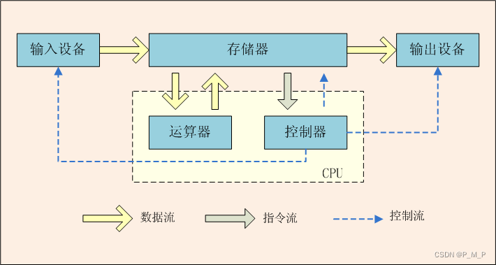
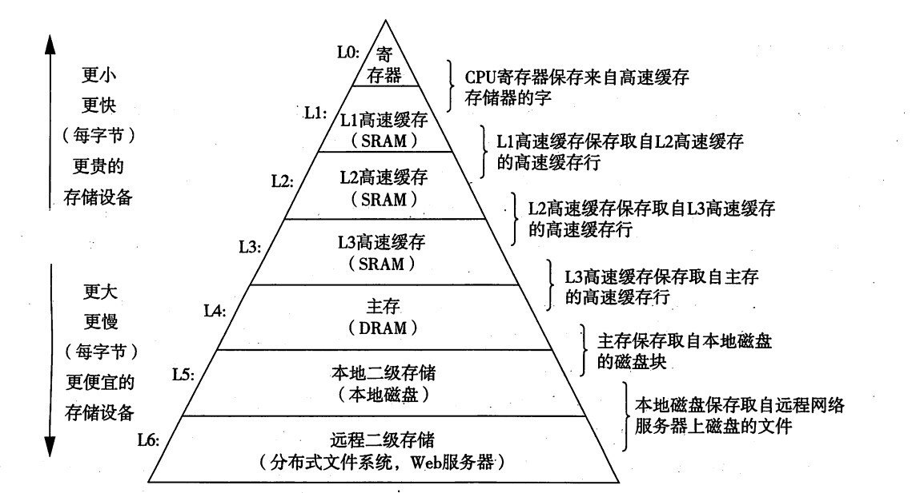
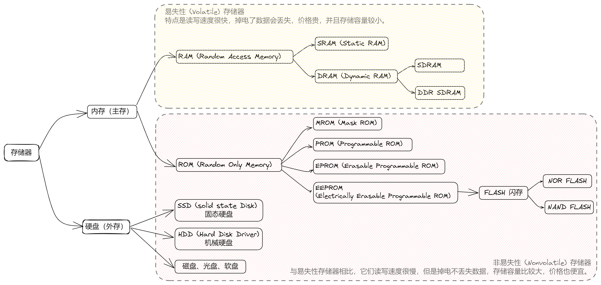
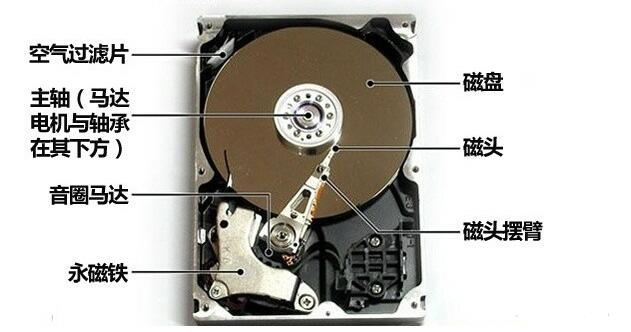
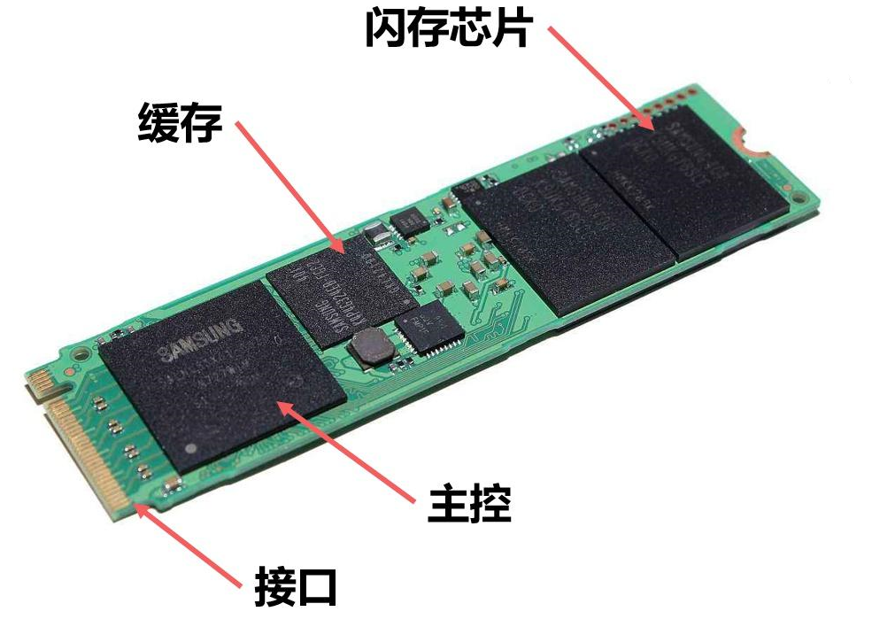

# 硬件内存

```
内存系统目录：
- 计算机的存储：软盘、硬盘、内存、缓存
- 什么是内存、堆、栈
- 内存的生命周期：内存分配、内存的使用、内存释放和内存回收
- 内存管理：手动和自动
- v8 的内存回收机制，主要针对堆内存
  - 早期的引用计数
  - 分代回收：新生代区和老生代区
  - 回收算法：Scavenge / Mark-Sweep（标记－清除） / Mark-compact（标记－紧缩）Incremental marking（增量标记）/ lazy sweeping（惰性清理）
- 什么是内存泄漏
- 如何排查内存泄露
  - 内存泄漏的症状
  - 内存泄漏的检查：怎么知道应用占用了多少内存，怎么看内存变化趋势？
- 常见的内存泄漏原因
- 如何预防内存泄漏
```

现代通用型计算机的实现结构，基本都是基于 冯·诺依曼架构。

> 下文引用自：[什么是内存（一）：存储器层次结构 ](https://www.cnblogs.com/yaoxiaowen/p/7805661.html)

## 什么是冯·诺依曼架构

冯·诺依曼架构（Von Neumann Architecture） 是冯·诺依曼和其他人提出的电子计算机通用架构。冯·诺依曼架构将通用计算机定义为以下 3 个基本原则：

1. 采用二进制： 程序指令和数据均采用二进制格式；
2. 存储程序： 一个计算机程序，不可能只有一条指令，而是由成千上万条指令组成的。指令和数据均存储在存储器中，而不是早期的插线板中，计算机按需从存储器中取指令和取数据；
3. 计算机由 5 个硬件组成： 运算器、控制器、存储器、输入设备和输出设备。



> 如果说图灵机描述的是计算机的抽象模型，那么冯·诺依曼架构则是对图灵机这个抽象模型的实现架构。 冯诺依曼架构确立了现代电子计算机的基础和结构，学习计算机组成原理，其实就是学习和拆解冯诺依曼架构。

## 冯·诺依曼架构的瓶颈

> 摩尔定律：当价格不变时，集成电路上可容纳的元器件的数目，约每隔18-24个月便会增加一倍，性能也将提升一倍。

伴随着摩尔定律不断被实现，作为计算机核心之一的 CPU 得到了飞速发展，现代电脑的 CPU 每秒钟可以执行几亿（甚至十几亿）条程序指令。但计算机的另一个核心 存储器 最早实现是通过外部软盘来持久保存程序数据。它的读写速度，与 CPU 相比，存在巨大的速度差，因此遏制了 CPU 的吞吐量。

针对这个冯·诺依曼架构的瓶颈，现代计算机体系只能采用优化策略来减弱冯·诺依曼瓶颈的影响，其中最重要的一个措施就是在 CPU 和存储器之间增加更多分层，包括主存、高速缓存等。

## 现代存储器层次结构 L5-L0



存储器按照访问速度、容量、成本和持久性等因素，可以分为多个层次：

- 高速缓存（Cache Memory）：集成在 CPU 内部或非常靠近 CPU，分为L1、L2、L3等多级缓存，速度最快，但容量较小。高速缓存通过减少CPU与主存之间的数据传输延迟，显著提高数据处理速度。
- 主存储器（Main Memory/RAM）：即随机访问存储器，是程序执行时的主要工作空间，速度较快，但断电后数据丢失。现代计算机通常使用 DDR（Double Data Rate）SDRAM，如DDR4、DDR5等。
- 二级辅助存储器（Secondary Storage）：也叫外存储器，包括机械驱动器（HDD）、固态驱动器（SSD）、闪存（Flash）等，用于长期存储大量数据，程序没有被加载到内存时，就放在这里。相比于主存储器，其访问速度较慢，但容量大，数据持久，并且成本低。

一般情况下，L5磁盘与L4主存速度相差几十万倍， 而L3-L0之间，它们每级缓存的速度差异大概是10倍。越往上，读写速度越快，价格更贵，存储容量也越小。(淘宝上搜搜8G的内存条，256G的SSD，1T的机械硬盘都是什么价格就明白了)。像L0 寄存器，每个寄存器只能存储一个字长的内容，但是CPU读写取寄存器耗费的时钟周期为0个。这是最快的速度。另外，在电脑主板上通常可以看到内存条(L4主存)和硬盘（L5外存），但是却没看到L3-L0，主要原因，他们都被集成在 CPU 芯片内部了。

> 磁盘和硬盘什么关系呢？其实是同一个意思。硬盘是最常见的磁盘类型。在很早之前，计算机使用软盘存储数据，所以那种软盘也被称为磁盘，不过软盘很早就已经被历史淘汰了。所以现在我们说磁盘，直接理解成硬盘就好了。
>
> 另一个冷知识：电脑硬盘分区从C盘开始，就是因为AB盘是之前软盘的编号。
> 在最早起的DOS时代，存储设备并不是硬盘，而是一个叫做软盘的东西，而软盘分两种，一个是5寸的大软盘，另一种是3.5寸的小软盘；当然对应的是就5寸软盘驱动器和3.5寸软盘驱动器2种。为此，当时的计算机一般配有两个软磁盘驱动器，分别称为“A驱动器”和“B驱动器”，而插在其中的软磁盘分别称为“A盘”和“B盘”。直到后续被容量更大，速度更快的硬盘取代，也就是现在电脑上看到的 C盘、D盘、E盘了。

## 易失性存储器和非易失存储器

另外，存储器按照存储数据的持久性，可以分为易失性存储器和非易失存储器。



- SRAM (Static RAM) 静态 RAM：速度非常快，是目前读写最快的存储设备了，但是它也非常昂贵，所以只在要求很苛刻的地方使用，譬如CPU的一级缓冲，二级缓冲。
- DRAM (Dynamic RAM) 动态 RAM：保留数据的时间很短，速度也比 SRAM 慢，不过它还是比任何的 ROM 都要快，但从价格上来说 DRAM 相比 SRAM 要便宜很多，计算机内存就是DRAM的。 DRAM分为很多种，常见的主要有FPRAM/FastPage、EDORAM、SDRAM、DDR RAM、RDRAM、SGRAM以及WRAM等。
- SDRAM (Synchronous Dynamic RAM) 同步动态随机存储器：同步是指其时钟频率和CPU前端总线的系统时钟相同，并且内部命令的发送与数据的传输都以它为基准；动态是指存储阵列需要不断的刷新来保证数据不丢失；随机是指数据不是线性依次存储，而是自由指定地址进行数据的读写。
- DDR RAM (Date-Rate RAM) 也称作DDR SDRAM，这种改进型的 SDRAM ，不同之处在于它可以在一个时钟读写两次数据，这样就使得数据传输速度加倍了。这是目前电脑中用得最多的内存，而且它有着成本优势，事实上击败了Intel 的另外一种内存标准－Rambus DRAM。在很多高端的显卡上，也配备了高速DDR RAM来提高带宽，这可以大幅度提高3D加速卡的像素渲染能力。
- MROM (Mask ROM) 掩模式只读存储器：由生产厂家在掩膜工艺过程中“写入”，“写入”之后任何人都无法改变其内容。“写入”是指在工艺过程中，将资料以一特制光罩（Mask）烧录于线路中，所以称为“光罩式只读内存”（Mask ROM），此内存的制造成本较低，常用于电脑中的开机启动。主要优点是存储内容固定，掉电后信息仍然存在,可靠性高。缺点是信息一次写入（制造）后就不能修改。
- PROM (Programmable ROM) 可编程只读存储器：允许用户通过专用的设备（编程器）一次性写入自己所需要的信息，一般只可编程一次，一经写入永久保存，无法再更改。PROM 存储器出厂时各个存储单元皆为1，或皆为0。用户使用时，再使用编程的方法使PROM存储所需要的数据。
- EPROM (Erasable Programmable ROM) 可编程可擦除只读存储器：可多次编程，是一种以读为主的可写可读的存储器。擦除远存储内容的方法可以采用以下方法：电的方法（称电可改写ROM）或用紫外线照射的方法（称光可改写ROM）。光可改写ROM可利用高电压将资料编程写入，抹除时将线路曝光于紫外线下，则资料可被清空，并且可重复使用，通常在封装外壳上会预留一个石英透明窗以方便曝光。电可改写 ROM 利用脉冲电流的方法将原有信息擦除，再上电写入新内容。
- EEPROM (Electrically Erasable Programmable ROM) 电可擦可编程序只读存储器：是一种随时可写入而无须擦除原先内容的存储器，其写操作比读操作时间要长得多。抹除的方式是使用高电场来完成，因此不需要透明窗。 EEPROM比 EPROM贵，集成度低，成本较高，一般用于保存系统设置的参数、IC卡上存储信息、电视机或空调中的控制器。但由于其可以在线修改，所以可靠性不如 EPROM。而EEPROM则可以一次只擦除一个字节(Byte)。
- Flash Memory 快擦除读写存储器，也就是我们常说的“闪存”。它也是一种非易失性的内存，属于 EEPROM 的改进产品，既有EEPROM的特点，又有RAM的特点，与 EEPROM一样，快闪存储器使用电可擦技术，整个快闪存储器可以在一秒钟至几秒内被擦除，速度比 EPROM 快得多。目前 FLASH 有两种：
  - NOR FLASH 被广泛用在PC机的主板上，用来保存BIOS程序，便于进行程序的升级。读取和常见的 SDRAM 基本一样，常用来替代 SDRAM 节省成本。
  - NAND FLASH 没有采用内存的随机读取技术，它的读取是以一次读取一块的形式，通常是一次读取 512 个字节，这种 FLASH 成本比较低，常用来作为硬盘的替代品，比如 U 盘，MP3 等，具有抗震、速度快、无噪声、耗电低的优点。
- SSD (Solid State Disk) 固态硬盘：又称固态驱动器（Solid State Drive），目前市场上通用的固态硬盘是基于 NAND FLASH 技术。固态硬盘的主体其实就是一小块PCB板，而这块PCB板上最基本的配件就是控制芯片、缓存芯片（部分低端硬盘无缓存芯片）和用于存储数据的 NAND FLASH 闪存芯片。
- HDD (Hard Disk Drive) 机械硬盘，机械结构的传统普通硬盘，通常由盘片，磁头，盘片转轴及控制电机，磁头控制器，数据转换器，接口，缓存等几个部分组成。磁头可沿盘片的半径方向运动，加上盘片每分钟几千转的高速旋转，磁头就可以定位在盘片的指定位置上进行数据的读写操作。信息通过离磁性表面很近的磁头，由电磁流来改变极性方式被电磁流写到磁盘上，信息可以通过相反的方式读取。机械硬盘读写速度依赖于电机的转速，因为需要依靠电机带动磁盘高速转动使磁头找到指定位置进行读写。
- Disk 磁盘：是指利用电磁记录技术存储数据的存储器。早期计算机使用的磁盘是软磁盘（Floppy Disk，简称软盘），如今常用的磁盘是硬磁盘（Hard disk，简称硬盘）。

<div>



</div>

## 延伸知识

关于物理内存、虚拟内存、物理寻址、虚拟寻址、页、段、进程分块，可以细看下面两个链接：

- [什么是内存(二)：虚拟内存 ](https://www.cnblogs.com/yaoxiaowen/p/7805964.html) --- 讲解了内存的寻址
- [019＊：内存五大区：（栈、堆、全局静态区、常量区、代码区）（线程、函数栈、栈帧）](https://www.cnblogs.com/zyzmlc/p/14078056.html)

摘要：

- 物理内存：指通过物理内存条而获得的内存空间，和虚拟内存对应；主要作用是：设备运行时为操作系统和各种程序提供临时储存空间；比如手机参数中的内存容量就是指物理内存大小。
- 虚拟内存：是计算机系统内存管理的一种技术，为每一个进程提供了一个 一致的、私有的地址空间；其主要作用是：保护了每个进程的地址空间不会被其他进程破坏，降低内存管理的复杂性；32位设备虚拟内存大小是4GB，64位设备（5s以后的设备）是 4GB \* 4GB；
- 物理寻址：主存就是一个有M个字节大小的单元组成的数组，每字节都有一个唯一的物理地址(Physical Address, PA)。 它的访问地址和数组一样，第一个地址为0，后面地址依次为1,2,3-----M-2, M-1;这叫做线性地址空间。这种自然的访问内存的方式我们称之为物理寻址(physical addressing)。
- 虚拟寻址：CPU 通过一个虚拟地址（virtual address,VA）来访问主存，这个虚拟地址在被送到主存之前会先转换成一个物理地址。将虚拟地址转换成物理地址的任务叫做地址翻译（address translation）。地址翻译需要 CPU 硬件和操作系统之间的配合。 CPU 芯片上叫做内存管理单元（Menory Management Unit, MMU）的专用硬件，利用存放在主存中的查询表来动态翻译虚拟地址，该表的内容由操作系统管理。
- **段页式存储结构**；用户程序在进程内先分段，每个段内再分页。利用 逻辑地址(段号 + 段内页号 + 页内地址) 进行地址变化，获得物理地址；这样的话，在段页式结构中，须三次访问内存才能获取数据或指令。当进程访问一个虚拟内存的页时，而对应的物理内存却不存在时，会触发一次 Page Fault（缺页中断），将需要的数据 or 指令从磁盘加载到物理内存页中，建立映射关系，然后再恢复现场，程序本身是无感知的；

## 参考链接

1. [什么是内存（一）：存储器层次结构 ](https://www.cnblogs.com/yaoxiaowen/p/7805661.html) --- 很值得看，讲解了为什么需要内存
2. [什么是内存(二)：虚拟内存 ](https://www.cnblogs.com/yaoxiaowen/p/7805964.html) --- 讲解了内存的寻址
3. [内存五大区：（栈、堆、全局静态区、常量区、代码区）（线程、函数栈、栈帧）](https://www.cnblogs.com/zyzmlc/p/14078056.html)
4. [一张图看懂内存(RAM，ROM，FLASH)及辅助内存之间的关系](<一张图看懂内存(RAM，ROM，FLASH)及辅助内存之间的关系>)
5. [什么是内存](https://blog.csdn.net/armjishu123/article/details/4495239) --- 上图中的各种内存缩写名称解释
6. [Memory Management Reference](https://www.memorymanagement.org/index.html)
