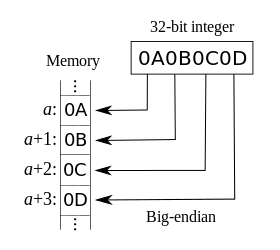
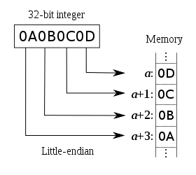

# Web API 二进制数据处理

javaScript 语言早期面向浏览器使用的脚本语言，没有对二进制数据的直接支持。在现代 JavaScript 的 ES6(es2015) 版本中发布了 ArrayBuffer 和 TypedArray 这样的原生构造函数来处理二进制数据。

## 二进制数据

二进制数据就是由 0 和 1 组成的数据——也就是电脑底层语言。当你处理文件（如图片或音乐）、网络通信等，这些数据在内存中都是以二进制形式存在的。

- 计算机硬件内存
- v8 内存管理、内存垃圾回收
- v8 如何将整数、小数存放为二进制数据，其中关于浮点数、IEEE 754标准、js 计算精度丢失原因等概念
- v8 如何将字符串编码为二进制数据，其中关于字形、字符、unicode 字符集、uft8/uft16/uft32字符编码规则、宽字符窄字符、大端序小端序的概念

以上内容见 [09-operation 运维章节中内存泄漏]()

## ArrayBuffer

ArrayBuffer 是一种表示通用的、固定长度的原始二进制数据缓冲区的对象。你可以把 ArrayBuffer 想象成一个原始的内存区域。它是一个以字节为单位的数组，在其它语言中也被称为“字节数组 byte array”。

ArrayBuffer 特殊的地方是我们不能直接操作 ArrayBuffer 里保存的二进制数据的内容，只能通过上层的 TypedArray 或 DataView 类来创建特定格式的实例缓冲区来读取 arrayBuffer 里的二进制数据，来呈现这段二进制数据实际表示的内容。

这么理解这句话的意思呢？也就是怎么理解内存、二进制数据、ArrayBuffer、TypedArray(DataView) 之间的关系。

上述关系可以用下面的这个比喻来理解：

小孩子要玩水，并且手上一些各种形式的气球，比如五角星、海星等，气球没充气或者还没有灌装水是瘪的，看不出形状。他先用一个水桶接一桶水，然后桶里的水装进五角星的气球中，可以理解为现在水是五角形的。如果把水装进普通气球里，可以理解为现在水是球形的。相反，他也可以反过来，把五角星气球里的水再倒进水桶。这里水从无形态变成特定形状，经过水桶和模具两层缓冲。

在计算机的数据存储中，不管终端呈现出什么样的内容，数值、字符、图案，存入计算机内存中的都是二进制数字。ArrayBuffer 实例化的过程，其时是向计算机申请预定大小的内存区域，用来存储二进制数据。ArrayBuffer 可以理解为上述例子的水桶，二进制的数据理解为水，装进 ArrayBuffer 里的二进制数据，仍然都是 0 和 1 表示，根据看不出是什么内容。此时需要再用 TypedArray 或 DataView 类的实例对象，按照一个预定的格式读取 ArrayBuffer 里的二进制数据，才知道内容是什么。这样从内存的二进制数据到终端显示的内容，经过了 ArrayBuffer 和 TypedArray 两层缓冲区。

```
二进制数据 => 水资源
ArrayBuffer => 水桶
TypedArray => 具体开关的气球
```

> 从单词语义上也可以理解：ArrayBuffer 原始数据缓存区，TypedArray 已经确定类型（Typed）的数据缓存区。

再用下面的代码例子，加深理解这个过程。

> TypedArray 与 Uint8Array / Uint16Array 的关系，见下面 TypedArray 章节

```js
// 申请一块2个字节大小的连续内存区域，也就是 8*2=16 比特位大小
const buffer = new ArrayBuffer(2)

/**********************************
 * Uint8Array
 *********************************/
// 将这块内存区域按8比特的元符号整数格式进行读和写，那么此时 view 可以读和写两个元素 element
const view = new Uint8Array(buffer)

console.log(view.byteLength) // 2 byteLength 字节长度就是 ArrayBuffer 实例时输入的长度大小
console.log(view.length) // 2 可装载元素的长度
console.log(view.BYTES_PER_ELEMENT) // 1 每个元素占据多少字节

// uint8 无符号整数值的区间 0-255，如果超出会溢出，输出显示为0
view[0] = 65
view[1] = 255
// view[1] = 256 // 会溢出，输出为 0
console.log(view.toString()) // 65，255

/**********************************
 * Uint8Array
 *********************************/
// 同样这块内存区域，按16比特的元符号整数格式进行读和写，那么此时 view 可以读和写1个元素 element
const view2 = new Uint16Array(buffer)

console.log(view2.byteLength) // 2
console.log(view2.length) // 1
console.log(view2.BYTES_PER_ELEMENT) // 2

view2[0] = 65
view2[1] = 255 // 超出忽略

console.log(view2.toString())
```

上例子的例子，是同一个内存区域存储的二进制数据，按不同字节单元大小读取为数值。

下面这个例子，是同一个内存区域存储的二进制数据，按不同编码规则读取为字符。

```js
// 申请一块1个字节大小的内存区域，也就是 8*1=8 bit 大小。
const buffer = new ArrayBuffer(1)

// TypedArray 只能把二进制数据按数值读取
const view = new Uint8Array(buffer)
view[0] = 65
console.log("number: ", view.toString()) // 65

// 如果要将二进制数据解释为字符串，可以使用 TextDecoder 类
const textDecoder = new TextDecoder() // 默认 utf8
const str = textDecoder.decoder(view)
console.log("string: ", str) // A，因为 A 的码点是 65

const textDecoder1 = new TextDecoder("utf-16") // 默认 utf8
const str1 = textDecoder1.decoder(view)
console.log("string: ", str1) // 䉁
```

```
+-------------------------------+
|             䉁                | new TextDecoder('utf-16').decoder(buffer)
+-------------------------------+
+---------------+---------------+
|      A        |     B         | new TextDecoder('utf8').decoder(buffer)
+---------------+---------------+
+-------------------------------+
|            16965              | new Uint16Array(buffer)
+-------------------------------+
+---------------+---------------+
|      65       |     66        | new Uint8Array(buffer)
+---------------+---------------+
+---------------+---------------+
|0|1|0|0|0|0|0|1|0|1|0|0|0|0|1|0| buffer = new ArrayBuffer(2)
+---------------+---------------+
```

理解了 ArrayBuffer 的作用之后，再来理解下面这段话的另一层意思。

> ArrayBuffer 特殊的地方是我们不能直接操作 ArrayBuffer 里保存的二进制数据的内容，只能通过上层的 TypedArray 或 DataView 类来创建特定格式的实例缓冲区来读取 arrayBuffer 里的二进制数据，来呈现这段二进制数据实际表示的内容。

这段话强调不能通过 ArrayBuffer 直接按内容的格式来操作数据，要操作存储的内容，需要通过上层的缓存区对象。但如果不在意内容的格式，可以直接对二进制数据进行的操作，ArrayBuffer 对象提供的操作主要包括 裁剪 slice 、转移 transfer、扩容 resize。

- 裁剪 slice
  - `ArrayBuffer.prototype.slice([start[, end]])`
- 转移 transfer
  - `ArrayBuffer.prototype.detached`
  - `ArrayBuffer.prototype.transfer()`
  - `ArrayBuffer.prototype.transferToFixedLength()`
- 扩容 resize
  - `ArrayBuffer.prototype.resizable`
  - `ArrayBuffer.prototype.maxByteLength`
  - `ArrayBuffer.prototype.resize()`

### 裁剪 slice

`ArrayBuffer.prototype.slice([start[, end]])` 返回一个新的 ArrayBuffer，包含从 start（含）到 end（不包括）字节的副本。

具体用法见 [MDN ArrayBuffer.prototype.slice()](https://developer.mozilla.org/zh-CN/docs/Web/JavaScript/Reference/Global_Objects/ArrayBuffer/slice)

对于已写入数据的 ArrayBuffer，裁剪可能会导致数据读写错误。

```js
const buf1 = new ArrayBuffer(8)

// 从0开始到结束，相当于完全无拷贝了一个 buffer
const buf2 = buf1.slice(0)
```

### 扩容 resize

- `ArrayBuffer.prototype.resizable`
- `ArrayBuffer.prototype.maxByteLength`
- `ArrayBuffer.prototype.resize(newLength)`

resize 方法可以用来缩小或增大 ArrayBuffer。新的大小通过 newLength 参数指定。但前提是该 ArrayBuffer 是可调整大小 `resizable` 的并且新的大小小于或等于该 ArrayBuffer 的 `maxByteLength`，可扩展的最大字节在 new 初始化时指定。

```js
// 创建一个 8 字节缓冲区，该缓冲区可调整大小到的最大长度是 16 字节
const buffer = new ArrayBuffer(8, { maxByteLength: 16 })

// 然后检查其 resizable 属性，如果 resizable 返回 true 则调整其大小：
if (buffer.resizable) {
  console.log("缓冲区大小是可调整的！")
  buffer.resize(12)
}

console.log("byteLength: ", buffer.byteLength) // 12
console.log("maxByteLength: ", buffer.maxByteLength) // 16
```

### 转移 transfer

ArrayBuffer 对象可以使用 `transfer()` 或 `transferToFixedLength()` 方法来转移申请的这段内存缓冲区的所有权。 也可以通过结构化克隆算法在不同的执行上下文之前传输，比如通过 postMessage 方法，将主线程对象复制到 web worker 线程中。

当一个 ArrayBuffer 对象被传输时，它原来的副本会被分离（detached），这意味着它不再可用。在任何时候，只有一个 ArrayBuffer 的副本实际拥有底层内存。分离后原来的缓冲区对象具有以下行为：

- 通过其 detached 属性来检查 ArrayBuffer 是否已分离。
- byteLength 变为 0（在缓冲区和关联的类型化数组视图中）。
- 所有实例方法，比如 resize() 和 slice()，会在调用时抛出 TypeError。关联的类型化数组视图的方法也会抛出 TypeError。

> [结构化克隆算法](https://developer.mozilla.org/zh-CN/docs/Web/API/Web_Workers_API/Structured_clone_algorithm)是一种用来复制复杂 JavaScript 对象的算法。 js 中通过 `structuredClone()` 方法调用。

```js
// 创建一个 ArrayBuffer 并写入一些字节
const buffer = new ArrayBuffer(8)
const view = new Uint8Array(buffer)
view[1] = 2
view[7] = 4

// 将缓冲区复制到另一个相同大小的缓冲区
const buffer2 = buffer.transfer()
console.log(buffer.detached) // true
console.log(buffer2.byteLength) // 8
const view2 = new Uint8Array(buffer2)
console.log(view2[1]) // 2
console.log(view2[7]) // 4

// 将缓冲区复制到一个更小的缓冲区
const buffer3 = buffer2.transfer(4)
console.log(buffer3.byteLength) // 4
const view3 = new Uint8Array(buffer3)
console.log(view3[1]) // 2
console.log(view3[7]) // undefined

// 将缓冲区复制到一个更大的缓冲区
const buffer4 = buffer3.transfer(8)
console.log(buffer4.byteLength) // 8
const view4 = new Uint8Array(buffer4)
console.log(view4[1]) // 2
console.log(view4[7]) // 0

// 已经分离，抛出 TypeError
buffer.transfer() // TypeError: Cannot perform ArrayBuffer.prototype.transfer on a detached ArrayBuffer
```

常规编码过程中，我们基本不需要直接操作底层的二进制数据。比如当在代码中声明一个变量并赋值一段字符串时，nodejs 底层依赖的 V8 引擎会帮我们将字符串编码为二进制数据存储到内存中，当需要读取该字符串时，又会自动从对应的内存中读取二进制数据并解码为字符串显示。

当某些场景中，比较涉及文件的场景可能需要操作二进制数据时，但是此类场景操作的对象一般也是上层封装的 File / Blob 对象，基本不会直接使用 arrayBuffer 对象进行操作。

## TypedArray

TypedArray 对象描述了底层二进制数据的格式，建立了预设格式的类数组视图缓冲区。

它是一个底层的抽象类，为所有类型化数组子类提供实用方法的通用接口。这个构造函数没有直接暴露为全局可用的函数，只能通过 Object.getPrototypeOf(Int8Array) 和类似的方式访问。

全局使用的是它的子类，包括：

```
类型	                值范围	                      大小（以字节为单位）	Web IDL(Interface Definition Language) 类型
Int8Array	           -128 至 127	                1	                 byte
Uint8Array	         0 至 255	                    1	                 octet
Uint8ClampedArray	   0 至 255	                    1	                 octet
Int16Array	         -32768 至 32767	            2	                 short
Uint16Array	         0 至 65535	                  2	                 unsigned short
Int32Array	         -2147483648 至 2147483647	  4	                 long
Uint32Array	        0 至 4294967295	              4	                 unsigned long
Float32Array	      -3.4e38 至 3.4e38	            4	                 unrestricted float
Float64Array	      -1.8e308 至 1.8e308	          8	                 unrestricted double
BigInt64Array	      -263 至 263 - 1	              8	                 bigint
BigUint64Array	    0 到 264 - 1	                8	                 bigint
```

关于整数和浮点数、有符号和符号的介绍见 [memory-number](../doc/26-operation/memory-number.md)

TypedArray 实例在理解上，可以把它当成对应**元素都数值类型的数组**，基本上拥有 `Array.prototype` 原型上同样的操作方法。

区别于常规数组，特有的属性包括：

```
TypedArray.prototype.buffer     原始的 ArrayBuffer 实例对象
TypedArray.prototype.byteLength buffer 的字节长度
TypedArray.prototype.byteOffset 当前类型数组相对于原始 buffer 的开始偏移量
TypedArray.BYTES_PER_ELEMENT   每个元素占几个字节长度
TypedArray.prototype.length    元素个数
```

实例的方法同 `Array.prototype`，比如常规的 `slice / some / includes / reduce / filter / every` 等等。具体见 [MDN TypedArray](https://web.nodejs.cn/en-us/docs/web/javascript/reference/global_objects/typedarray/)

相较于普通数组，特殊的点是：

- 原型对象不能设置索引属性
- 对象不能被冻结

```js
// Setting and getting using standard array syntax
const int16 = new Int16Array(2)
int16[0] = 42
console.log(int16[0]) // 42

// 原型对象不能设置索引属性 Indexed properties on prototypes are not consulted (Fx 25)
Int8Array.prototype[20] = "foo"
new Int8Array(32)[20] // 0
// even when out of bound
Int8Array.prototype[20] = "foo"
new Int8Array(8)[20] // undefined
// or with negative integers
Int8Array.prototype[-1] = "foo"
new Int8Array(8)[-1] // undefined

// 但是具名属性可以 Named properties are allowed, though (Fx 30)
Int8Array.prototype.foo = "bar"
new Int8Array(32).foo // "bar"

// 对象不能被冻结
const i8 = Int8Array.of(1, 2, 3)
Object.freeze(i8)
// TypeError: Cannot freeze array buffer views with elements
```

## DataView

DataView 的作用同 TypedArray 基本一样，为 ArrayBuffer 数据建立数据格式的视图缓冲区，区别在于是否可以自定义字节顺序 BOM(Byte Order Mark)，也就是常见的大端序(BE:Big-Endian)和小端序(LE:Little-Endian)。

### 字节序 BOM

字节序 BOM(Byte Order Mark) 是用来确定 UTF-16 和 UTF-32 这两种定长编码方案中高低位字节存储顺序的。

> 关于字符集 unicode、字符编码规则 UTF-8 / UTF-16 / UTF-32 详细内容见 [内存的字符存储](../doc/26-operation/memory-string.md)

比如 UTF-16 编码规则对所有字符都是用两个字节编码，比如汉字“齐”的字符的码位是：U+2EEC，分成两个字节表示高位字节 2E(00101110) 和低位字节 EC(11101100)，那在读写到内存中，内存地址默认是从低到高的，那此时就有两种写入和读取的方式了：

- 大端序：内存地址从低到高，写入顺序相反，高位字节+低位字节，即 a(00101110)-2E a+1(11101100)-EC
- 小端序：内存地址从低到高，写入顺序一致，低位字节+高位字节，即 a(11101100)-EC a+1(00101110)-2E

> 记忆方式：端理解为写入内存开始的一端，是写入的是高位字节还是低是字节。大端序的意思是开头端写入高位字节（大），小端序的意思是开头端写入低位字节（大）。
> 所以写入的内存地址是由低到高，小端序写入顺序也是先低位字节，再高位字节，顺序保持一致，更符合直觉。




那为什么 UTF-8 编码规则不需要 BOM 呢？

UTF-8 是不定长编码方案，它的编码方式决定了它不可能出现字节顺序的问题。UTF-8这个编码对每个字符存储为几个自己是不固定的，最少为1个字节，最多为4个字节。当某个字符的编码为一个字节时拥有7个比特位给它编码，两个字节拥有11个比特位，3个字节拥有16个比特位，4个字节拥有21个比特位。其中剩余的比特位用来标注，并不用于编码。比如当解码器碰到某个字节以0开头，则说明这是一个单字节字符，当它碰到某个字节以1110开头则表明这个是一个三字节字符，当它碰到10开头的字节，说明这个字节属于某个字符编码的一部分，而不是一个新字符的开始。很显然，UTF-8的编码已经规定了每个字符占几个字节，如果是多个字节则第一个字节应该是什么样子，第二个字节应该是什么样子，...，这样以来就不会出现因字节顺序而引起的问题。一般来说我们用的汉字用UTF8编码基本都是用三字节编码的。

UTF-8 编码约定如下规则：

- 对于编号较小的、用一个字节足以容纳的字符，我们就可以规定这个字符编号的最高位（Bit）必须是 0，（同 ASCII 编码一样）；
- 对于编号较大的、要用两个字节存储的字符，我们就可以规定这个字符编号的高字节的高位必须是 110，低字节的最高位必须是 10；
- 对于编号更大的、需要三个字节存储的字符，我们就可以规定这个字符编号的高字节的高位都必须是 1110，其后每个字节高位是 10。

> 即左边第一个高字节有几个 1，就可解读为需要几个字节。其它字节高位固定以 10 开头

具体的表现形式为：

- 0xxxxxxx：单字节编码形式，这和 ASCII 编码完全一样，因此 UTF-8 是兼容 ASCII 的；
- 110xxxxx 10xxxxxx：双字节编码形式；
- 1110xxxx 10xxxxxx 10xxxxxx：三字节编码形式；
- 11110xxx 10xxxxxx 10xxxxxx 10xxxxxx：四字节编码形式。

| 字符 | 具体的 Unicode 字符（码位）<br>二进制 / 十六进制 | UTF-8 编码（码元）         | 编码后的字节数 |
| ---- | ------------------------------------------------ | -------------------------- | -------------- |
| N    | 01001110 / 4E                                    | 01001110                   | 1              |
| æ    | 11100110 / E6                                    | 11000011 10100110          | 2              |
| ⻬   | 00101110 11101100 / 2E EC                        | 11100010 10111011 10101100 | 3              |

程序在定位字符时，从前往后依次扫描，如果发现当前字节的最高位是 0，那么就把这一个字节作为一个字符编号。如果发现当前字节的最高位是 1，那么就继续往后扫描，如果后续字节的最高位不在是 10，则停止，把之前字节合并为一个字符编码；

对于常用的字符, Unicode 码位范围是 0 ~ FFFF，用 1~3 个字节足以存储，只有及其罕见，或者只有少数地区使用的字符才需要 4~6 个字节存储。特别一点是 UTF-8 编码方案完全兼容了早期广泛使用的 ASCII编码。所以 UTF-8 是目前最普遍的编码方案。

### DataView 与 TypedArray 区别

根据机器架构的不同，多字节数字格式在内存中的表示方式也有所不同

- TypedArray 在创建时会自动根据系统的字节顺序来解释数据。大多数现代系统（如基于x86和x86_64的PC）使用小端字节序，而 TypedArray 会默认使用这种字节序。
- DataView 无论执行计算机系统架构默认的字节顺序如何，它允许你自定义指定字节顺序来解释 buffer 数据，这对于处理来自不同系统或网络的数据非常有用。

所以两者的应用场景也不同：

- TypedArray：由于其高效性和固定大小的元素，它特别适用于需要大量数据处理和计算的场景，如图像处理、音频处理、WebGL等。TypedArray可以直接与底层的二进制数据进行交互，因此非常适合这些需要高效访问和操作二进制数据的场景。
- DataView：由于其灵活性和支持多种数据类型的能力，它更适合于处理来自不同源或需要不同解释方式的二进制数据。例如，当你从网络接收数据时，你可能需要使用DataView来正确地解析这些数据。

```js
/*
 * 1.声明一个2个字节大小的内存缓冲区
 * 2.假设要写的数值是 256，二进制表示 00000001 00000000
 * 3.内存的读和写的顺序默认是从低地址到高地址，比如申请的内存空间的两个字节开头地址分别为 a 和 a+1
 * 4. 如果采用大端序（大尾序) 写入 256，存入的内存数据表示：a[00000000] a+1[00000001]
 *    如果采用小端序（小尾序）写入 256，存入的内存数据表示：a[00000001] a+1[00000000]
 *
 */
import os from "node:os"

// nodejs 中通过 os.endianness() 查看当前系统采用的字节序，返回一个字符串，输出可能是 'LE' 或 'BE'
const endianness = os.endianness()
console.log("🚀 ~the platform's endianness:", endianness) // LE

// 声明一个2个字节大小的内存缓冲区
const buffer = new ArrayBuffer(2)
// 声明一个 dataView 视图
const dataView = new DataView(buffer)

// 使用大端序的格式写入 256，存入的内存数据表示：a[00000000] a+1[00000001]
// setInt16(byteOffset, value, littleEndian)
dataView.setInt16(0, 256, false) // littleEndian 入参为 false 或 undefined 时，即采用大端序

// 使用与写入一样字节序，大端序格式读取当前内存缓冲区的二进制数据
// getInt16(byteOffset, littleEndian)
const beVal = dataView.getInt16(0, true)
console.log("🚀 ~dataView getInt16 littleEndian val:", beVal) // 1

// 使用小端序格式读取此时内存数据，
const leVal = dataView.getInt16(0, false)
console.log("🚀 ~dataView getInt16 bigEndian val:", leVal) // 256

// TypedArray 实例化时默认采用系统的字节序，即小端序 LE
const uint16 = new Uint16Array(buffer)
console.log("🚀 ~ Uint16Array:", uint16[0]) // 1
```

### DataView API

- 属性
  - DataView.prototype.buffer 当前数据视图的原始 ArrayBuffer
  - DataView.prototype.byteLength 当前数据视图的字节长度
  - DataView.prototype.byteOffset 当前数据视图相对原始 buffer 开头的字节偏移量
- 方法
  - 有符号整型
    - `DataView.prototype.getInt8(byteOffset)`
    - `DataView.prototype.getInt16(byteOffset[, littleEndian])`
    - `DataView.prototype.getInt32(byteOffset[, littleEndian])`
    - `DataView.prototype.getBigInt64(byteOffset[, littleEndian])`
    - `DataView.prototype.setInt8(byteOffset, value)`
    - `DataView.prototype.setInt16(byteOffset, value[, littleEndian])`
    - `DataView.prototype.setInt32(byteOffset, value[, littleEndian])`
    - `DataView.prototype.setBigInt64(byteOffset, value[, littleEndian])`
  - 无符号整型
    - `DataView.prototype.getUint8(byteOffset)`
    - `DataView.prototype.getUint16(byteOffset[, littleEndian])`
    - `DataView.prototype.getUint32(byteOffset[, littleEndian])`
    - `DataView.prototype.getBigUint64(byteOffset[, littleEndian])`
    - `DataView.prototype.setUint8(byteOffset, value)`
    - `DataView.prototype.setUint16(byteOffset, value[, littleEndian])`
    - `DataView.prototype.setUint32(byteOffset, value[, littleEndian])`
    - `DataView.prototype.setBigUint64(byteOffset, value[, littleEndian])`
  - 浮点型
    - `DataView.prototype.getFloat32(byteOffset[, littleEndian])`
    - `DataView.prototype.getFloat64(byteOffset[, littleEndian])`
    - `DataView.prototype.setFloat32(byteOffset, value[, littleEndian])`
    - `DataView.prototype.setFloat64(byteOffset, value[, littleEndian])`

上述 littleEndian 可选参数，如果默认缺省 undefined 或 false 则按大端序规则，设为 true，则按小端序。

```js
const buffer = new ArrayBuffer(10)
const dataview = new DataView(buffer)
dataview.setInt8(0, 3)
dataview.getInt8(0) // 3

const buffer = new ArrayBuffer(10)
const dataview = new DataView(buffer)
// 默认大端序存入 00000000 00000011 00000000 00000000 00000000 ...
dataview.setUint16(0, 3)
dataview.getUint16(1) // 偏移一们，取出16个bit，即 00000011 00000000 = 768

const buffer = new ArrayBuffer(10)
const dataview = new DataView(buffer)
dataview.setFloat64(0, 3)
dataview.getFloat64(1) // 3.785766995733679e-270
```

## TextEncoder / TextDecoder

不管是 TypedArray 还是 DataView 类提供的方法都是关于数值的编码和解码（uint/int/float），那如果是字符和字符串编码为二进制数，或直接从二进制解码为字符或字符串，则需要在 TypedArray / DataView 之上，再增加一层视图缓冲区，这就是 TextEncoder / TextDecoder。

至于为什么是在 TypedArray / DataView 之上增加缓冲区，因为字符在内存中存储过程就是通过字符映射数值型的码位，再将数值的码位转为二进制存入内存。这个映射表就是字符编码规则，比如UTF-8编码方案中字符A的码位是65，再将65转为二进制 1000001 写入内存，读取时反向，先读取码位，再接编码规则表中转为对应的字符。

```js
const buffer = new ArrayBuffer(1)
const uint8 = new Uint8Array(buffer)

/************************************
 * 编码 encode
 **********************************/
// 使用 TextEncoder 编码字符串，默认是生成 web 通用的 UTF-8 编码方案
const textEncoder = new TextEncoder()
// encodeInto(string, uint8Array) 返回 read 表示字符串编码的码元数量，written 表示写入内存的字节数量
const { read, written } = textEncoder.encodeInto("A", uint8)
console.log("🚀 ~ read, written:", read, written) // 1 1

/************************************
 * 解码 decode
 **********************************/
// new TextDecoder(utfLabel, options)，其中 uftLabel 默认 uft8 / uft-8
const uft8decoder = new TextDecoder()
// decode(buffer) buffer 可以是一个 ArrayBuffer / TypedArray / DataView 对象
const str = uft8decoder.decode(uint8)
console.log("🚀 ~ str:", str) // A
```

### API

- 编码 TextEncoder
  - `new TextEncoder()` 统一默认按 UTF-8 规则编码
  - `textEncoder.encoding` 只读属性，表示当前使用的编码规则，只能是通用的 utf-8。
  - `textEncoder.encode(string)` 方法接受一个字符串作为输入，返回一个按 UTF-8 编码的二进制数据视图的 Uint8Array 对象。
  - `textEncoder.encodeInto(string, uint8Array)` 方法接受一个要编码的字符串和一个要写入的二进制数据视图的 Uint8Array 对象。返回一个指示编码进度的对象，包括 read 和 written 属性。
- 解码 TextDecoder
  - `new TextDecoder([utfLabel[, options])` 创建一个解码器对象。
    - utfLabel 可选，默认是 "utf-8"。可以是 web Encoding API 支持的任意有效的编码。
    - option.fatal 一个布尔值，表示在解码无效数据时，`textDecoder.decode()` 方法是否抛出 TypeError 错误，默认 false，不抛出错误，使用替换字符（� REPLACEMENT CHARACTER U+FFFD）替换错误的字符数据。
  - `textDecoder.encoding` 返回一个字符串，表示当前解码器的解码规则，在 new 实例时由 uftLabel 指定，默认是 uft-8。
  - `textDecoder.fatal` 返回一个布尔值，如果 true 表示解码错误时，是否抛出 TypeError 错误; 如果是 false，解码器使用替换字符替换 U+FFFD（�）无效字符。
  - `textDecoder.ignoreBOM` 返回或设置一个布尔值，表示是否忽略字节顺序标记 BOM(Byte Order Mark)，是 true；否则是 false。
  - `TextDecoder.decode(buffer, options)` 方法返回一个解码后的字符串，buffer 可以是一个 ArrayBuffer / TypedArray / DataView 对象。
    - `options.stream` 一个布尔值，指示是否以流式数据进行解码。
- 流模式
  - `TextDecoderStream()` 将二进制编码（如 UTF-8 等）的文本流转换为字符串流。它与 TextDecoder 的流形式`options.stream = true`等价。
  - `TextEncoderStream()` 接口将一个字符串流转换为 UTF-8 编码的字节。它与 TextEncoder 的流形式等价。

示例1：基本使用

```js
const encoder = new TextEncoder()
const array = encoder.encode("€") // Uint8Array(3) [226, 130, 172]

const decoder = new TextDecoder()
const str = decoder.decode(array) // String "€"
```

示例2：错误处理

```js
const decoder = new TextDecoder("utf-8", { fatal: true })
const bytes = new Uint8Array([0x80, 0x81]) // 无效的 UTF-8 编码
try {
  const string = decoder.decode(bytes)
} catch (e) {
  console.error("解码失败：", e)
}
```

示例3：流式处理

在解码方法的选项 stream

- 如果不传递，或者设置 `{ stream: false }` 选项给 TextDecoder 的构造函数，那么你会得到一个非流式解码器。这种解码器期望一次性接收到完整的字节序列，并在调用 `decode()` 方法后返回完整的解码字符串。如果你尝试对部分字节序列进行解码，可能会得到不完整或错误的字符串。
- 如果传递 `{ stream: true }` 选项，TextDecoder 会以流式模式工作。这意味着你可以多次调用 `decode()` 方法，每次传递数据流的一部分，而解码器会尝试基于当前可用的字节返回尽可能多的解码字符串。流式解码器在内部维护了一个状态，以便在多次调用 `decode()` 时能够正确处理跨多个调用的数据。它知道哪些字节已经被处理过，哪些还没有，从而能够拼接和解码连续的字节流。流式解码器在处理文本文件的末尾或网络流中的不完整数据时特别有用。即使数据的末尾被截断或损坏，流式解码器也能够尽可能多地返回有效的解码字符串。

```js
// 假设我们有一个分块的字节流
const byteChunks = [
  new Uint8Array([0x48, 0x65, 0x6c]), // "Hel"
  new Uint8Array([0x6c, 0x6f]), // "lo"
  new Uint8Array([0x20, 0x57, 0x6f, 0x72, 0x6c, 0x64]), // " World"
]

// 使用非流式解码器
const nonStreamDecoder = new TextDecoder("utf-8")
let nonStreamResult = ""
for (const chunk of byteChunks) {
  nonStreamResult += nonStreamDecoder.decode(chunk, { stream: false })
}
console.log(nonStreamResult)
// 输出可能是乱码，因为非流式解码器期望一次性接收完整的字节序列

// 使用流式解码器
const streamDecoder = new TextDecoder("utf-8")
let streamResult = ""
for (const chunk of byteChunks) {
  streamResult += streamDecoder.decode(chunk, { stream: true }) // 正确使用 { stream: true }
}
console.log(streamResult)
// 输出 "Hello World"，因为流式解码器能够正确处理分块的字节流
```

流模式

```js
const response = await fetch("https://example.com")
const stream = response.body.pipeThrough(new TextDecoderStream())
```

需要注意的是，即使使用流式解码器，你也应该确保在所有数据都处理完毕后调用一次 decode() 方法，并传入一个空的 Uint8Array 或 null，以确保解码器处理任何剩余的内部状态。这样做可以确保所有字节都被解码，并返回最终的字符串。
