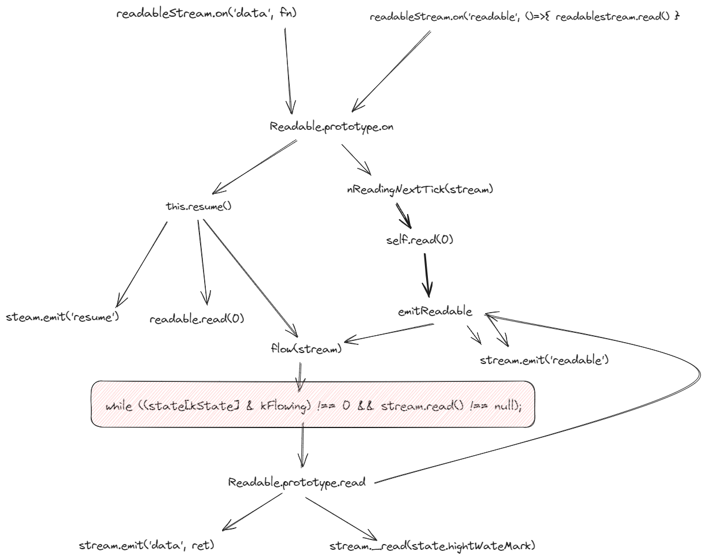
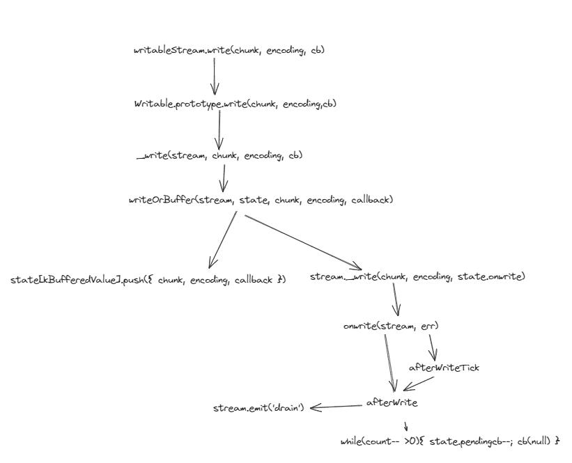

# Stream 源码解析

在 `/node/lib/stream.js` 入口文件

```js
// lib/stream.js
const Stream = (module.exports = require("internal/streams/legacy").Stream)
Stream.Readable = require("internal/streams/readable")
Stream.Writable = require("internal/streams/writable")
Stream.Duplex = require("internal/streams/duplex")
Stream.Transform = require("internal/streams/transform")
```

可以看到基类 Stream 和四种流的子类的实现文件都在 `/lib/internal/streams` 目录中。

先看下基类 Stream 的实现

```js
// lib/internal/streams/legacy.js
const EE = require("events")
function Stream(opts) {
  EE.call(this, opts)
}
ObjectSetPrototypeOf(Stream.prototype, EE.prototype)
ObjectSetPrototypeOf(Stream, EE)

Stream.prototype.pipe = function (dest, options) {
  // 省略代码
}
```

流的基类 Stream 继承于事件类 EventEmitter，所以具有相关的事件和方法。

另外，基类只提供了一个方法就是 pipe 用于实现管道化。管道化是对数据从一个地方流向另一个地方的抽象。这个方法代码比较多，后面说。

然后分别看下不同类，如何继承 Stream 类。

Readable Stream

```js
// lib/internal/streams/readable.js

module.exports = Readable
Readable.ReadableState = ReadableState
ObjectSetPrototypeOf(Readable.prototype, Stream.prototype)
ObjectSetPrototypeOf(Readable, Stream)

function Readable(options) {
  if (!(this instanceof Readable)) return new Readable(options)

  // 省略 options 处理逻辑...

  Stream.call(this, options)
}

// 之后是在 Readable.prototype.xx 挂载对应的方法
```

Writable Stream

```js
// lib/internal/streams/writable.js
module.exports = Writable
Writable.WritableState = WritableState
ObjectSetPrototypeOf(Writable.prototype, Stream.prototype)
ObjectSetPrototypeOf(Writable, Stream)

function Writable(options) {
  if (!(this instanceof Writable)) return new Writable(options)

  // 省略 options 处理逻辑...

  Stream.call(this, options)
}

// 之后是在 Writable.prototype.xx 挂载对应的方法
```

Duplex Stream

```js
// lib/internal/streams/duplex.js
module.exports = Duplex
ObjectSetPrototypeOf(Duplex.prototype, Readable.prototype)
ObjectSetPrototypeOf(Duplex, Readable)

// 继承于 Readable，然后再复制 Writable Stream 类上的属性和方法
{
  const keys = ObjectKeys(Writable.prototype)
  // Allow the keys array to be GC'ed.
  for (let i = 0; i < keys.length; i++) {
    const method = keys[i]
    if (!Duplex.prototype[method])
      Duplex.prototype[method] = Writable.prototype[method]
  }
}

// Use the `destroy` method of `Writable`.
Duplex.prototype.destroy = Writable.prototype.destroy

function Duplex(options) {
  if (!(this instanceof Duplex)) return new Duplex(options)

  // 省略 options 处理逻辑...

  Stream.call(this, options)
}
```

Transform Stream

```js
// lib/internal/streams/transform.js
module.exports = Transform

ObjectSetPrototypeOf(Transform.prototype, Duplex.prototype)
ObjectSetPrototypeOf(Transform, Duplex)

function Transform(options) {
  if (!(this instanceof Transform)) return new Transform(options)

  // 省略 options 处理逻辑...

  Duplex.call(this, options)

  // When the writable side finishes, then flush out anything remaining.
  // Backwards compat. Some Transform streams incorrectly implement _final
  // instead of or in addition to _flush. By using 'prefinish' instead of
  // implementing _final we continue supporting this unfortunate use case.
  this.on("prefinish", prefinish)
}

Transform.prototype._transform = function (chunk, encoding, callback) {
  throw new ERR_METHOD_NOT_IMPLEMENTED("_transform()")
}

// 实现 _read 方法
Transform.prototype._read = function () {
  if (this[kCallback]) {
    const callback = this[kCallback]
    this[kCallback] = null
    callback()
  }
}

Transform.prototype._write = function (chunk, encoding, callback) {
  const rState = this._readableState
  const wState = this._writableState
  const length = rState.length

  this._transform(chunk, encoding, (err, val) => {
    if (err) {
      callback(err)
      return
    }

    if (val != null) {
      this.push(val)
    }

    if (rState.ended) {
      // If user has called this.push(null) we have to
      // delay the callback to properly progate the new
      // state.
      process.nextTick(callback)
    } else if (
      wState.ended || // Backwards compat.
      length === rState.length || // Backwards compat.
      rState.length < rState.highWaterMark
    ) {
      callback()
    } else {
      this[kCallback] = callback
    }
  })
}

Transform.prototype._final = function final(cb) {
  if (typeof this._flush === "function" && !this.destroyed) {
    this._flush((er, data) => {
      if (er) {
        if (cb) {
          cb(er)
        } else {
          this.destroy(er)
        }
        return
      }

      if (data != null) {
        this.push(data)
      }
      this.push(null)
      if (cb) {
        cb()
      }
    })
  } else {
    this.push(null)
    if (cb) {
      cb()
    }
  }
}
```

Transform 流继承于 Duplex 类，但是重写了 `_read / _write / _final` 方法的实现，同时要求实现必须实现 `_transform` 方法。

所以分析 Stream 流的关键是熟悉 Readable 和 Writable 类的实现。

### Readable

从一个文件流使用的例子来分析 Readable Stream 的实现过程。

```js
const stream = fs.createReadStream("sample.txt")
stream.on("data", (chunk) => {
  console.log("读取文件数据:", chunk)
})
```

上述示例中，创建一个可读流之后，只要监听 data 事件，就能持续读取文件中的数据，这是怎么实现的呢。可以在源码中找到可读流的 on 方法的实现。

```js
Readable.prototype.on = function (ev, fn) {
  // 这里 Stream
  const res = Stream.prototype.on.call(this, ev, fn)
  const state = this._readableState

  if (ev === "data") {
    state[kState] |= kDataListening

    // Update readableListening so that resume() may be a no-op
    // a few lines down. This is needed to support once('readable').
    state[kState] |= this.listenerCount("readable") > 0 ? kReadableListening : 0

    // Try start flowing on next tick if stream isn't explicitly paused.
    if ((state[kState] & (kHasFlowing | kFlowing)) !== kHasFlowing) {
      this.resume()
    }
  } else if (ev === "readable") {
    if ((state[kState] & (kEndEmitted | kReadableListening)) === 0) {
      state[kState] |= kReadableListening | kNeedReadable | kHasFlowing
      state[kState] &= ~(kFlowing | kEmittedReadable)
      debug("on readable")
      if (state.length) {
        emitReadable(this)
      } else if ((state[kState] & kReading) === 0) {
        process.nextTick(nReadingNextTick, this)
      }
    }
  }

  return res
}
Readable.prototype.addListener = Readable.prototype.on
```

当可读流注册了 data 或 readable 事件，会设置相应的状态位标志，然后开启流数据传递。这里以 data 事件为例，会调用 `this.resume()` 方法。

```js
Readable.prototype.resume = function () {
  const state = this._readableState
  if ((state[kState] & kFlowing) === 0) {
    debug("resume")
    // We flow only if there is no one listening
    // for readable, but we still have to call
    // resume().
    state[kState] |= kHasFlowing
    if ((state[kState] & kReadableListening) === 0) {
      state[kState] |= kFlowing
    } else {
      state[kState] &= ~kFlowing
    }
    resume(this, state)
  }
  state[kState] |= kHasPaused
  state[kState] &= ~kPaused
  return this
}

function resume(stream, state) {
  if ((state[kState] & kResumeScheduled) === 0) {
    state[kState] |= kResumeScheduled
    process.nextTick(resume_, stream, state)
  }
}

function resume_(stream, state) {
  debug("resume", (state[kState] & kReading) !== 0)
  if ((state[kState] & kReading) === 0) {
    stream.read(0)
  }

  state[kState] &= ~kResumeScheduled
  stream.emit("resume")
  flow(stream)
  if ((state[kState] & (kFlowing | kReading)) === kFlowing) stream.read(0)
}

function flow(stream) {
  const state = stream._readableState
  debug("flow")
  while ((state[kState] & kFlowing) !== 0 && stream.read() !== null);
}
```

`ReadStream.prototype.resume` 函数，这个函数会在最后通过 `process.nextTick` 调用函数 `resume_`。在这个函数中会判断当前 kReading 状态，在我们的示例中，开始的初始化状态为 0，所以会直接调用 `stream.read(0)`。如果 kReading 不为 0 ，表示正在持续读取中，此时触发 resume 事件 `stream.emit("resume")` ，并且执行 `flow(stream)`，可以看到 flow 函数是一个 while 语句，循环调用 `stream.read()` 直到它返回 null，即当前缓存 buffer 中数据已读完。所以接着看 read 方法的实现。

```js
Readable.prototype.read = function (n) {
  debug("read", n)
  // Same as parseInt(undefined, 10), however V8 7.3 performance regressed
  // in this scenario, so we are doing it manually.
  if (n === undefined) {
    n = NaN
  } else if (!NumberIsInteger(n)) {
    n = NumberParseInt(n, 10)
  }
  const state = this._readableState
  const nOrig = n

  // If we're asking for more than the current hwm, then raise the hwm.
  // 如果请求的 read(size) 中的 size 大于水位线 hwm，就创建一个新的更高的水位线的值，下面是 computedNewHighWaterMark 函数的实现
  // const MAX_HWM = 0x40000000
  // function computeNewHighWaterMark(n) {
  //   if (n > MAX_HWM) {
  //     throw new ERR_OUT_OF_RANGE("size", "<= 1GiB", n)
  //   } else {
  //     // Get the next highest power of 2 to prevent increasing hwm excessively in
  //     // tiny amounts.
  //     n--
  //     n |= n >>> 1
  //     n |= n >>> 2
  //     n |= n >>> 4
  //     n |= n >>> 8
  //     n |= n >>> 16
  //     n++
  //   }
  //   return n
  // }
  if (n > state.highWaterMark) state.highWaterMark = computeNewHighWaterMark(n)

  if (n !== 0) state[kState] &= ~kEmittedReadable

  // If we're doing read(0) to trigger a readable event, but we
  // already have a bunch of data in the buffer, then just trigger
  // the 'readable' event and move on.
  // 如果此时执行 read(0)，并且缓存区已经有一堆数据，就触发 readable 事件。
  if (
    n === 0 &&
    (state[kState] & kNeedReadable) !== 0 &&
    ((state.highWaterMark !== 0
      ? state.length >= state.highWaterMark
      : state.length > 0) ||
      (state[kState] & kEnded) !== 0)
  ) {
    debug("read: emitReadable")
    if (state.length === 0 && (state[kState] & kEnded) !== 0) endReadable(this)
    else emitReadable(this)
    return null
  }

  n = howMuchToRead(n, state)

  // If we've ended, and we're now clear, then finish it up.
  // 经过计算，如果当前已经没有可读数据了，那就执行 endReadable 并返回 null
  if (n === 0 && (state[kState] & kEnded) !== 0) {
    if (state.length === 0) endReadable(this)
    return null
  }

  // All the actual chunk generation logic needs to be
  // *below* the call to _read.  The reason is that in certain
  // synthetic stream cases, such as passthrough streams, _read
  // may be a completely synchronous operation which may change
  // the state of the read buffer, providing enough data when
  // before there was *not* enough.
  //
  // So, the steps are:
  // 1. Figure out what the state of things will be after we do
  // a read from the buffer.
  //
  // 2. If that resulting state will trigger a _read, then call _read.
  // Note that this may be asynchronous, or synchronous.  Yes, it is
  // deeply ugly to write APIs this way, but that still doesn't mean
  // that the Readable class should behave improperly, as streams are
  // designed to be sync/async agnostic.
  // Take note if the _read call is sync or async (ie, if the read call
  // has returned yet), so that we know whether or not it's safe to emit
  // 'readable' etc.
  //
  // 3. Actually pull the requested chunks out of the buffer and return.

  // if we need a readable event, then we need to do some reading.
  let doRead = (state[kState] & kNeedReadable) !== 0
  debug("need readable", doRead)

  // If we currently have less than the highWaterMark, then also read some.
  if (state.length === 0 || state.length - n < state.highWaterMark) {
    doRead = true
    debug("length less than watermark", doRead)
  }

  // However, if we've ended, then there's no point, if we're already
  // reading, then it's unnecessary, if we're constructing we have to wait,
  // and if we're destroyed or errored, then it's not allowed,
  if (
    (state[kState] &
      (kReading | kEnded | kDestroyed | kErrored | kConstructed)) !==
    kConstructed
  ) {
    doRead = false
    debug("reading, ended or constructing", doRead)
  } else if (doRead) {
    debug("do read")
    state[kState] |= kReading | kSync
    // If the length is currently zero, then we *need* a readable event.
    if (state.length === 0) state[kState] |= kNeedReadable

    // Call internal read method
    try {
      this._read(state.highWaterMark)
    } catch (err) {
      errorOrDestroy(this, err)
    }
    state[kState] &= ~kSync

    // If _read pushed data synchronously, then `reading` will be false,
    // and we need to re-evaluate how much data we can return to the user.
    if ((state[kState] & kReading) === 0) n = howMuchToRead(nOrig, state)
  }

  let ret
  if (n > 0) ret = fromList(n, state)
  else ret = null

  if (ret === null) {
    state[kState] |= state.length <= state.highWaterMark ? kNeedReadable : 0
    n = 0
  } else {
    state.length -= n
    if ((state[kState] & kMultiAwaitDrain) !== 0) {
      state.awaitDrainWriters.clear()
    } else {
      state.awaitDrainWriters = null
    }
  }

  if (state.length === 0) {
    // If we have nothing in the buffer, then we want to know
    // as soon as we *do* get something into the buffer.
    if ((state[kState] & kEnded) === 0) state[kState] |= kNeedReadable

    // If we tried to read() past the EOF, then emit end on the next tick.
    if (nOrig !== n && (state[kState] & kEnded) !== 0) endReadable(this)
  }

  if (ret !== null && (state[kState] & (kErrorEmitted | kCloseEmitted)) === 0) {
    state[kState] |= kDataEmitted
    this.emit("data", ret)
  }

  return ret
}

// Abstract method.  to be overridden in specific implementation classes.
// call cb(er, data) where data is <= n in length.
// for virtual (non-string, non-buffer) streams, "length" is somewhat
// arbitrary, and perhaps not very meaningful.
// 约束子类或实例必须实现 _read 方法。否则报错
Readable.prototype._read = function (n) {
  throw new ERR_METHOD_NOT_IMPLEMENTED("_read()")
}
```

read 方法主要计算可读取的数据值，如果缓存还有数据，调用 `fromList(n, state)` 继续读取，如果没有数据，通过 `_read` 从数据源读取数据。

```js
// Pluck off n bytes from an array of buffers.
// Length is the combined lengths of all the buffers in the list.
// This function is designed to be inlinable, so please take care when making
// changes to the function body.
// 从缓冲区读取 n 字节数据
function fromList(n, state) {
  // nothing buffered.
  if (state.length === 0) return null

  let idx = state.bufferIndex
  let ret

  const buf = state.buffer
  const len = buf.length

  // 如果是对象模式，直接取出当前序号的值
  if ((state[kState] & kObjectMode) !== 0) {
    ret = buf[idx]
    buf[idx++] = null
  } else if (!n || n >= state.length) {
    // Read it all, truncate the list.
    if ((state[kState] & kDecoder) !== 0) {
      ret = ""
      while (idx < len) {
        ret += buf[idx]
        buf[idx++] = null
      }
    } else if (len - idx === 0) {
      ret = Buffer.alloc(0)
    } else if (len - idx === 1) {
      ret = buf[idx]
      buf[idx++] = null
    } else {
      ret = Buffer.allocUnsafe(state.length)

      let i = 0
      while (idx < len) {
        TypedArrayPrototypeSet(ret, buf[idx], i)
        i += buf[idx].length
        buf[idx++] = null
      }
    }
  } else if (n < buf[idx].length) {
    // `slice` is the same for buffers and strings.
    ret = buf[idx].slice(0, n)
    buf[idx] = buf[idx].slice(n)
  } else if (n === buf[idx].length) {
    // First chunk is a perfect match.
    ret = buf[idx]
    buf[idx++] = null
  } else if ((state[kState] & kDecoder) !== 0) {
    ret = ""
    while (idx < len) {
      const str = buf[idx]
      if (n > str.length) {
        ret += str
        n -= str.length
        buf[idx++] = null
      } else {
        if (n === buf.length) {
          ret += str
          buf[idx++] = null
        } else {
          ret += str.slice(0, n)
          buf[idx] = str.slice(n)
        }
        break
      }
    }
  } else {
    ret = Buffer.allocUnsafe(n)

    const retLen = n
    while (idx < len) {
      const data = buf[idx]
      if (n > data.length) {
        TypedArrayPrototypeSet(ret, data, retLen - n)
        n -= data.length
        buf[idx++] = null
      } else {
        if (n === data.length) {
          TypedArrayPrototypeSet(ret, data, retLen - n)
          buf[idx++] = null
        } else {
          TypedArrayPrototypeSet(
            ret,
            new FastBuffer(data.buffer, data.byteOffset, n),
            retLen - n
          )
          buf[idx] = new FastBuffer(
            data.buffer,
            data.byteOffset + n,
            data.length - n
          )
        }
        break
      }
    }
  }

  if (idx === len) {
    state.buffer.length = 0
    state.bufferIndex = 0
  } else if (idx > 1024) {
    state.buffer.splice(0, idx)
    state.bufferIndex = 0
  } else {
    state.bufferIndex = idx
  }

  return ret
}
```

现在在看下 `fs.createReadStream()` 方法中 `_read` 方法的实现。

```js
// lib/fs.js
function createReadStream(path, options) {
  lazyLoadStreams()
  return new ReadStream(path, options)
}

function lazyLoadStreams() {
  if (!ReadStream) {
    ;({ ReadStream, WriteStream } = require("internal/fs/streams"))
    FileReadStream = ReadStream
    FileWriteStream = WriteStream
  }
}
```

可以看到 ReadStream 的路径在 `'internal/fs/streams'` 中。

```js
ReadStream.prototype._read = function (n) {
  n =
    this.pos !== undefined
      ? MathMin(this.end - this.pos + 1, n)
      : MathMin(this.end - this.bytesRead + 1, n)

  if (n <= 0) {
    this.push(null)
    return
  }

  const buf = Buffer.allocUnsafeSlow(n)

  this[kIsPerformingIO] = true
  this[kFs].read(this.fd, buf, 0, n, this.pos, (er, bytesRead, buf) => {
    this[kIsPerformingIO] = false

    // Tell ._destroy() that it's safe to close the fd now.
    if (this.destroyed) {
      this.emit(kIoDone, er)
      return
    }

    if (er) {
      errorOrDestroy(this, er)
    } else if (bytesRead > 0) {
      if (this.pos !== undefined) {
        this.pos += bytesRead
      }

      this.bytesRead += bytesRead

      if (bytesRead !== buf.length) {
        // Slow path. Shrink to fit.
        // Copy instead of slice so that we don't retain
        // large backing buffer for small reads.
        const dst = Buffer.allocUnsafeSlow(bytesRead)
        buf.copy(dst, 0, 0, bytesRead)
        buf = dst
      }

      this.push(buf)
    } else {
      this.push(null)
    }
  })
}
```

在 `_read` 方法中读取数据后，通过 `push(buf)` 方法将数据推入缓存区。所以回到 `Readable.prototype.push` 方法的实现。

```js
Readable.prototype.push = function (chunk, encoding) {
  debug("push", chunk)

  const state = this._readableState
  return (state[kState] & kObjectMode) === 0
    ? readableAddChunkPushByteMode(this, state, chunk, encoding)
    : readableAddChunkPushObjectMode(this, state, chunk, encoding)
}
```

这里根据读写模式，分为字节模块和对象模式，我们看字节模式。

```js
function readableAddChunkPushByteMode(stream, state, chunk, encoding) {
  // push(null) 有特定意义，即为结束可读流。就像 read(0) 的特殊意义，开启可读流。
  if (chunk === null) {
    state[kState] &= ~kReading
    onEofChunk(stream, state)
    return false
  }

  if (typeof chunk === "string") {
    encoding = encoding || state.defaultEncoding
    if (state.encoding !== encoding) {
      chunk = Buffer.from(chunk, encoding)
      encoding = ""
    }
  } else if (chunk instanceof Buffer) {
    encoding = ""
  } else if (Stream._isArrayBufferView(chunk)) {
    chunk = Stream._uint8ArrayToBuffer(chunk)
    encoding = ""
  } else if (chunk !== undefined) {
    errorOrDestroy(
      stream,
      new ERR_INVALID_ARG_TYPE(
        "chunk",
        ["string", "Buffer", "TypedArray", "DataView"],
        chunk
      )
    )
    return false
  }

  if (!chunk || chunk.length <= 0) {
    state[kState] &= ~kReading
    maybeReadMore(stream, state)

    return canPushMore(state)
  }

  if ((state[kState] & kEnded) !== 0) {
    errorOrDestroy(stream, new ERR_STREAM_PUSH_AFTER_EOF())
    return false
  }

  if ((state[kState] & (kDestroyed | kErrored)) !== 0) {
    return false
  }

  state[kState] &= ~kReading
  if ((state[kState] & kDecoder) !== 0 && !encoding) {
    chunk = state[kDecoderValue].write(chunk)
    if (chunk.length === 0) {
      maybeReadMore(stream, state)
      return canPushMore(state)
    }
  }

  addChunk(stream, state, chunk, false)
  return canPushMore(state)
}
```

继续看 `addChunk` 实现。

```js
// 如果当前是 flowing 模式下，并且是 data 数据监听，那么直接触发 data 事件输出数据，否则进行 buffer 缓存。
function addChunk(stream, state, chunk, addToFront) {
  if (
    (state[kState] & (kFlowing | kSync | kDataListening)) ===
      (kFlowing | kDataListening) &&
    state.length === 0
  ) {
    // Use the guard to avoid creating `Set()` repeatedly
    // when we have multiple pipes.
    // awaitDrainWriters 主要是 pipe 方法中根据目标可写流背压情况时状态来设置的状态。
    if ((state[kState] & kMultiAwaitDrain) !== 0) {
      state.awaitDrainWriters.clear()
    } else {
      state.awaitDrainWriters = null
    }

    state[kState] |= kDataEmitted
    stream.emit("data", chunk)
  } else {
    // Update the buffer info.
    state.length += (state[kState] & kObjectMode) !== 0 ? 1 : chunk.length
    if (addToFront) {
      if (state.bufferIndex > 0) {
        state.buffer[--state.bufferIndex] = chunk
      } else {
        state.buffer.unshift(chunk) // Slow path
      }
    } else {
      state.buffer.push(chunk)
    }

    if ((state[kState] & kNeedReadable) !== 0) emitReadable(stream)
  }
  maybeReadMore(stream, state)
}
```

如果只注册了 `readable` 事件呢。可以从 `Readable.prototype.on` 方法中看到

```js
Readable.prototype.on = function (ev, fn) {
  // 这里 Stream
  const res = Stream.prototype.on.call(this, ev, fn)
  const state = this._readableState

  if (ev === "data") {
   // on('data', fn)
  } else if (ev === "readable") {
    if ((state[kState] & (kEndEmitted | kReadableListening)) === 0) {
      state[kState] |= kReadableListening | kNeedReadable | kHasFlowing
      state[kState] &= ~(kFlowing | kEmittedReadable)
      debug("on readable")
      if (state.length) {
        emitReadable(this)
      } else if ((state[kState] & kReading) === 0) {
        process.nextTick(nReadingNextTick, this)
      }
    }
  }
```

如果暂时还没有数据，会执行 `nReadingNextTick` 函数，它只有一条语句

```js
function nReadingNextTick(self) {
  debug("readable nexttick read 0")
  self.read(0)
}
```

此时就跟 `this.read(0)` 逻辑一致了。主要区别在于 `push` 方法中判断 `kFlowing | kDataListening` 为假，数据源的数据读取到 buffer 中暂存。然后执行 `emitReadable` 方法。

```js
function emitReadable(stream) {
  const state = stream._readableState
  debug("emitReadable")
  state[kState] &= ~kNeedReadable
  if ((state[kState] & kEmittedReadable) === 0) {
    debug("emitReadable", (state[kState] & kFlowing) !== 0)
    state[kState] |= kEmittedReadable
    process.nextTick(emitReadable_, stream)
  }
}

function emitReadable_(stream) {
  const state = stream._readableState
  debug("emitReadable_")
  if (
    (state[kState] & (kDestroyed | kErrored)) === 0 &&
    (state.length || (state[kState] & kEnded) !== 0)
  ) {
    stream.emit("readable")
    state[kState] &= ~kEmittedReadable
  }

  // The stream needs another readable event if:
  // 1. It is not flowing, as the flow mechanism will take
  //    care of it.
  // 2. It is not ended.
  // 3. It is below the highWaterMark, so we can schedule
  //    another readable later.
  state[kState] |=
    (state[kState] & (kFlowing | kEnded)) === 0 &&
    state.length <= state.highWaterMark
      ? kNeedReadable
      : 0
  flow(stream)
}

function flow(stream) {
  const state = stream._readableState
  debug("flow")
  while ((state[kState] & kFlowing) !== 0 && stream.read() !== null);
}
```

此时因为 flow 中 `stream.read()` 未传入参数，导致 read 方法内部循环调用 emitReadable。所以注册 readable 事件的时候，需要应用程序主动调用 `Readable.read` 方法。不然会导致 buffer 积压。

```js
const stream = fs.createReadStream("sample.txt", { encoding: "utf8" })
stream.on("readable", () => {
  // 主动读取数据
  const buffer = stream.read()
  console.log("文件数据为：", buffer)
})
```

总结：可读流每次能将 buffer 缓冲区数据读完，关键实现是 while 循环 read 方法

```js
function flow(stream) {
  const state = stream._readableState
  debug("flow")
  while ((state[kState] & kFlowing) !== 0 && stream.read() !== null);
}
```



### Writable

从写入数据到文件中的例子，来分析 Writable 流的实现

```js
const writeStream = fs.createWriteStream("./file")
writeStream.write("a")
```

看下可写流的 write 方法的实现。

```js
Writable.prototype.write = function (chunk, encoding, cb) {
  if (encoding != null && typeof encoding === "function") {
    cb = encoding
    encoding = null
  }

  return _write(this, chunk, encoding, cb) === true
}
```

然后是内部的 `_write` 方法，注意这里不是实例的 `writeStream._write()` 。

```js
function _write(stream, chunk, encoding, cb) {
  const state = stream._writableState

  if (cb == null || typeof cb !== "function") {
    cb = nop
  }

  if (chunk === null) {
    throw new ERR_STREAM_NULL_VALUES()
  }

  if ((state[kState] & kObjectMode) === 0) {
    if (!encoding) {
      encoding =
        (state[kState] & kDefaultUTF8Encoding) !== 0
          ? "utf8"
          : state.defaultEncoding
    } else if (encoding !== "buffer" && !Buffer.isEncoding(encoding)) {
      throw new ERR_UNKNOWN_ENCODING(encoding)
    }

    if (typeof chunk === "string") {
      if ((state[kState] & kDecodeStrings) !== 0) {
        chunk = Buffer.from(chunk, encoding)
        encoding = "buffer"
      }
    } else if (chunk instanceof Buffer) {
      encoding = "buffer"
    } else if (Stream._isArrayBufferView(chunk)) {
      chunk = Stream._uint8ArrayToBuffer(chunk)
      encoding = "buffer"
    } else {
      throw new ERR_INVALID_ARG_TYPE(
        "chunk",
        ["string", "Buffer", "TypedArray", "DataView"],
        chunk
      )
    }
  }

  // 如果可写流已经结束 end 或销毁 destroyed，则不可再写入
  let err
  if ((state[kState] & kEnding) !== 0) {
    err = new ERR_STREAM_WRITE_AFTER_END()
  } else if ((state[kState] & kDestroyed) !== 0) {
    err = new ERR_STREAM_DESTROYED("write")
  }

  if (err) {
    process.nextTick(cb, err)
    errorOrDestroy(stream, err, true)
    return err
  }

  state.pendingcb++
  return writeOrBuffer(stream, state, chunk, encoding, cb)
}
```

正常写入的话，继续调用 `writeOrBuffer` 方法

```js
function writeOrBuffer(stream, state, chunk, encoding, callback) {
  const len = (state[kState] & kObjectMode) !== 0 ? 1 : chunk.length

  state.length += len

  // 如果当前正在写入或报错或阻塞状态，则写入缓冲区 kBufferedValue
  if (
    (state[kState] & (kWriting | kErrored | kCorked | kConstructed)) !==
    kConstructed
  ) {
    if ((state[kState] & kBuffered) === 0) {
      state[kState] |= kBuffered
      state[kBufferedValue] = []
    }

    state[kBufferedValue].push({ chunk, encoding, callback })

    if ((state[kState] & kAllBuffers) !== 0 && encoding !== "buffer") {
      state[kState] &= ~kAllBuffers
    }
    if ((state[kState] & kAllNoop) !== 0 && callback !== nop) {
      state[kState] &= ~kAllNoop
    }
  } else {
    state.writelen = len
    if (callback !== nop) {
      state.writecb = callback
    }
    state[kState] |= kWriting | kSync | kExpectWriteCb

    // 否则调用实例时实现的写入方法
    stream._write(chunk, encoding, state.onwrite)
    state[kState] &= ~kSync
  }

  const ret = state.length < state.highWaterMark || state.length === 0

  if (!ret) {
    state[kState] |= kNeedDrain
  }

  // Return false if errored or destroyed in order to break
  // any synchronous while(stream.write(data)) loops.
  return ret && (state[kState] & (kDestroyed | kErrored)) === 0
}
```

在可写流实现的 `stream._write(chunk, encoding, state.onwrite)` 中传入回调函数 `state.onwrite` 。

```js
function onwrite(stream, er) {
  const state = stream._writableState

  if ((state[kState] & kExpectWriteCb) === 0) {
    errorOrDestroy(stream, new ERR_MULTIPLE_CALLBACK())
    return
  }

  const sync = (state[kState] & kSync) !== 0
  const cb = (state[kState] & kWriteCb) !== 0 ? state[kWriteCbValue] : nop

  state.writecb = null
  state[kState] &= ~(kWriting | kExpectWriteCb)
  state.length -= state.writelen
  state.writelen = 0

  if (er) {
    // Avoid V8 leak, https://github.com/nodejs/node/pull/34103#issuecomment-652002364
    er.stack // eslint-disable-line no-unused-expressions

    if ((state[kState] & kErrored) === 0) {
      state[kErroredValue] = er
      state[kState] |= kErrored
    }

    // In case of duplex streams we need to notify the readable side of the
    // error.
    if (stream._readableState && !stream._readableState.errored) {
      stream._readableState.errored = er
    }

    if (sync) {
      process.nextTick(onwriteError, stream, state, er, cb)
    } else {
      onwriteError(stream, state, er, cb)
    }
  } else {
    if ((state[kState] & kBuffered) !== 0) {
      clearBuffer(stream, state)
    }

    if (sync) {
      const needDrain = (state[kState] & kNeedDrain) !== 0 && state.length === 0
      const needTick =
        needDrain || state[kState] & (kDestroyed !== 0) || cb !== nop

      // It is a common case that the callback passed to .write() is always
      // the same. In that case, we do not schedule a new nextTick(), but
      // rather just increase a counter, to improve performance and avoid
      // memory allocations.
      if (cb === nop) {
        if ((state[kState] & kAfterWritePending) === 0 && needTick) {
          process.nextTick(afterWrite, stream, state, 1, cb)
          state[kState] |= kAfterWritePending
        } else {
          state.pendingcb--
          if ((state[kState] & kEnding) !== 0) {
            finishMaybe(stream, state, true)
          }
        }
      } else if (
        (state[kState] & kAfterWriteTickInfo) !== 0 &&
        state[kAfterWriteTickInfoValue].cb === cb
      ) {
        state[kAfterWriteTickInfoValue].count++
      } else if (needTick) {
        state[kAfterWriteTickInfoValue] = { count: 1, cb, stream, state }
        process.nextTick(afterWriteTick, state[kAfterWriteTickInfoValue])
        state[kState] |= kAfterWritePending | kAfterWriteTickInfo
      } else {
        state.pendingcb--
        if ((state[kState] & kEnding) !== 0) {
          finishMaybe(stream, state, true)
        }
      }
    } else {
      afterWrite(stream, state, 1, cb)
    }
  }
}

function afterWriteTick({ stream, state, count, cb }) {
  state[kState] &= ~kAfterWriteTickInfo
  state[kAfterWriteTickInfoValue] = null
  return afterWrite(stream, state, count, cb)
}
```

其中 `process.nextTick(afterWriteTick, state[kAfterWriteTickInfoValue])` 和最后 `afterWrite(stream, state, 1, cb)` 调用了 afterWrite 函数。

```js
function afterWrite(stream, state, count, cb) {
  state[kState] &= ~kAfterWritePending

  const needDrain =
    (state[kState] & (kEnding | kNeedDrain | kDestroyed)) === kNeedDrain &&
    state.length === 0
  if (needDrain) {
    state[kState] &= ~kNeedDrain
    stream.emit("drain")
  }

  while (count-- > 0) {
    state.pendingcb--
    cb(null)
  }

  if ((state[kState] & kDestroyed) !== 0) {
    errorBuffer(state)
  }

  if ((state[kState] & kEnding) !== 0) {
    finishMaybe(stream, state, true)
  }
}
```

这里也有一个循环语句

```js
while (count-- > 0) {
  state.pendingcb--
  cb(null)
}
```

直接数据写完成。然后触发 drain 事件。

```js
if (needDrain) {
  state[kState] &= ~kNeedDrain
  stream.emit("drain")
}
```

再看下 cork 和 uncork 方法

```js
Writable.prototype.cork = function () {
  const state = this._writableState

  state[kState] |= kCorked
  state.corked++
}

Writable.prototype.uncork = function () {
  const state = this._writableState

  if (state.corked) {
    state.corked--

    if (!state.corked) {
      state[kState] &= ~kCorked
    }

    if ((state[kState] & kWriting) === 0) clearBuffer(this, state)
  }
}
```

总结：



### pipe

可读流 `Readable.prototype.pipe` 实现的关键代码

```js
Readable.prototype.pipe = function (dest, pipeOpts) {
  const src = this
  const state = this._readableState

  // 省略其它...

  state.pipes.push(dest)

  src.on("data", ondata)

  function ondata(chunk) {
    const ret = dest.write(chunk)
    if (ret === false) {
      pause()
    }
  }

  return dest
}
```

pipe 方法的实现，监听可读流的 data 事件，并在回调中调用可写流的 write 方法。

如果当前可写流产生背压了（可写流内部缓冲区满了），就暂停可读流读取，即设置状态 kMultiAwaitDrain 和保存当前可写流 awaitDrainWriters （一个 Set 对象），并监听可写流的 drain 事件。

```js
function pause() {
  // If the user unpiped during `dest.write()`, it is possible
  // to get stuck in a permanently paused state if that write
  // also returned false.
  // => Check whether `dest` is still a piping destination.
  if (!cleanedUp) {
    if (state.pipes.length === 1 && state.pipes[0] === dest) {
      debug("false write response, pause", 0)
      state.awaitDrainWriters = dest
      state[kState] &= ~kMultiAwaitDrain
    } else if (state.pipes.length > 1 && state.pipes.includes(dest)) {
      debug("false write response, pause", state.awaitDrainWriters.size)
      state.awaitDrainWriters.add(dest)
    }
    src.pause()
  }
  if (!ondrain) {
    // When the dest drains, it reduces the awaitDrain counter
    // on the source.  This would be more elegant with a .once()
    // handler in flow(), but adding and removing repeatedly is
    // too slow.
    ondrain = pipeOnDrain(src, dest)
    dest.on("drain", ondrain)
  }
}
```

看下 pipeOnDrain 的实现

```js
function pipeOnDrain(src, dest) {
  return function pipeOnDrainFunctionResult() {
    const state = src._readableState

    // `ondrain` will call directly,
    // `this` maybe not a reference to dest,
    // so we use the real dest here.
    if (state.awaitDrainWriters === dest) {
      debug("pipeOnDrain", 1)
      state.awaitDrainWriters = null
    } else if ((state[kState] & kMultiAwaitDrain) !== 0) {
      debug("pipeOnDrain", state.awaitDrainWriters.size)
      state.awaitDrainWriters.delete(dest)
    }

    if (
      (!state.awaitDrainWriters || state.awaitDrainWriters.size === 0) &&
      (state[kState] & kDataListening) !== 0
    ) {
      src.resume()
    }
  }
}
```

当可写流排干后，重置可读流的状态，并调用可读流的 resume 方法恢复数据读取。同时删除缓存的可写流对象。
