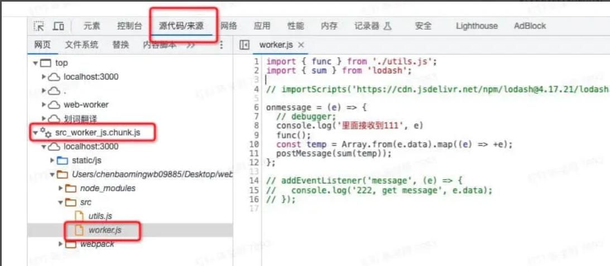
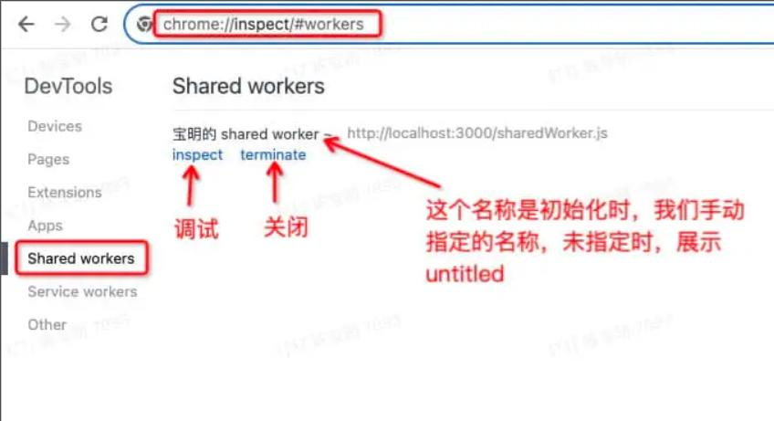

# Web Worker

> 线程是什么，见 [程序、进程、线程、协程、阻塞I/O、非阻塞I/O、同步、异步、并发]()

Web Worker 是HTML5标准的一部分，他定义了一整套的api允许开发者在js线程之外独立出一个单独的线程，处理额外的js代码。

因为是独立的线程，Web Worker 可以和主线程js同时运行，互不影响。我们可以把复杂且耗时的计算交给 Web Worker 进行，待 Worker 计算完成之后，再交由主线程 js 去消费。这样主线程仅需要关心业务逻辑和页面渲染，不需要把时间耗费在计算上，流畅度可以大大提升。

所以 Web Worker 的意义在于可以将一些耗时的数据处理操作从主线程中剥离，使主线程更加专注于页面渲染和交互。

## Web Worker 使用的一些限制：

- 有同源限制
- 无法访问 DOM 节点，及与 DOM 相关属性和方法
- 无法使用 Window 对象，但是 worker 有自己特定的上下文对象 WorkerGlobalScope 对象，它是 window 对象的子集，其中有些属性和 window 一致，而有些属性则并不完全相同。在 worker 中可以通过 self 关键字引用。
- Web Worker 的运行不会影响主线程，但与主线程交互时仍受到主线程单线程的瓶颈制约。换言之，如果 Worker 线程频繁与主线程进行交互，主线程由于需要处理交互，仍有可能使页面发生阻塞。

## Web Worker 的分类

- Dedicated worker （专用 worker，也就是常用的普通 worker） 是由单个脚本使用的 worker。该上下文由 DedicatedWorkerGlobalScope 对象表示。
- Shared worker 共享 worker，是可以由在不同窗口、IFrame 等中运行的多个脚本使用的 worker，只要它们与 worker 在同一域中。它们比专用的 worker 稍微复杂一点，脚本必须通过活动端口进行通信。该上下文对象由 SharedWorkerGlobalScope 对象表示。
- Service Worker 是一个特别的 worker，通常用于 PWA 的实现，最主要的功能是用作浏览器网络请求拦截器，位于 web 应用程序、浏览器和网络（如果可用）之间。它们的目的是（除开其他方面）创建有效的离线体验、拦截网络请求，以及根据网络是否可用采取合适的行动并更新驻留在服务器上的资源。它们还将允许访问推送通知和后台同步 API。 该上下文对象由 ServiceWorkerGlobalScope 对象表示。

上述针对不同类型 worker 的上下文对象都是基于 WorkerGlobalScope 对象衍生的，扩展了特定的 worker 所支持的属性和方法。

因为 Service Worker 较为特殊，所以单独讲述，这里只讲解普通 worker 和共享 worker

> Service Worker 学习可以参考 [Service Worker cookbook](https://github.com/bengle/Service-Worker-Cookbook)

## 创建

```
const worker = new Worker(aURL, options);

aURL: 是一个DOMString 表示 worker 将执行的脚本的 URL。
  - 它必须遵守同源策略。
  - 如果 aURL 无法解析，则报 SyntaxError 语法错误
  - url 指向的文件类型必须是 text/javascript，如果不是报 NetworkError 错误
options
  - name：worker 线程的名称，可以在工作者线程中通过 self.name 获取到字符串标识，主要用于调试目的。
  - type：表示加载脚本的方式，可以是 'classic' 或者'module'。'classic'将脚本作为普通脚本来执行，'module'将脚本作为模块来执行。
  - credentials：用以指定在 worker 中如何获取和传输凭证数据（cookie）。当 type = 'module'时与 fetch 的 credentials 属性一致，可选值是 'omit'｜'same-origin'｜'include'。在type为'classic'时默认为'omit'。
```

示例

```js
// worker.js
console.log("Hello Web Worker")
```

主线程中使用

```html
<script>
  const worker = new Worker("./worker.js")
  const sharedWorker = new SharedWorker("shared-worker.js")
</script>
```

如果 worker 逻辑不是特别复杂，代码量不多的情况下，还有另一种嵌入式的使用方式。

## 嵌入式 worker

在 HTML 中，如果一个 `<script>` 元素没有 src 属性，并且它的 type 属性没有指定成一个可运行的 MIME type，那么它就会被认为是一个数据块元素，并且能够被 JavaScript 使用。或者指定一个可执行的 MIME TYPE `type=text/javascript`。

```html
<!--默认数据块，可以被执行 -->
<script></script>
<!-- 指定类型为 text/javascript，也可以被执行 -->
<script type="text/javascript"></script>
```

目前没有一种“官方”的方法能够像 `<script>` 元素一样将 worker 的代码嵌入到网页中。但是可以利用上述 `<script>` 数据块的特性，指定一个假设的类型，并结合 `URL.createObjectURL` 特性实现 worker 代码嵌入。

```html
<script type="text/js-worker">
  // 该脚本不会被 JS 引擎解析，因为它的 mime-type 是我们假设的 text/js-worker，不在 MIME Type 规范内。
  const myVar = 'Hello World!';
  // 剩下的 worker 代码写到这里。
</script>
<script>
  // 该脚本会被 JS 引擎解析，因为它的 mime-type 默认是 text/javascript。
  const workerScriptEl = document.querySelector(
    "script[type='text\/js-worker']"
  )
  const workerScript = workerScriptEl.textContent
  const blob = new Blob([workerScript], { type: "text/javascript" })
  const workerUrl = window.URL.createObjectURL(blob)
  const worker = new Worker(workerUrl)
</script>
```

sharedWorker 可以同样操作，只是最终生成 `new SharedWorker(url)`

## Worker 对象的方法和事件

```
- 方法：
  - `postMessage(message[, transfer])`
  - `terminate()`
- 事件
  - message
  - error
  - connect
  - messageerror
```

SharedWorker 对象的属性、方法和事件

```
- 属性
  - port
- 事件
  - connect
  - error
```

其中 port 是 MessageProt 的实例

```
- 方法
  - postMessage(message[, transfer])
  - close()
  - start()
- 事件
  - message
  - messageerror
```

## 通信

worker 工作线程和主线程之间的数据通信，主要是通过 postMessage 方法发送消息，通过 message 事件回调接收消息。

在 worker 创建时，内部就实现 MessageChannel 通道。这里有一种区别是：

- Dedicated worker 普通 worker 一般主线程和工作线程是一对一通信，所以 MessageChannel 消息通道实现通信基础的 MessagePort 实例对象的功能直接在 worker 对象自身上。
- Shared worker 共享线程虽然会在多个窗口内引用创建，但其它只会共享一个 sharedWorker 实例，但是与主线程的消息通道会根据多少引用建立多个。每个消息通道的实例通过 worker.port 对象持有。

### 普通 worker 通信

主线程内

```js
// 主线程
var worker = new Worker("worker.js")
worker.postMessage([10, 24])
worker.onmessage = function (e) {
  console.log(e.data)
}
```

工作线程内

```js
// Worker 线程
onmessage = function (e) {
  if (e.data.length > 1) {
    postMessage(e.data[1] - e.data[0])
  }
}
```

在 Worker 线程的执行上下文中，self 和 this 都代表子线程的全局对象。所以对于一个属性或方法的调用，以下方式都是等效的·

```js
this.onmessage = fn
self.onmessage = fn
onmessage = fn
```

另外，对事件的监听，在 web 中一直有新旧两种写法 `onEventName = fn` 和 `addEventListener('EventName', fn)`，目前也是等效的。

```js
this.addEventListener("message", fn)
self.addEventListener("message", fn)
addEventListener("message", fn)
```

### 共享 worker 通信

主线程内

```js
// 主线程
var sharedWorker = new SharedWorker("shared-worker.js")
sharedWorker.port.onmessage = function (e) {
  // 业务逻辑
}
```

子线程内

```js
let portPool = new Set()

onconnect = function (e) {
  let port = e.ports[0]

  // 可以所有连接通道缓存起来
  portPool.add(port)

  port.onmessage = function (e) {
    // 业务轮回
    // port.postMessage(data)
  }
}
```

但是这里有一个特殊的区别，是对 `start` 方法，意思开始对事件消息进行处理。。可以理解为 `start()` 方法是与 `addEventListener` 配套使用的。如果我们选择 `onmessage` 进行事件监听，那么将隐含调用 `start()` 方法。

```js
var sharedWorker = new SharedWorker("shared-worker.js")
sharedWorker.port.addEventListener(
  "message",
  function (e) {
    // 业务逻辑
  },
  false
)
sharedWorker.port.start() // 需要显式打开
```

### 数据传递

主线程与 worker 工作线程之间，或者 worker 之间，传递的数据，默认是采用结构化克隆算法（The structured clone algorithm）进行拷贝的。

该算法的逻辑在发送数据时需要进行一次序列化过程，然后在接收端进行反序列化，可以比喻为，在发送方使用类似 `JSON.stringfy()`的方法将参数序列化，在接收方采用类似 `JSON.parse()` 的方法反序列化。

那这种默认传递数据的方法有两个弊端：

- 这个序列化和反序化的算法只对 js 常规对象有用，像一些包括函数，或者含有循环引用的对象，比如 DOM 对象，还有一些其它复杂对象，比如 ArrayBuffer TypedArray DataView 等，都不操作。
- 另一个就是性能问题，数据拷贝，生成一个副本对象，会造成同样的内容在内存中留存了两份。

所以在 Web 中实现另外两种数据传递方式：

- 传输（Transfer）: 当你传输一个 Buffer 或 TypedArray 到另一个线程时，它实际上将那块内存的所有权从一个线程转移到了另一个线程。这意味着一旦传输完成，原线程中的那个 Buffer 或 TypedArray 将变得不再可用，因为它的内容已经被移动到了新线程。
  - 这种方法的好处是效率极高，因为它避免了复制数据带来的开销。这对于需要处理大量数据并且关注性能的场景非常有用。
- 共享（Shared）: 另一种选择是使用 SharedArrayBuffer，它允许在不同的工作线程之间共享内存。这意味着多个线程可以同时读写相同的内存区域，但这也引入了必须通过某种形式的同步机制来管理访问冲突的复杂性。
  - 共享内存可能对于某些需要高度协作的线程之间的数据交换场景更为合适，但它通常需要更细致的控制来避免问题。

> [MDN 结构化克隆算法 structuredCline()](https://developer.mozilla.org/zh-CN/docs/Web/API/Web_Workers_API/Structured_clone_algorithm)
>
> [MDN 可转移对象 Transferable object](https://developer.mozilla.org/zh-CN/docs/Web/API/Web_Workers_API/Transferable_objects)
>
> [MDN SharedArrayBuffer](https://developer.mozilla.org/zh-CN/docs/Web/JavaScript/Reference/Global_Objects/SharedArrayBuffer)

具体使用是在 `postMessage(message[, transferList])` 提供了第二个参数，指明数据以传输的形式进行传递。

```js
// 可转移对象
// 创建一个 8MB 的文件并填充
const uInt8Array = new Uint8Array(1024 * 1024 * 8).map((v, i) => i)
console.log(uInt8Array.byteLength) // 8388608
// 将底层 buffer 传递给 worker
worker.postMessage(uInt8Array, [uInt8Array.buffer])
console.log(uInt8Array.byteLength) // 0
```

### BroadcastChannel

上述基于 MessageChannel 消息通道的通信，适合于一对一的通信。如果需要一对多通信，可以利用 Web API 的 BroadcastChannel 广播通道。

它允许同源的不同浏览器窗口、tab页、frame 或者 iframe 下的不同文档之间互相通信。通过触发 message 事件，消息可以广播到所有监听了该频道的 BroadcastChannel 对象。

所以它适合于共享 worker 之间的通信，或者主线程与多个子线程之间的通信。

主线程

```js
// 初始化具名频道
const channel = new BroadcastChannel("shared_channel")
// 广播消息，发送的消息自己接收不到，其他源可以接收到
channel.postMessage("main thread broadcast")
// 接收其他源发送的消息
channel.onmessage = (e) => {
  console.log("main thread received message from thread", e.data)
}
```

子线程

```js
// sharedWorker.js
/** 创建一个port池，把所有的 port 缓存起来，用于广播消息 */
const portPool = new Set()
const channel = new BroadcastChannel("shared_channel")

channel.onmessage = (e) => {
  console.log("thread received message", e.data)
}
onconnect = (e) => {
  console.log("shared worker connect ~~", e)
  let port = e.ports[0]

  // 将当前 port 缓存进 portPool
  portPool.add(port)
}

// 向其他页面发送消息
const broadcastMessage = (msg) => {
  channel.postMessage(msg)
}
```

### MessageChannel 和 BroadcastChannel

MessageChannel 和 BroadcastChannel 都是 HTML5 提供的用于在不同环境或上下文之间进行通信的机制，但它们之间存在几个关键的区别，主要体现在通信范围、通信方式以及使用场景上。

- MessageChannel
  - 通信场景：它的通信范围主要限制在同一窗口或 Web Worker 内的不同上下文之间。例如，它可以在两个 Web Worker 之间、父级窗口与子级窗口（如 iframe）之间，或在同一个窗口内的不同脚本之间建立双向通信通道。
  - 通信方式：一对一，通过创建一个消息通道（MessageChannel），该通道包含两个 MessagePort 端口（port1 和 port2）。这两个端口可以相互发送和接收消息，从而实现双向通信。发送方使用 port.postMessage() 方法发送消息，接收方则通过为 MessagePort 添加 'message' 事件监听器来接收消息。
  - 劣势：无法跨越浏览器标签页进行通信，即它不支持在不同标签页或窗口之间的直接通信。此点在 nodejs 中不存在。
- BroadcastChannel
  - 通信场景：它的通信范围则更广泛，允许在同一域名下的多个浏览器窗口、标签页或 iframe 之间进行实时消息广播。例如，可以在一个标签页中更新数据，并实时将更新通知给所有其他连接到同一频道的标签页。
  - 通信方式：广播的方式一对多，通过创建一个广播频道（BroadcastChannel），并指定频道的名称来建立通信。所有连接到同一频道的窗口或标签页都能接收到发送的消息。发送方使用 channel.postMessage() 方法发送消息，而接收方则通过为 BroadcastChannel 实例添加 'message' 事件监听器来接收消息。

## 关闭

- 第一种方式：在主线程中使用 `terminate()` 方法关闭子线程。
- 第二种方式：在 Worker 线程中使用 `close()` 方法关闭 worker。

这两种方法是等效的，但比较推荐的用法是使用 `close()`，防止意外关闭正在运行的 Worker 线程。Worker 线程一旦关闭 Worker 后 Worker 将不再响应。

```js
// 主线程
worker.terminate()
```

另一种，自身内部主动关闭

```js
// Dedicated Worker 线程中
self.close()

// Shared Worker 线程中
self.port.close()
```

共享线程与父上下文的启动和关闭不是对称的。每个新 SharedWorker 连接都会触发一个事件，但没有事件对应断开 SharedWorker 实例的连接（如页面关闭）。

这种情况对于共享线程中维护了通信通道池的场景，随着断开连接的页面越来越多，portPool 线程池中会受到死端口的污染，没有办法识别它们。一个解决方案是在销毁页面时，明确发送卸载消息，让共享线程有机会清除死端口。

```js
// 在主线程中 main.js 当页面关闭时主动发送一打特别的消息
document.addEventListener("beforeunload", () => {
  sharedWorker.port.postMessage("NEED CLOSE")
})

// 在子线程中
onconnect = (e) => {
  console.log("shared worker connect ~~", e)
  let port = e.ports[0]

  // 将当前 port 缓存进 portPool
  portPool.add(port)

  // 接收到页面传入的消息时触发
  port.onmessage = (p) => {
    // 向自己发消息
    // port.postMessage(p.data);

    // 清空无效的port
    if (e.data === "NEED CLOSE") {
      portPool.delete(port)
    }
  }
}
```

### 错误处理

不管是主线程还是子线程内，都是通过对 error 事件进行监听，并且同样支持 onerror 和 `addEventListener('error', cb)` 的形式。

```js
// 主线程
worker.onerror = function () {
  // ...
}

// 主线程使用共享线程
worker.port.onerror = function () {
  // ...
}

// worker 线程
onerror = function () {}
```

### worker 内加载其它脚本

总有一些场景，需要放到 worker 进程去处理的任务很复杂，需要大量的处理逻辑，我们当然不想把所有代码都塞到 worker.js 里，那样代码逻辑就太臃肿了。

web worker 为我们提供了解决方案，有两种方式：

- classic 识别为普通脚本，通过 `importScripts()` 方法加载我们需要的js文件，而且，通过此方法加载的js文件不受同源策略约束！
- module 将脚本作为模块，通过 `import xxx from path` 语句导入。

`new Worker ` 创建时默认 classic 形式。

示例，一个外部模块执行加法算法

```js
// utils.js
const add = (a, b) => a + b
```

然后在工作线程中以默认的普通脚本导入

```js
// worker.js（worker线程）
// 使用方法：importScripts(path1, path2, ...);

importScripts("./utils.js")

console.log(add(1, 2)) // log 3
```

导入脚本的方法和属性将作为当前工作线程的全局方法和属性，可以直接调用。

另一种模块形式导入，需要在创建 worker 时明确指定。

```js
// main.js（主线程）
const worker = new Worker("/worker.js", {
  type: "module", // 指定 worker.js 的类型
})
```

此时工作线程通过 import 语句形式加载外部脚本。

```js
// utils.js
export default add = (a, b) => a + b
```

```js
// worker.js（worker线程）
import add from "./utils.js" // 导入外部js

self.addEventListener("message", (e) => {
  postMessage(e.data)
})

add(1, 2) // log 3

export default self // 只需把顶级对象self暴露出去即可
```

### 调试

- Web Worker 可以在当前页面的 Source 中进行查看。
  
- Shared Worker 需要在谷歌调试中调试，链接：chrome://inspect/#workers
  

## 链接

- [一文带你了解 Web Worker - 前端的“多线程”](https://juejin.cn/post/7282603912650358784)
- [service worker cookbook](https://github.com/bengle/Service-Worker-Cookbook)
