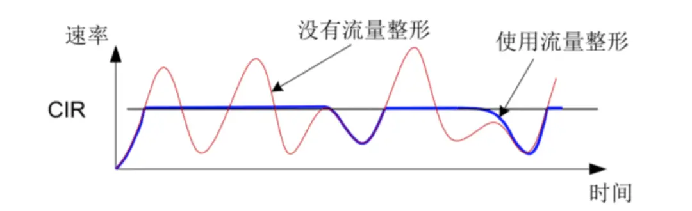

# Rate Limit 限流

## What

软件工程中，限流中的“流”，在不同场景下定义不同，流可以是单位时间的请求数、事务处理数、网络IO流量等等。

通常情况下说的限流指代的是限制到达服务的并发请求数，一旦达到限制阀值就可以拒绝服务，或者排队等待，或降级处理等，防止过多的请求导致服务应用崩溃。

常见的限流手段主要从控制并发数量（限流）和控制请求速率（限频）来实现：

- 限流：限制并发的总数量，比如数据库连接池、线程池
- 限频：限制并发访问的速率，单位时间内请求连接数

## Why

- 安全需要，防止恶意攻击，比如分布式拒绝服务（DDOS）攻击、爬虫的不正常流量。
- 业务需求，比如登录接口连续请求后要求几分钟后才能再操作、某些高级功能对还不是高级用户仅开放试用，会对操作作出限制，比如一个小时只能操作50次等。

## How

根据请求处理流程，流量控制可以在客户端，服务程序，架构级别上实现。

无论在哪端实现，流量控制的基本原理都是建立一个检查点，在检查点中拦截请求执行限制算法。有些编程语言提供了内置功能，有些编程语言通过中间件实现。

## 客户端并发限制

具体见并发章节 [concurrent 并发限制](./concurrent.md)

## 服务端限流

服务端限流主要是控制API服务的入站流量。

为了实现限流控制，必须有一个明确定义的约束，该约束可以根据应用整体架构来选择一种使用或几种组合使用。

- 按用户：跟踪用户使用API密钥、访问令牌或IP地址进行的调用
- 按地理区域划分：例如降低每个地理区域在一天的高峰时段的速率限制
- 按服务器：如果你有多个服务器处理对API的不同调用，你可能会对访问更昂贵的资源实施更严格的速率限制。

另外，要对限流的阀值进行明确:

- 如何确定限速数值：对数据频繁更新的查询类API而言，用户需要频繁的访问的到最新的数据，如果设置1小时只能访问10次的话，用户肯定不满意。访问限速的初衷是为了应对服务器短时间内遭遇大规模访问不堪重负从而无法提供服务，但如果让用户用起来不方便就得不偿失了，所以要尽可能的了解提供的API在什么情况下被使用，然后决定限速的数值。
- 如何确定限速时间单位：根据在线服务的不同，有些会以一天作为访问次数的时间单位，不过这对很多API来说有点长了，假设使用者正在写脚本访问API，开始并不清楚访问次数的时间单位，那就可能需要让他等24个小时才能继续访问API，或者换一个账号。如果我们以10分钟作为访问次数的时间单位，如果超出访问次数限制，也只需要等10分钟就能继续访问了。虽然单位时间的设定和API返回的数据密切相关，但大部分已公开的API都设置了1小时左右的单位时间。
- 在什么时候重置限速的数值：当用户超出访问上限值时，服务端该如何返回响应消息呢？这种情况下可以返回 HTTP 协议中备好的“429 Too Many Request”状态码。429 状态码在2012年4月发布的RFC 6585中定义，当特定用户在一定时间内发起的请求次数过多时，服务器端可以返回该状态码表示出错。另外还有一些相关的头字段设置 [RateLimit Fields for HTTP](https://www.ietf.org/archive/id/draft-ietf-httpapi-ratelimit-headers-05.html)：
  - `RateLimit-Policy` 限流策略，比如 `100;w=60` 每分钟 100 个配额单位的示例策略，或者通过自定义参数包含更多策略信息 `100;w=60;comment="fixed window"` 或 `12;w=1;burst=1000;policy="leaky bucket"`，其中 comment 或 burst/Policy 自行约定。
  - `RateLimit-Limit` 时间窗口内的访问上限值
  - `RateLimit-Remaining` 当前时间窗口中剩余的请求配额
  - `RateLimit-Reset` 当前窗口中的剩余时间，以秒为单位指定。如果响应中同时包含 Retry-After 和 RateLimit-Reset 字段，则 RateLimit-Reset 字段值应与 Retry-After 字段值相同。

```
HTTP/1.1 301 Moved Permanently
Location: /foo/123
RateLimit-Policy: 100;w=10
RateLimit-Limit: 100
RateLimit-Remaining: 1
RateLimit-Reset: 7
```

实际应用中可以使用第三方依赖包来实现限流，比如 express 应用的 express-rate-limit，nestjs 的 @nestjs/throttler 包等。

### rate-limit 依赖包

```js
const express = require("express");
const indexRoute = require("./router");
const rateLimit = require("express-rate-limit");
const app = express();
const port = 3000;
​
app.use(
  rateLimit({
    windowMs: 12 * 60 * 60 * 1000, // 12 hour duration in milliseconds
    limit: 5,
    message: "You exceeded 100 requests in 12 hour limit!",
    standardHeaders: true,
    legacyHeaders: false,
  })
);
​
app.use("/posts", indexRoute);
​
app.listen(port, () => {
  console.log(`Example app listening at http://localhost:${port}`);
});
```

配置说明：

- windowMs 是窗口时间，单位时间(以毫秒为单位)
- limit 是用户在给定窗口时间内可以发出的最大请求量
- message 是用户在超出限制时收到的响应消息
- standardHeaders 在 `RateLimit-*` 头字段中返回率限制信息，再次尝试发出请求之前的等待持续时间
- legacyHeaders 禁用兼容旧的 `X-RateLimit-*` 头字段

这是简单示例，更多功能配置项可以查看文档。

## 服务架构使用 nginx 限流

> 参考链接：[6 种限流实现方案，人人都能看的懂 ！(纯干货)](https://zhuanlan.zhihu.com/p/141823121)

在客户端和后端应用服务之间，架构 Nginx 服务。Nginx 提供了两种限流手段，一是控制速率，二是控制并发连接数

- 控制速率

使用 limit_req_zone 用来限制单位时间内的请求数，即速率限制，示例配置如下：

配置表示，限制每个 IP 访问的速度为 2r/s，因为 Nginx 的限流统计是基于毫秒的，我们设置的速度是 2r/s，转换一下就是 500ms 内单个 IP 只允许通过 1 个请求，从 501ms 开始才允许通过第 2 个请求。

使用单 IP 在 10ms 内发并发送了 6 个请求的执行结果，只有 1 个执行成功了，其他的 5 个被拒绝了（第 2 个在 501ms 才会被正常执行）。

```conf
limit_req_zone $binary_remote_addr zone=mylimit:10m rate=2r/s;
server {
    location / {
        limit_req zone=mylimit;
    }
}
```

优化速率限制，上面的速率控制虽然很精准但是应用于真实环境未免太苛刻了，真实情况下我们应该控制一个 IP 单位总时间内的总访问次数，而不是像上面那么精确但毫秒，我们可以使用 burst 关键字开启此设置，示例配置如下：

burst=4 表示每个 IP 最多允许4个突发请求。如果单个 IP 在 10ms 内发送 6 次请求的结果，有 1 个请求被立即处理了，4 个请求被放到 burst 队列里排队执行了，另外 1 个请求被拒绝了。

```conf
limit_req_zone $binary_remote_addr zone=mylimit:10m rate=2r/s;
server {
    location / {
        limit_req zone=mylimit burst=4;
    }
}
```

- 控制并发数

利用 limit_conn_zone 和 limit_conn 两个指令即可控制并发数，示例配置如下：

其中 limit_conn perip 10 表示限制单个 IP 同时最多能持有 10 个连接；limit_conn perserver 100 表示 server 同时能处理并发连接的总数为 100 个。

> 只有当 request header 被后端处理后，这个连接才进行计数

```conf
limit_conn_zone $binary_remote_addr zone=perip:10m;
limit_conn_zone $server_name zone=perserver:10m;
server {
    ...
    limit_conn perip 10;
    limit_conn perserver 100;
}
```

## 限流算法

应用服务限流需要配合限流的算法来执行，常见的限流算法：

- 固定时间窗口计数器 Fixed Window Counter
- 滑动日志 Sliding Log
- 滑动时间窗口计数器 Sliding Window Counter
- 漏桶算法 Leaky Bucket
- 令牌桶算法 Token Bucket

> 有人看到「算法」两个字可能就晕了，觉得很深奥，其实并不是。算法就解决一个具体问题的一系列步骤，其实并不难懂，不要被它的表象给吓到。
>
> 比如说解决如何把大象装进冰箱的问题，分两步，第一步打开冰箱，第二步把大象塞进去。这就是这个问题的算法。

### 固定窗口计数器

固定窗口计数器（Fixed Window Counter），又称计数器算法，是最简单的限流算法，通过一个定时器维护一个时间窗口，用 IP 标识同一个用户，为每个用户维护一个计数器，记录时间窗口内的请求数量。如果计数器达到指定阀值，则拒绝请求。定时器时间到了就清空所有计数器，开始下一轮定时。

- 时间窗口：每个用户的入站流量为每分钟允许 100 个请求，那么实现上就要一个 60 秒的时间窗口 00:00:00 到 00:01:00。
- key-value 存储：对于用户在一分钟内发出的第一个请求，可以使用 key-value 存储（如 HashMap 或 Redis），其中将用户`ip:limitrate` 作为 Redis 的 Key，Key 的过期时间作为滑动窗口的大小，请求数量作为 value。
- 逻辑：在同一窗口内的请求中，若 Key 不存在，则设置当前 Key 的值为 1；若 Key 存在，则 Key 的值加 1；检查用户是否未超过限制（即计数不大于 100），响应 429（Too Many Requests）。时间过期，Redis 会自动删除 key。

这里结合 Redis 来演示代码。

```js
// middleware/fixedWindow.middleware.js
import Redis from "ioredis"

const FIX_WINDOW_SIZE = 60 // second
const FIX_WINDOW_MAX_REQUEST = 100

const redisClient = new Redis(6379)

export const fixedWindowMiddleware = async (req, res, next) => {
  const redisKey = `ratelimit:${req.ip}`
  const curCount = await redisClient.get(redisKey)

  if (!curCount) {
    // setex(key, expire, value)
    await redisClient.setex(redisKey, FIX_WINDOW_SIZE, 1)
    next()
    return
  }
  if (Number(curCount) < FIX_WINDOW_MAX_REQUEST) {
    await redisClient.incr(redisKey)
    next()
  } else {
    res.status(429).send("you have too many requests")
  }
}
```

优点：容易实现
缺点：

- 这种方法并不完全准确，因为对所有用户强加一个通用的窗口开始时间是不公平的。实际上，在这种情况下，用户的窗口应该从他们第一次请求的时间到 60 秒后开始计数。
- 当接近窗口结束时出现流量突发时，例如，在第 55 秒时，服务器最终会完成比每分钟计划更多的工作。例如，我们可能在 55 到 60 秒之间有 10 个来自用户的请求，在 0 到 5 秒之间的下一个窗口中可能有来自同一用户的另外 10 个请求。因此，服务器最终在 10 秒内为该用户处理了 20 个请求。
- 在特别大的窗口周期中，例如每小时 50 个请求（3,600 秒），如果用户在前 10 分钟（600 秒）内达到限制，最终可能会等待很长时间。这意味着用户发出 50 个请求需要 10 分钟，但发出 51 个请求需要一个小时。这可能会导致在打开新窗口后立即对 API 进行标记。

### 滑动日志

滑动日志算法记录用户访问的每个请求的时间戳。可以使用 HashMap 或 Redis 记录此处的请求。在这两种情况下，可以根据时间对请求进行排序，然后在每一次请求到来时，以当前时间为结束时间，向前推算出时间窗口开始时间，然后查询集合中所有请求的时间戳数目，在时间窗口内，若请求数目没有超过最大限制，则将最新的时间戳存入集合；若超过最大限制，则返回429。

在 Redis 的数据结构中，Sorted set 是十分适合作为滑动日志算法的存储结构的，利用它的特性，我们可以能很容易实现一个高效的具备原子性操作的限流算法，使用命令如下：

- 每一个用户都有一个与之对应的 Sorted set 集合，在每一次请求
- 由于 Sorted set 之中的时间戳会过期，因此在进行所有操作之前，应该先使用 ZREMRANGEBYSCORE 清除过期的数据
- 使用 ZCARD 统计当前周期的请求数量
- 若请求数没达到限制，则通过 ZADD 添加时间戳，score 也设置为时间戳的值

```js
// middleware/slidingLog.middleware.js
import Redis from "ioredis"

const DURATION = 60
const MAX_REQ_IN_DURATION = 100
const redisClient = new Redis(6379)

export const slidingLogMiddleware = async (req, res, next) => {
  const redisKey = `ratelimit:${req.ip}`
  const durationEnd = Date.now()
  const durationStart = durationEnd - DURATION * 1000
  const exists = await redisClient.exists(redisKey)

  if (!exists) {
    await redisClient
      .multi()
      .zadd(redisKey, durationEnd, durationEnd) // 初始时以当前时间添加时间戳
      .expire(redisKey, DURATION)
      .exec()
    next()
    return
  }
  const re = await redisClient
    .multi()
    .zremrangebyscore(redisKey, 0, durationStart) // 先使用清除过期的数据
    .zcard(redisKey) // 统计当前周期的请求数量
    .expire(redisKey, DURATION)
    .exec()
  if (re[1][1] < MAX_REQ_IN_DURATION) {
    // 若请求数没达到限制，则添加时间戳，score 也设置为时间戳的值
    await redisClient.zadd(redisKey, durationEnd, durationEnd)
    next()
  } else {
    res.status(429).send("you have too many requests")
  }
}
```

优势：

- 这种方法更准确，因为它根据用户的活动计算每个用户的最后一个窗口，并且不会为所有用户强加一个固定的窗口。
- 由于没有固定的窗口，因此它不受窗口末尾的请求激增的影响。

劣势：

- 它的内存效率不高，因为我们最终会为每个请求存储一个新条目。
- 计算非常昂贵，因为每个请求都会触发对先前保存的请求的计算，以检索最后一分钟的日志，然后获取计数。

### 滑动窗口计数器

这种方法试图优化固定窗口计数器和滑动日志技术的一些劣势。在这种技术中，将一个大时间窗口拆分为多个小的时间窗口，拆分的越细，滑动窗口算法越平滑。

然后在每个小的时间窗口内进行定时计数，在统计大的时间窗口内的总数时，以当前小的时间窗口向前推算包含在的大时间范围内的所有小时间窗口计数的总和来判断。

比如我们定义时间窗口的常量：

- DURATION ，大的时间窗口，单位秒
- SPLIT_DURATION ，所拆分的最小窗口的时间周期，单位秒
- MAX_REQ_IN_DURATION ，大的时间窗口内所允许的最大请求数

这里使用 Redis 中的 Hash 结构来计数。操作逻辑：

- 在每次更新键值的时候，通过 EXPIRE 去更新 Redis Key 的过期时间
- 在每次更新键值的时候，通过 HDEL 删除在滑动窗口之前的 Hash Key
- 在每次更新键值的时候，我们需要通过 HGETALL 获取到所有 Key，然后进行进行判断：
- 存在 Key 在最小拆分窗口的周期时间内，HINCRBY 在原有 Key 的基础上去增加 1
- 不存在 Key 在最小拆分窗口的周期时间时，将当前时间的时间戳作为 HINCRBY 的 Key

```js
// middleware/slidingWindow.middleware.js
import Redis from "ioredis"

const DURATION = 60
const MAX_REQ_IN_DURATION = 100
const SPLIT_DURATION = 0.0001

const redisClient = new Redis(6379)

export const slidingWindowMiddleware = async (req, res, next) => {
  const redisKey = `ratelimit:${req.ip}`
  const durationEnd = Date.now()
  const durationStart = durationEnd - DURATION * 1000
  const splitStart = durationEnd - SPLIT_DURATION * 1000
  const userRequestMap = await redisClient.hgetall(redisKey)

  if (Object.keys(userRequestMap).length === 0) {
    await redisClient
      .multi()
      .hset(redisKey, durationEnd, 1)
      .expire(redisKey, DURATION)
      .exec()
    next()
    return
  }

  let requestCount = 0
  let splitTimestamp = null

  for (let [timestamp, count] of Object.entries(userRequestMap)) {
    if (Number(timestamp) < durationStart) {
      await redisClient.hdel(redisKey, timestamp)
    } else {
      requestCount += Number(count)
      if (Number(timestamp) > splitStart) {
        splitTimestamp = timestamp
      }
    }
  }

  if (requestCount < MAX_REQ_IN_DURATION) {
    await redisClient.hincrby(
      redisKey,
      splitTimestamp ? splitTimestamp : durationEnd,
      1
    )
    await redisClient.expire(redisKey, DURATION)
    next()
  } else {
    res.status(429).send("you have too many requests")
  }
}
```

- 当接收到用户的请求时，我们检查用户的记录是否已经存在，以及是否已经存在该时间戳的条目。如果这两种情况都成立，我们只需增加时间戳上的计数器。
- 在确定用户是否超出限制时，我们检索在最后一个窗口中创建的所有组，然后对它们的计数器求和。如果总和等于限制，则用户已达到限制，传入请求将被丢弃。否则，将插入或更新时间戳并处理请求。
- 此外，可以将时间戳组设置为在窗口时间用完后过期，以控制内存消耗的速率。

优势：这种方法节省了更多内存，因为我们不是为每个请求创建一个新条目，而是按时间戳对请求进行分组并增加计数器。

### 漏桶算法

漏桶算法（Leaky Bucket）是一个经典的限速算法，将用户访问接口的过程类比为往一个漏斗中加水的过程，因为漏斗的容量和底部的开口是固定的，也就相当于限制阀值。当请求增多时，漏斗开口是固定的，所以流速是固定的，不断增多的请求只会使漏斗越装越满，超出的只能让他溢出，就是拒绝掉。这意味着即使服务器受到突发流量的影响，传出响应仍然以相同的速率发送出去。

- 无论上面的水流倒入漏斗有多大，也就是无论请求有多少，它都是以均匀的速度慢慢流出的。
- 当上面的水流速度大于下面的流出速度时，漏斗会慢慢变满，当漏斗满了之后就会丢弃新来的请求;
- 当上面的水流速度小于下面流出的速度的话，漏斗永远不会被装满，并且可以一直流出。

优势：这种技术可以平滑流量，从而防止服务器过载。
劣势：由于漏斗流出速度是恒定的，也就是请求的处理速度是固定的，当某个小段时间点请求激增，不能有效的被处理。


上面我们演示 Nginx 的控制速率其实使用的就是漏桶算法，当然我们也可以借助 Redis 很方便的实现漏桶算法。

定义两个变量：

- rate 桶的流速（漏斗开口的阀值），单位毫秒，桶内数量的流失速度
- capacity 桶的容量

然后定义一下存储结构，这里的 Key 依然为用户的请求 IP，然后需要用 Redis Hash 结构储存两个变量：

- last_update_time 最近一次请求的时间
- amount 桶内当前请求数量

通过这两个变量即可计算出当前桶内的剩余总数：当前桶内请求数量 amount - 距最近一次时间间隔内流出的数量 `(now - last_update_time) * rate`，若新的 amount 没有达到最大容量 ，则允许继续请求，否则就忽视掉请求。

为了节省内存，还可以为当前桶设置过期时间，过期时间可设置为 `amount * rate` 的秒级单位，代码如下：

```js
// middleware/leakyBucket.middleware.js
import Redis from "ioredis"

const RATE = 1000
const CAPACITY = 5
const redisClient = new Redis(6379)

export const leakyBucketMiddleware = async (req, res, next) => {
  const redisKey = `ratelimit:${req.ip}`
  const now = Date.now()
  const exists = await redisClient.exists(redisKey)

  if (!exists) {
    await redisClient
      .multi()
      .hset(redisKey, "amount", 1)
      .hset(redisKey, "update_time", now)
      .expire(redisKey, (1 * RATE) / 1000)
      .exec()
    next()
    return
  }

  const updateTime = await redisClient.hget(redisKey, "update_time")
  const amount = await redisClient.hget(redisKey, "amount")
  const newAmount = Math.ceil(
    Math.max(0, amount - (now - updateTime) * RATE) + 1
  )

  if (newAmount <= CAPACITY) {
    await redisClient
      .multi()
      .hset(redisKey, "update_time", now)
      .hset(redisKey, "amount", newAmount)
      .expire(redisKey, (newAmount * RATE) / 1000)
      .exec()
    next()
  } else {
    res.status(429).send("you have too many requests")
  }
}
```

### 令牌桶算法

令牌桶算法（Token Bucket）定义了一个集合（桶），集合只能容纳一定数量的令牌，令牌以恒定的速率生成被放入桶中。每当一个请求到达时，就会尝试从桶中获取一个令牌消耗掉。如果从桶中没有取到令牌，则请求被拒绝。这样可以确保处理请求的速率不会超过指定限制。

相较于漏桶算法因为出口恒定速率没办法应对短时间的突发请求的问题，在令牌算法里，应对各种情况的变化，因为前期的空闲会导致桶中存在充足的令牌用于短时间激增请求的消耗。

令牌桶算法，实现逻辑可以借鉴漏桶算法，只需要将部分流程反过来，从计算接口消耗的逻辑变为计算令牌消耗的逻辑。在数据结构结构上遵从之前定义出来的漏桶算法的结构，使用 Hash 储存用户当前的令牌数与更新时间，在下一次请求来的时候，再通过更新时间与令牌生成速率去生成新的令牌。


代码逻辑如下：

- 当请求进来时，初始化一个令牌桶与过期时间，其中每次进行更新操作，都需要设置令牌桶的过期时间为需要补充的令牌数
- 计算当前距上一个时间间隔内，可以生成多少令牌，并与桶内上次剩余令牌相加，得到当前最新的令牌数为多少，然后再判断是否请求能拿到令牌：
  - 若请求能拿到令牌，则更新最新的令牌数与更新时间
  - 若不能拿到令牌，将该请求抛弃

```js
// middleware/tokenBucket.middleware.js
import Redis from "ioredis"

const RATE = 1000 // 生成令牌的速率
const CAPACITY = 5 // 令牌桶容量
const redisClient = new Redis(6379)

export const tokenBucketMiddleware = async (req, res, next) => {
  const redisKey = `ratelimit:${req.ip}`
  const now = Date.now()
  const exists = await redisClient.exists(redisKey)

  if (!exists) {
    await redisClient
      .multi()
      .hset(redisKey, "amount", CAPACITY - 1)
      .hset(redisKey, "update_time", now)
      .expire(redisKey, RATE / 1000)
      .exec()
    next()
    return
  }

  const updateTime = await redisClient.hget(redisKey, "update_time")
  const amount = await redisClient.hget(redisKey, "amount")
  // 计算当前距上一个时间间隔内，可以生成多少令牌，并与桶内上次剩余令牌相加，并减掉当前请求消耗的一个令牌
  const newAmount =
    Math.min(CAPACITY, Number(amount) + Math.floor((now - updateTime) * RATE)) -
    1

  if (newAmount >= 0) {
    await redisClient
      .multi()
      .hset(redisKey, "update_time", now)
      .hset(redisKey, "amount", newAmount)
      .expire(redisKey, ((CAPACITY - newAmount) * RATE) / 1000)
      .exec()
    next()
  } else {
    res.status(429).send("you have too many requests")
  }
}
```

### 总结

- 固定窗口算法实现简单，性能高，但是会有临界突发流量问题，瞬时流量最大可以达到阈值的2倍。
- 为了解决临界突发流量，可以将窗口划分为多个更细粒度的单元，每次窗口向右移动一个单元，于是便有了滑动窗口算法。滑动窗口当流量到达阈值时会瞬间掐断流量，所以导致流量不够平滑。
- 想要达到限流的目的，又不会掐断流量，使得流量更加平滑？可以考虑漏桶算法！需要注意的是，漏桶算法通常配置一个FIFO的队列使用以达到允许限流的作用。由于速率固定，即使在某个时刻下游处理能力过剩，也不能得到很好的利用，这是漏桶算法的一个短板。
- 限流和瞬时流量其实并不矛盾，在大多数场景中，短时间突发流量系统是完全可以接受的。令牌桶算法就是不二之选了，令牌桶以固定的速率v产生令牌放入一个固定容量为n的桶中，当请求到达时尝试从桶中获取令牌。当桶满时，允许最大瞬时流量为n；当桶中没有剩余流量时则限流速率最低，为令牌生成的速率v。
- 如何实现更加灵活的多级限流呢？滑动日志限流算法了解一下！这里的日志则是请求的时间戳，通过计算制定时间段内请求总数来实现灵活的限流。当然，由于需要存储时间戳信息，其占用的存储空间要比其他限流算法要大得多。

不管黑猫白猫，能抓到老鼠的就是好猫。限流算法并没有绝对的好劣之分，如何选择合适的限流算法呢？需要从性能，是否允许超出阈值，落地成本，流量平滑度，是否允许突发流量以及系统资源大小限制多方面考虑。

市面上也有比较成熟的限流工具和框架。如 Nginx 的控制速率其实使用的就是漏桶算法, Google 出品的 Guava 中基于令牌桶实现的限流组件，以及alibaba开源的面向分布式服务架构的流量控制框架 Sentinel 基于滑动窗口实现。

## 参考链接

- [高并发之 API 接口，分布式，防刷限流，如何做？](https://zhuanlan.zhihu.com/p/131262597)
- [6 种限流实现方案，人人都能看的懂](https://zhuanlan.zhihu.com/p/141823121)
- [NodeJS Rate Limiting 入门](https://juejin.cn/post/7103563833393807373#heading-4)
- [通过Node和Redis进行API速率限制](https://juejin.cn/post/6872711612533473293)
- [手把手教你在 Node.js 中使用 Redis 做请求限流](https://github.com/vv13/rate-limit-example/tree/master)

## 延伸概念

> 参考链接：[10张图带你彻底搞懂限流、熔断、服务降级](https://cloud.tencent.com/developer/article/1815254)

```
             +-----+
             |  A  |
             +--+--+
                |
             +--v--+
             |  B  |
             +--+--+
                |
   +--------------------------+
   |            |             |
+--v--+      +--v--+       +--v--+
|  C  |      |D故障|       |  E  |
+-----+      +-----+       +-----+

```

如果 D 服务发生了故障不能响应，B 服务调用 D 时只能阻塞等待。假如 B 服务调用 D 服务设置超时时间是10秒，请求速率是每秒100个，那10秒内就会有1000个请求线程被阻塞等待，如果 B 的线程池大小设置1000，那 B 系统因为线程资源耗尽已经不能对外提供服务了。而这又影响了入口系统 A 的服务，最终导致系统全面崩溃，这就是系统服务的雪崩效应。

要防止系统发生雪崩，就必须要有容错设计，采用的系统容错手段包括：限流、缓存、熔断、降级。

- 限流的目的是通过对并发请求进行限速和限频，一旦达到限制阀值可以拒绝服务、排队等待、降级等处理
- 缓存的目的是提升接口响应速度来增加单位时间内的请求处理容量
- 熔断的目的增加一个熔断层代理请求访问，当请求失败数超过阈值时打开熔断器，让请求不能真正地访问到应用，达到保护应用的作用。
- 降级是当服务出现问题或者影响到核心流程时，需要暂时屏蔽掉，待高峰或者问题解决后再打开。比如秒杀活动时，添加购物车和结账是当前的核心流程，此时端口收藏等非核心流程会进行降级处理。

如果遇到突增流量，一般的做法是对非核心业务功能采用熔断和服务降级的措施来保护核心业务功能正常服务，而对于核心功能服务，则需要采用限流的措施。

### 熔断

生活小常识：以前老式电闸都安装了保险丝，一旦有人使用超大功率的设备，瞬时电流过大，保险丝就会因温度过高而烧断，从而保护各个电器不被强电流给烧坏。

同理我们的应用程序接口也需要安装上“保险丝”，业务实操中相当于在客户端请求和服务端处理之间加一个中间层，称为熔断器。客户端访问服务时，通过断路器代理进行访问，断路器会持续观察服务返回的成功、失败的状态，当失败超过设置的阈值时熔断器打开，请求就不能真正地访问到服务了，达到保护其它服务的作用，这就是“服务熔断”。

```
+-----------+           +-----------+             +-----------+
|  客户端    |           |  熔断器    |             |  服务端    |
+---+-------+           +-----+-----+             +-----+-----+
    |                         |                         |
    |       请求              |                         |
    +------------------------->        请求             |
    |                         +------------------------->
    |                         |                         |
    |      成功响应            <-------------------------+
    <-------------------------+        成功响应          |
    |                         |                         |
    |                         |                         |
    |       请求               |                         |
    +------------------------->        请求              |
    |                         +------------------------->
    |                         |                         |
    |      失败响应            <-------------------------+
    <-------------------------+       失败响应           |
    |                         |                         |
    |                         |                         |
    |  请求                    |                         |
    +------------------------->                         |
    |                         | 当失败请求达到阀值         |
    <-------------------------+ 熔断开启                 |
    |   拒绝请求               |                         |
    +                         +                         +

```

熔断器有3种状态：

- CLOSED：默认状态。熔断器观察到请求失败比例没有达到阈值，熔断器认为被代理服务状态良好。
- OPEN：熔断器观察到请求失败比例已经达到阈值，熔断器认为被代理服务故障，打开开关，请求不再到达被代理的服务，而是快速失败。
- HALF OPEN：熔断器打开后，为了能自动恢复对被代理服务的访问，会切换到半开放状态，去尝试请求被代理服务以查看服务是否已经故障恢复。如果成功，会转成CLOSED状态，否则转到OPEN状态。

使用熔断器需要考虑一些问题：

- 针对不同的异常，定义不同的熔断后处理逻辑。
- 设置熔断的时长，超过这个时长后切换到HALF OPEN进行重试。
- 记录请求失败日志，供监控使用。
- 主动重试，比如对于connection timeout造成的熔断，可以用异步线程进行网络检测，比如telenet，检测到网络畅通时切换到HALF OPEN进行重试。
- 补偿接口，熔断器可以提供补偿接口让运维人员手工关闭。
- 重试时，可以使用之前失败的请求进行重试，但一定要注意业务上是否允许这样做。

使用场景

- 服务故障或者升级时，让客户端快速失败
- 与限流机制一起，对超过限流的请求，采用熔断措施。
- 响应耗时较长，客户端设置的 read timeout 会比较长，防止客户端大量重试请求导致的连接、线程资源不能释放

### 服务降级

在服务发生限流或熔断后会拒绝时，一般会让请求走事先配置的处理方法，这个处理方法就是一个降级逻辑。

常见场景：

- 服务处理异常，把异常信息直接反馈给客户端，不再走其他逻辑
- 服务处理异常，把请求缓存下来，给客户端返回一个中间态，事后再重试缓存的请求
- 监控系统检测到突增流量，为了避免非核心业务功能耗费系统资源，关闭这些非核心功能
- 数据库请求压力大，可以考虑返回缓存中的数据
- 对于耗时的写操作，可以改为异步写
- 暂时关闭跑批任务，以节省系统资源

### 流量整型 Traffic Shaping

流量整型，wikipedia 解释是一种控制网络数据包传输的技术，通过控制数据速率使数据较为均匀发送。流量整形可以一定程度减少网络拥塞，并减弱突发流量带来的影响。

限流的思想就来自于流量整形，通过算法对请求流量进行“削峰填谷”。


